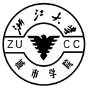

# **2022-23学年第1学期**

## **实 验 报 告**

- 课程名称: 软件体系结构与实践
- 实验项目: Clean Architecture
- 专业班级\_\_\_
- 学生学号\_\_\_
- 学生姓名\_\_\_
- 实验指导教师:郭鸣

### 【实验目的】

- 熟练掌握 Clean Architecture

### 【实验内容】

#### 1 阅读 https://www.bookstack.cn/read/Clean-Architecture-zh/docs-README.md 
- 第四部分 组件原则

- 第五部分 软件架构

  - **第 22 章 整洁架构**

#### 2 阅读 Ivan-Paulovich-Clean-Architecture-Essentials-SSC.pdf

- 理解  **Demo**  的代码
- 在大作业里面实践 Clean Architecture
  - 提供多个数据存储机制，关系数据库，NoSQL
  - 提供多个UI, Web,REST API,命令行

- 最少一个模块使用该编程方法

#### Demo 程序
https://github.com/ivanpaulovich/clean-architecture-manga
[其他参考](https://github.com/ivanpaulovich/TechTalks)

### 【实验报告要求】

1. 作业文档、源程序 提交至 bb
1. Markdown 完成作业，包括正确的格式
1. 实验中碰到的问题和心得体会写在此处

### 【参考资源】

