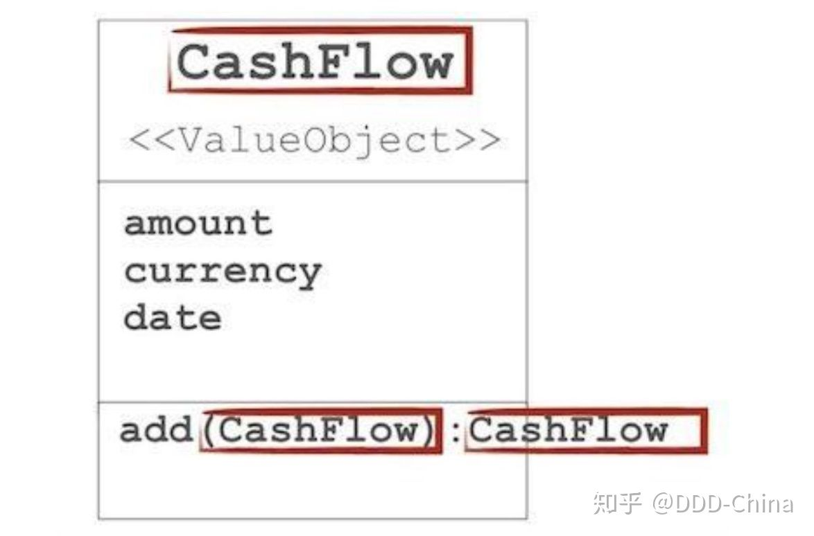
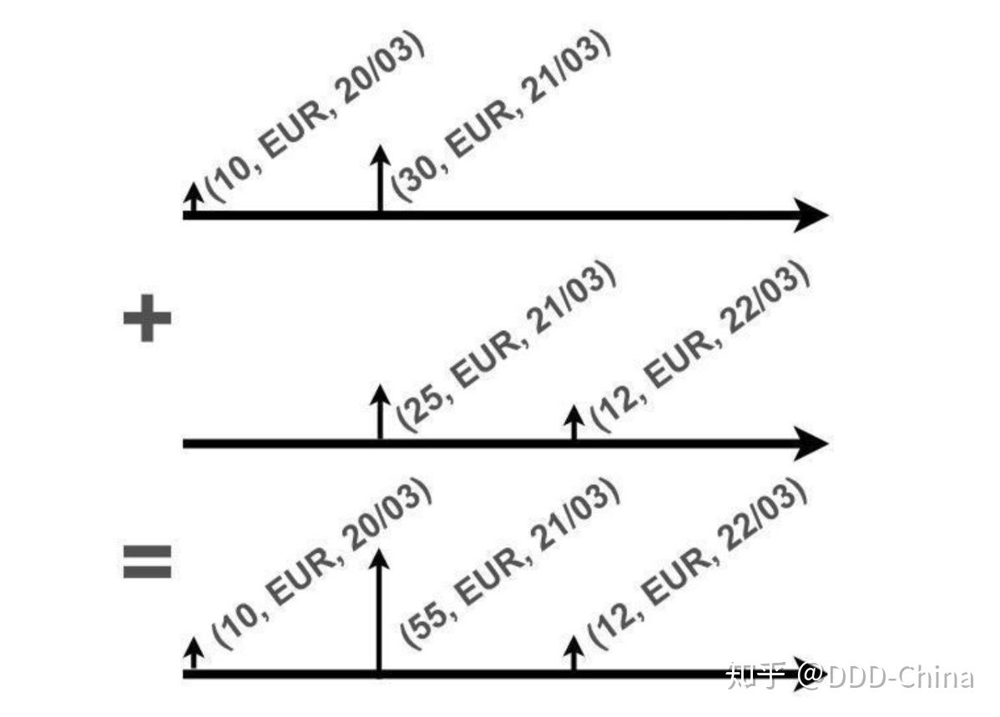

# 用幺半群进行领域建模


*《领域驱动设计15年》第9章*

*作者：Cyrille Martraire*

 *译者：田震*

*校审：覃宇*

“**幺半群（monoid）**”是个非常尴尬的名字，其实这个词表达的是一个非常简单的通用概念。

幺半群的一切都和**组合性**有关，它是对小事物无限地组合成大事物的特性的抽象。

很多典型的体现出幺半群组合性的情况对你来说并不陌生，比如任何可以 **group-by** 的情况，或者任何可以 **reduce** 的情况。我想强调的是幺半群常常出现在业务领域之中，应该识别出来并好好加以利用。

此前，在世界各地的会议上我都热衷于谈论幺半群，我也收到了很多团队关于幺半群的积极反馈，这些反馈具体到他们是如何借助幺半群领域模型中复杂的部分进行重新设计，达到简化的目地。新的设计“更加优雅”，在谈到这一点时他们的喜悦溢于言表。

有一点要特别注意：不要混淆幺半群（monoid）和单子（monad）。幺半群要比单子更容易理解。本文剩下的内容将只聚焦于幺半群以及和它紧密相关的内容，单子并不在本文讨论的范围之内。

## 1. 什么是幺半群？

幺半群来自一门叫做抽象代数的数学学科。抽象代数让人望而却步，但其实并不需要全面掌握 ，至少幺半群不用，两岁的孩子不用理解原理也能很好地掌握它。

那么幺半群究竟是什么？幺半群是一个**代数结构**。我们先从一个简单集合讲起。一个集合只是一个判断标准，用来判断一个元素是否属于这个集合。这个定义的确有点绕，但你应该能理解其中的含义。

在演讲中我习惯用啤酒杯来解释幺半群，但这次我把例子换成水管。比如，我们用下面这种方式来定义一个水管的集合：

这么粗的水管属于这个集合

根据水管集合的定义就可以判断下面这些元素是否属于这个集合。


我们在这个集合之上定义一种能把两个元素组合起来的运算，可以把它称为“组合”、“追加”、“合并”或者“添加”。


我们注意到一个有趣的现象，对于集合中给定的两个元素进行运算，运算的结果...也属于这个集合！听起来好像没什么，但这就是运算的封闭性：集合在这个运算下封闭。这一点很有意义。我们有了一个小巧的系统，它总是保持封闭，非常酷。

还有更多有趣的现象。如果先把前两根水管组合起来再和第三根组合，或者先把后两根组合再和第一根组合，得到的结果一模一样。我们并没有调换水管的顺序，我们改变的只是组合的顺序。这就像是在运算中任意加上括号，运算结果并不会改变。这个重要的概念叫做结合律。


此外，如果调换水管的顺序后得到的运算结果也是一样的话，我们就称该运算满足交换律，但这种特性并不常见。

我们有了一个元素集合，一种在这个集合之上**封闭**的运算，而且这种运算还满足结合律。现在离真正的幺半群就只差一种水管定义了，这种水管看不见也摸不着，无法展示。作为系统的开发者，我可以随心所欲地进行设计，所以这种水管一定存在。这根特殊的水管也属于这个集合：它也是这么粗。无论何时把这个特殊元素和其它任意元素组合起来，得到的结果都还是这些元素本身。它不会引起任何变化。这也是它被称为**幺元（Neutral Element）或单位元（Identity Element）**的原因。

好了！**一个集合，一种运算，该运算在集合下封闭，结合律，还有幺元**：这就是一个幺半群的正式定义。

好吧，现在你可能有些懵了：

这到底是真正的数学还是抽象的空话

但请坚持看下去，这个概念与日常工作息息相关。

## 1.1. 所以那又怎样？

我刚开始给别人解释幺半群的时候，也给我的妻子解释过。她立刻就明白了，然后反问我：这有什么用？

轮到我被问住了。为什么我要关注它？我相信它是封装某种在结构中存在着的多样性的关键。

你可能听过编程界的一个老梗：

> 编程只用搞定三个数：0 个、1 个、多个（Many）

这简直无法反驳。而这也勾勒出了一种普遍存在的多样性：单数（1 个）、复数（多个）和不存在（0 个），我们无时不刻都要面对这种多样性。幺半群集合中的元素天然代表着单数。通过组合运算可以把复数转化成集合中的元素，这样复数它也能处理。而幺元可以处理不存在的情况，并且幺元也属于这个集合。幺半群把这种多样性封装在其结构内部，这样在结构之外就无需关心其内部细节。这是一种应对复杂性的好办法。

0个 - 幺元，1个 - 元素，多个 -运算

如果面对现实问题的时候太随意，就会不得不同时处理多种概念，而每种概念都可能存在自己独特的多样性，它们有单数、复数或者不存在的情况。最差的结果是处理所有概念全部情况的笛卡尔积。这样很难扩展。


如果用幺半群把每种概念的多样性封装起来，每种概念只是一个幺半群，那么它们合起来也只会产生一种情况。


如果你经常这样干，高复杂性就不是什么难题，可以轻松应对了。幺半群能够扩展适应复杂度。实际上，如果熟悉面向对象编程，这种感觉似曾相识：对于给定的接口，通常使用**组合模式**来处理复数的情况，使用 **NullObject 模式**处理不存在的情况。这些模式可以处理所有单数、复数、不存在的情况，所以接口调用者无需关注实现细节。这和幺半群殊途同归。

0 个 -NullObject 模式，1 个 -具体实现，多个 -组合模式

## 1.2. 来些例子吧！

编程语言中已经存在许多幺半群了：

- 支持加法的**整数**：整数在加法运算下封闭：int + int = int；也满足结合律：(3+5)+2=3+(5+2)，**幺元是 0**，因为任何整数加上 0 还是它们自己。
- 支持追加操作（运算）的**列表**：列表 + 列表 = 列表；列表在追加运算下封闭，也满足结合律：(a︎)+(b︎,c)=(a︎, b)+(c)。这里幺元是**空列表**。
- 列表的特例——支持连接的**字符串**："hello" + "world" 的结果也是一个字符串。它也满足结合律："cy"+"ri"+"lle"，而幺元是**空字符串**。

注意：整数和乘法也可以形成一个幺半群，这种情况下幺元是 1。但自然数和减法无法形成一个幺半群，因为 3 - 5 的结果不在自然数集合中。

这些都挺简单的。但这个简单概念却是极端复杂的行为的关键。同样，它也是无限扩展的空间的关键（想想 Hadoop），也是无限增量扩展的关键（想想 Storm）。大数据圈中有一句玩笑话：

> 如果搞大数据的连阿贝尔群（abelian group）都不知道，那就是在瞎搞！

这些全都和*组合性*有关，组合性几乎无孔不入。

## 1.3. 用常见的编程语言实现幺半群

如何在 Java 代码中实现幺半群？

> 幺半群是典型的函数式编程概念；在函数式编程中万物都是值；因此幺半群也是值！

这是对幺半群是值对象的严格证明。实事求是地讲，它确实是值对象，也就是说，它具备不可变性和值相等性。但幺半群对象不是只有数据的贫血模型。它们也应该有行为，而且是组合行为，例如长度，我们希望可以这样写：18 m + 16 m = 34 m。这个方法对应的代码如下：

```java
public Length add(Length other){
 return new Length(value + other.value);
}
```

这个 add（）方法返回的是一个新的实例，值对象就应该这样。方法不能有任何副作用，就像领域驱动设计中**“无副作用函数（Side-Effect-Free Functions）”**模式提倡的那样。不可变性和无副作用函数结合起来是良好的设计品味！这应该是常规的编程风格，除非是遇到了实在是不可抗拒的其它原因。

另外，不可变性和无副作用还意味着写测试时不用怎么动脑子：只需要传入数据，断言输出结果。就这么简单。


## 2. 领域建模中的幺半群

特定领域的列表，比如只包含邮件地址的列表——邮件列表，至少可以形成两个幺半群，一个是在并集（union）运算之下，另一个则是在交集（intersection）运算之下。前一种情况下幺元是 *nobody()*，后一种情况下则是 *everybody()*。注意幺元的命名和特定领域相关，而不是通用的*空（empty）*或者*全部（all）*。我们可以进一步用*重叠（overlapping）*重命名 intersection() 运算，这个名称方便和领域专家讨论相关问题。

**2.1. 货币和数量**

我们以 Martin Fowler 很早之前提出的漂亮的货币（Money）分析模型为例：(EUR, 25) + (EUR, 30) = (EUR, 55)。如果货币币种不一致，add 方法将抛出异常。注意，异常其实会**破坏组合性**，但在实践中如果异常仅仅是用于揭示编码错误，我们可以避免这些破环性。货币类的定义可以用下面的 UML 类图表述：


货币模式确实是更加笼统的数量（Quantity）分析模型的一个特例，用 Martin Fowler 的话说，数量“表示了由数值（amount）和单位（unit）组成的可被度量的值”。

**2.2. 现金流和现金流序列**

有了货币金额，再加上日期就可以变成**现金流（Cashflow）**了：

(EUR, 25, TODAY)

\+ (EUR, 30, TODAY)

= (EUR, 55, TODAY)

如果日期的单位不匹配，我们同样可以抛出异常。



观察现金流的 UML 类图，这个类有个非常鲜明的特点，它只引用了自身的类型和基本类型（在构造方法中引用，类图中没有体现）。方法接受的参数类型是 Cashflow，返回的也是类型 Cashflow，除此之外没用到别的类型。

这就是运算封闭性在代码中的体现。这个类型是自解释的，它只和自己相关。这是领域驱动设计所提倡的高质量代码，也是幺半群必须具备的属性之一。

到此为止了吗？我们通常要把许多相关的现金流（Cashflow Sequence）一起处理，它们也被认为是可以相加的：



所以再重复一遍，我们还是想用同样的方式写代码：

Cashflow Sequence

\+ Cashflow Sequence

= Cashflow Sequence

现在，终于图穷匕见了：**幺半群就是对象的算术**。

注意上面的例子中，现金流序列的加法运算基本是列表的连接操作（例如 Java 中的 addAll()），而币种相同、日期也相同的现金流直接就用现金流自己的加法运算相加。

**2.3. 范围（Range）**

一个范围内的数字集合或者一个范围内的日期集合都可以被看作幺半群，比如在紧凑并集（compact-union）运算下以空范围为幺元。

`[1, 3] Union [2, 4] = [1, 4] *// compact union*`

`[1, 3] Union []= [1, 3] *// neutral element*`

“紧凑”并集运算的定义如下：

```java
public final class Range
{
 private final int min;
 private final int max;
 public final static EMPTY = new Range();

 public Range union(Range other)
  {
 return new Range(
      min(this.min, other.min),
      max(this.max, other.max)
    );
  }
}
```

注意，范围的内部实现完全可以采用一些现成的方案，比如一些有良好测试保障的著名开源库。

**2.4. 断言（Predicate）**

断言天然就是半幺群，在逻辑与（AND）运算之下以永远为真的（ALWAYS_TRUE）断言为幺元；或者在逻辑或（OR）运算之下以永远为假（ALWAYS_FALSE）的断言为幺元。

**2.5. 授权（Grant）**

有些出人意料的是，像**读/写/执行**这样的授权与某种合并运算也可以形成幺半群，例如“安全优先”的合并：

r merge w = r

w merge x = w

可以用枚举实现，计算枚举值内部次序的最小值（MIN）。

```java
public final enum Grant
{
  R, W, X;

 public Grant merge(Grant other)
  {
 return
 this.ordinal() < other.ordinal() ? this : other;
  }
}
```

当然了，需要哪些行为，还有这些行为的命名都由领域专家们定夺。

**2.6. 嵌套的幺半群还是幺半群**

嵌套幺半群很容易就形成了新的幺半群。例如，很多系统都会用到配置表来设置应用程序。通常先有一份硬编码的默认配置表，接下来部门会有一份，然后服务台有一份，最后每个用户还有一份，这些配置表中的设置会按照这个顺序优先生效。这样自然而然地形成了幺半群：

MonoidMap + MonoidMap = MonoidMap

简单的做法是按照“最后优先”（LAST ONE WINS）的策略让配置表中的设置生效：

```java
public MonoidMap append(MonoidMap other) 
{

  Map<String, Object> result = new HashMap<>(this.map);
  result.putAll(other.map);
 return new MonoidMap(result);
}
```

但还可以再展开一层，如果配置表中所有设置的值也是幺半群，就让每个值发挥自己的幺半群魔力吧：


上面这个例子里，“Color”的值可以使用 OVERWRITE（覆盖）运算进行组合（最后优先），而“Enable”的值可以使用逻辑 OR（或）运算进行组合，“Timeout”的值则可以使用整数的 MIN（最小值）运算进行组合。可以发现这份配置表里所有的值本身都是各自运算下的幺半群。如果定义一个配置表级的组合运算（这里用 + 表示），它会分别执行每个值的幺半群运算，那么配置表也变成了幺半群。它的幺元可以是一份**空配置表**，也可以是一份所有**值都是各自幺元**的配置表。

```java
public NestedMonoidMap append(NestedMonoidMap other) 
{
  Map<String, Monoid<?>> result = new HashMap<>(map);
 for (String key:other.map.keySet()){
    Monoid value = map.get(key);
    Monoid value2 = other.map.get(key);
 
    result.put(key, value == null ? value2 : value.append(value2));
  }

 return new NestedMonoidMap(result);
}
```

这个例子里的每个值当然就是有着各自特定追加或合并运算的幺半群。

还有一个原因让我喜欢这个例子，它说明了值对象不一定都很小。大型的对象树也可以被当作值和幺半群来处理，这种方法同样有效。不要太担心这里面的内存占用，实际上大多数值都会重用很多次。

**2.7. 非线性**

并不是所有事情都可以简单地用幺半群来建模。例如，如果想把部分的**平均值（Average）组合**起来得到更大的平均值，就不能这样写：Average + Average，因为这是错（WRONG）的：

Average + Average = WRONG

**平均值的计算根本不能组合**。这让人沮丧。

如果实在是想用幺半群来硬套平均值这个概念，也是可以的！常用的技巧是退回到中间的**计算过程**，找出某种能够进行组合的过渡子计算：

avg = sum / count

这样就可以**用一个元组**来表示这个算式，再定义一个元组级别的加法运算，将元组中的每一项（sum 和 count）分别加起来，就能完美地组合了：

(sum, count) + (sum, count) = (sum, count)

运算内部实现会转换成这样：

(sum_0, count_0)

\+ (sum_1, count_1)

= (sum_0 + sum_1, count_0 + count_1)

这样你就可以大规模地**组合元组**，例如，可以使用多个节点进行计算，组合得到的最终结果也是一个元组，然后实际上只需用该元组中的 sum 除以 count 就得到了最终平均值。

```java
public class Average 
{
 private final int count;
 private final int sum;

 public static final Average NEUTRAL = new Average(0, 0);
 
 public static final Average of(int... values) 
  {
 return new Average( values.length, stream(values).sum());
  }

 private Average(int count, int sum)
  {
 this.count = count;
 this.sum = sum;
  }

 public double average() 
  {
 return (double) sum / count;
  }

 public int count() 
  {
 return count;
  }

 public Average add(Average other) 
  {
 return new Average( count + other.count, sum + other.sum);
  }

 // hashcode, equals, toString

}
```

如果需要计算的是**标准差**，套路是一样的，只需要加上一项，值的平方之和（sum2）。

(sum2, sum, count)

\+ (sum2, sum, count)

= (sum2, sum, count)

运算内部实现会转换成这样：

(sum2_0, sum_0, count_0 )

\+ (sum2_1, sum_1, count_1 )

= (sum2_0 + sum2_1, sum_0 + sum_1, count_0 + count_1)

再运用标准差计算公式得到最后的标准差：

> 标准差等于值平方的平均值与算术平均值的平方之差的平方根。

STD = square root[1/N.Sum(x^2) - (1/N.Sum(x))^2]

幺半群不一定要用加法，下面是乘法运算下的比例（Ratio）幺半群示例：

```java
public class Ratio 
{
 private final int numerator;
 private final int denumerator;
 public static final Ratio NEUTRAL = new Ratio(1, 1);

 public Ratio(int numerator, int denumerator)
  {
 this.numerator = numerator;
 this.denumerator = denumerator;
  }

 public double ratio() 
  {
 return numerator / denumerator;
  }

 public Ratio multiply(Ratio other) 
  {
 return new Ratio(numerator * other.numerator, denumerator * other.denumerator);
  }

  ...// hashcode, equals, toString

}
```

这些年来，我越来越相信**任何问题都可以被抽象成幺半群**，上面这些套路屡试不爽。**固定分组的直方图**天然就可以一个分组一个分组地组合：


加法运算对应的代码如下，将每个对应分组中元素的数量分别加起来：

```java
public Histogram add(Histogram other) 
{
 if (buckets.length != other.buckets.length) {
 throw new IllegalArgumentException( "Histograms must have same size");
  }

 int[] bins = new int[buckets.length];

 for (int i = 0; i < bins.length; i++){
    bins[i] = buckets[i] + other.buckets[i];
  }

 return new Histogram(bins);
}
```

如果直方图的分组不同，可以使用近似值（比如样条曲线）组合。

移动平均值没有办法进行组合，除非能把所有独立的值都保存在内存里，然后像直方图这样组合。但是如果仔细研究关于内存受限的微控制器的相关文献，也许能找到一些替代的计算方法，比如使用寄存器，这些方法并不会占用太多内存。

注意，条件数过多导致的病态（ill-conditioned）或者数值溢出这类问题，可能会妨碍将任意计算抽象成幺半群，但我还没遇到过。


## 3. 幺半群及相关内容：运用的要点

水管的例子可以说明，幺半群在日常生活中随处可见，它是全人类共同语言的一部分，我们用它来描述事物，甚至连它们的抽象定义都能得到体现。每个人都知道如何把杯子或椅子叠在一起。我的孩子也知道如何把木头车厢连在一起变成更长的火车。

**3.1. 声明式风格**

这种组合事物的能力既是我们心智模型的组成部分，也是领域驱动设计中统一语言的组成部分。例如，在酒店预订领域，1 月 21 日到 23 日的预订和同一家酒店的 1 月 23 日到 24 日的预订合起来就相当于 1 月 21 日到 24 日的预订。

```java
  Booking [21, 23] 
+ Booking [23, 24] 
= Booking [21, 24]
```

我们可以用某种并集运算下的范围来表示：


这种运算的代码实现只需要用到两组日期各自的最早时间和最晚时间，检查它们是否是同一天。这个例子中很可能是一个交换运算。

使用幺半群可以让代码更具声明式的风格，这也是在 Eric Evans 在《领域驱动设计》中推崇的另一中做法。

我们再来看看另外一个例子，**手机资费套餐**。套餐中可能包括固定金额的**月费（monthly）**，还可能包括保险服务**年费（annual）**，以及激活某些功能时的**一次性费用（one-off）**等等。对于给定客户的给定资费套餐，选择对应的现金流序列，加起来就可以变成账单。我们用下图说明这个领域问题：


很可惜，开发者却喜欢用一系列特殊的累加操作来解决这个问题：

```java
// without monoids 
PaymentsFees(...)
PaymentsFeesWithOptions(...)
PaymentsFeesWithInsuranceAndOptions(...)
PaymentsFeesWithInsurance(...)
NoFeesButInsurance(...)
…
```

然而，一旦意识到现金流序列可以形成一个幺半群，实现就可以如法炮制了：

```java
// basic generators
monthlyFee(...) : Payments
options(...) : Payments
insurance(...) : Payments

// your custom code to combine

Payments invoice = monthlyFee
    .add(options)
    .add(insurance);
```

这种方式主要的优点是其造成的认知过载程度最小。只用了解**类型**和它的**组合方法**就够了，此外再没有别的了。然而，它却能**提供无限多种组合**的可能性，组合出任何想要的东西。

**3.2. 特定于限界上下文中的领域**

你可能已经跃跃欲试，想在一个大型系统中不同的部分重用幺半群值对象，但我并不提倡这种做法。甚至一个简单的货币类也只能在特定的某个子域中使用。

例如，交易前领域可能有一个优化过速度的货币类，用整数来表示交易手数的倍数，然而会计领域需要用 BigDecimal 实现货币类，才能保证多笔金额合计后依然能达到期望的精度，哪怕这些金额经过了多次汇率转换。

再举一个和现金流有关的例子：税务相关领域的退税现金流和利息现金流不能直接相加，因为税务机构处理两种现金流的方式大相径庭，而投资领域的两种现金流则可以直接相加，没有什么限制。关于这一点，推荐阅读 Mathias Verraes 的[这篇博客](https://link.zhihu.com/?target=http%3A//verraes.net/2016/02/type-safety-and-money/)[[1\]](https://zhuanlan.zhihu.com/p/109424291#ref_1)，他指出：

> *...把货币的处理作通用域太危险了。不同的项目需求不同，对货币的处理方式也不同。如果货币很重要，你需要创建一个适合特定的问题空间的模型...*

**3.3. 一个概念多个幺半群**

某些领域概念可以形成多个幺半群，这种现象并不罕见，例如，在加法运算下以 0 作为幺元形成一个幺半群，还可以在乘法运算下以 1 作为幺元形成另一个幺半群。 从领域的角度来看，只要这样作确实很有意义，那么这个概念就需要更多的结构（同时成为多个幺半群）或者是更强大的结构（参见本文后面要介绍到的其它数学结构）。

**3.4. 幺半群的内部黑科技**

还要注意一点，幺元可能要用一些内部的黑科技来实现。它会依赖 **-1** 或者 **Integer.MIN_VALUE** 这样的**魔数**，或者一些特殊的魔数组合。魔数本不该被经常使用或者被暴露，这可能会被认为是代码的坏味道。然而，只要是经过充分测试（或者是用测试驱动出来的）并且对调用者不可见，那么只有在修改这个类自身时才会产生影响，而这是可以接受的。幺半群通常不会经常发生变化，这是一个完美协调的高度一致的系统，一切都要归功于它背后的数学理论基础。

**3.5. 用活文档记录现成的形式**

业务领域可以被识别出来的代数结构之中，幺半群是最常见的。但其它结构，如群（带逆元的幺半群[[2\]](https://zhuanlan.zhihu.com/p/109424291#ref_2)）、**空间向量**（加法与实系数乘法）[[3\]](https://zhuanlan.zhihu.com/p/109424291#ref_3)和**循环群**（想想模运算）[[4\]](https://zhuanlan.zhihu.com/p/109424291#ref_4)，也很常见。你可以通过维基百科了解更多与这些结构有关的信息，看看它们是否适用于实际的领域问题。

数学文献中对这些结构的描述十分完整，这一点非常重要。这说明这些解决方案都是经过时间检验的现成的形式。出于这个原因，《领域驱动设计》一书尤其主张借鉴这些现成的形式。

不必自己写文档记录是另一个原因。只需要一个引用就可以了。这就是名副其实的活文档吧！

如果想要说明实现是幺半群，可以专门创建一个 Java 注解 @Monoid(String neutralElement)，然后用它来注解某个类中的组合方法：


从 Java 8 开始出现了另一种选择，定义一个类级别的注解：

```java
@Monoid(neutralElement="emptyList", operation="union")
```

一个类可以是多个幺半群，所以自定义注解 @Monoid 需要用 @Repeatable 标记，并且还要定义它的容器注解 @Monoids，这样才可以多次注解同一个类：

```java
@Monoid(neutralElement="one", operation="multiply")
@Monoid(neutralElement="zero", operation="add")
```

**3.6. 自解释的值**

假设现在需要进行全面的审计，审计的内容包括从初始输入到最终结果之间的全部计算过程。如果没有幺半群，就要在所有计算步骤中插入日志，这让人很头疼，而且还会在代码中引入很多副作用，导致代码可读性下降。

但如果整个计算过程是通过一个带有自定义运算的幺半群类型完成的，那么只需要丰富一下自定义运算，让它自带可追溯的审计路径：

```java
public static class Ratio 
{
 private final int numerator;
 private final int denumerator;
 private final String trace;

 public Ratio multiply(Ratio other) 
  {
 return new Ratio( 
      numerator * other.numerator, 
      denumerator * other.denumerator, 
 "(" + asString() + ")*(" + other.asString() + ")"
    );
  }

 public String asString() 
  {
 return numerator + "/" + denumerator;
  }
 // ...
}
```

有了内建的可追溯性，我们就可以在这个运算完成后再进行追踪说明：

```java
new Ratio(1, 3)
  .multiply(new Ratio(5, 2))
  .trace()
// trace: "(1/3)*(5/2)"
```

追踪存在一个问题，需要决定是否采用对象的相等性。 例如，(5/6, "") 和("⅚, "(1/3)*(5/2)")真的相等吗？ 一种方法是不要在追踪中使用主要对象的 equals()方法，如有必要则创建另一个调用它的 strictEquals()方法。

**3.7. 封装错误处理**

许多计算可能会出错。数字零不能用作除数。自然数集合中不能用 5 减去 7。软件领域中，错误处理是造成偶然复杂度的重要原因，例如防御性编程中的检查语句会让代码体积成倍地膨胀。

传统的错误处理方法就是简单的抛出异常，但这样做难以到达目的，还会破坏组合性，因为控制流被异常搞得支离破碎。在实践中，我发现如果只是编码错误，抛出异常是可以接受的；一旦这些错误被修复，就不应该再次发生，这样实质性问题依然可以保留显而易见的组合性。

有一种方法可以代替抛出运行时实际发生的异常，那就是把幺半群运算变成***全函数***。全函数可以接受其全部参数的任意可能的值，它总是能够返回一个结果。实操的技巧是引入一个表示错误情况的特殊值。例如，Java 引入了特殊值 NaN 表示除数为零的情况，它表示运算结果并非数字（Not-a-Number）。

因为幺半群必须满足运算的封闭性，所以这个特殊的附加值必须也属于幺半群的合法值集合，它不但可以作为运算的输出而且作为运算的输入。常见的实现是，如果参数的值是 NaN，不进行实质性运算立即返回 NaN：**错误会被传播**，但却是以一种**可组合的方式传播**。

这个思路来自于由 Ward Cunningham 提出的 CHECKS 模式语言[[5\]](https://zhuanlan.zhihu.com/p/109424291#ref_5)中的 Whole Object 模式。Java 中的 Optional 和函数式编程语言中的单子（如 Maybe 单子和它的两个值 Some 或 None）都是类似的机制，它们实现了无感的错误传播。这是 NaN 这样的零元[[6\]](https://zhuanlan.zhihu.com/p/109424291#ref_6)应该具备的属性：a + NaN = a。

并集运算下的范围可以引入一个特殊元素 NotARange，用它来表示不相交的范围**并集运算出错**的情况：


对于自然数和减法，把函数变成全函数的方式是将负整数也包含到集合里（这也将幺半群扩展成了带逆元的群）。把平方根函数变成全函数的方式（这与幺半群无关）是将实数集合扩展成它的复数超集。

**3.8. 一切皆幺半群**

**使用附加的特殊值扩展原始集合**的思路是处理幺半群的**通用技巧**，并非只是针对错误处理。人为地将任意集合转换为对指定运算封闭的集合也很有意义。

假定一个函数的输入是 I 输出是 O，输入和输出并不是同一类型，而我们可以引入这两种类型组成的元组(I, O)，这种人造类型总是可以变成幺半群。

例如，假定一个函数的参数是 String，返回的是 Integer，可以引入一个类型Something(String, int)，这样我们就得到了一个新函数，它的参数是 Something，返回的也是 Something。

 

## **4. 测试幺半群**

前面曾提到过，幺半群很容易测试，因为它们不可变并且没有副作用。输入相同的时候，**组合**操作返回的结果也相同。幺半群的测试面是最小的，只用覆盖一个函数。

然而幺半群的测试依然要覆盖所有重要的属性，包括对结合律的满足和一些随机值的运算，重点要关注幺元、人为引入的值（比如 NaN 或其它特殊情况）以及边界值（MAX_VALUE...）。

既然幺半群的测试都是下面这样的属性（“结果为真的表达式”）：

*Associativity*

*FOR ANY 3 values X, Y and Z,*

*THEN (X + Y) + Z == X + (Y + Z)*


*Neutral element*

*FOR ANY value X*

*THEN X + NEUTRAL = X*

*AND NEUTRAL + X = X*


*Absorbing element*

*FOR ANY value X*

*THEN X + NaN = NaN*

那么基于属性的测试（Property-based Testing，PBT）[[1\]](https://zhuanlan.zhihu.com/p/109781930#ref_1)就非常适合用来测试幺半群， 因为直接可以用 PBT 工具表达和测试这些属性。例如，Java 语言可以用 [JunitQuickCheck](https://github.com/pholser/junit-quickcheck) 把测试用例变成属性。用上面这些属性来表达一个自定义 Balance 类，它有一个幺元和一个命名为 Error 的[零元](https://en.wikipedia.org/wiki/Absorbing_element)：

```java
public class Balance {
 private final int balance;
 private final boolean error;
 
 public final static Balance ZERO = new Balance(0);
 
 public final static Balance ERROR = new Balance(0, true);
 
 public Balance add(Balance other) 
  {
 return error ? ERROR : 
    other.error ? ERROR : 
 new Balance(balance + other.balance);
  }
```

属性可以写成这样：

```java
@RunWith(JUnitQuickcheck.class)
public class MonoidTest 
{    
 @Property
 public void neutralElement(@From(Ctor.class) Balance a) 
  {
    assertEquals(a.add(ZERO), a);
    assertEquals(ZERO.add(a), a);
  }

 @Property
 public void associativity( 
      @From(Ctor.class) Balance a, 
      @From(Ctor.class) Balance b, 
      @From(Ctor.class) Balance c) 
  { 
    assertEquals(a.add(b).add(c), a.add(b.add(c)));
  }

 @Property
 public void errorIsAbsorbingElement(@From(Ctor.class) Balance a) 
  {
    assertEquals(a.add(ERROR), ERROR);
    assertEquals(ERROR.add(a), ERROR);
  }
```

PBT 工具会用一定数量的（默认是 100 个）随机值作为参数运行这些测试用例。

## **5. 不止是幺半群**

当我们将现实生活中的领域建模成软件，在我们思考分析领域时常常发现与这些领域背后的数学结构最匹配的就是幺半群了。

但是还有许多其它数学结构值得去了解。说句良心话，运用这些结构并不需要记住那些深奥的名字，只需重点关注这些结构与众**不同的特性**，大概就是它们**“独特的特征”**。

这里列举了一些常见的代数结构和它们的名字（用来炫耀挺不错），但有一点最重要，那就是它们与众不同的特定属性[[2\]](https://zhuanlan.zhihu.com/p/109781930#ref_2)。

如果该结构的运算只满足**封闭性**，称之为**“原群”（Magma）**，我也不知道为什么起这个名。它的结构比幺半群弱很多。如果运算还满足**结合律**，称之为**“半群”（Semigroup）**。如果存在**幺元**，那么它实际上就成了**幺半群（Monoid）**。我们可以一直增加特定的属性。注意，这里所有的结构都和组合性息息相关，还要再加上一些增强组合性的属性。

如果任意一个值（value）都存在***逆元素*（inverse value）**，那么它就成为了**“群”（Group）**：

*value + inverse-value = neutral element*

全部值都有逆元素是一个严格的属性。例如，自然数在加法下没有逆元素，但有符号整数在加法下有逆元素：3 + (-3) = 0。逆元素在业务领域中不那么常见，因此群也不像幺半群那么常用。群一定和补偿有关，任何值的效果都可以用逆元素来补偿。

我们还可以更进一步，不仅可以让全部元素可组合，还可以让*部分*值可组合，这样就得到了向量空间。比如，我们可以这样写 (1, 3) + 0.5(6, 8) = (4, 7)。注意表达式里第二项用来调节影响的系数（这里是实数 0.5）。加法运算下的货币不仅可以被当作幺半群，还可以被当作群，甚至可以被当作空间向量：

*EUR25*

*+ 1.5.EUR30*

*= EUR70*

空间向量就是加法与标量系数的乘法。

如果一个结构，无论参与运算的值无论怎样调整顺序产生的结果都相同，这样的结构就“满足**交换律**”，即：a + b = b + a。 这个属性非常严格，很少见，所以领域建模的过程中不太碰得到，但如果你发现了这种属性来或者刻意地让它显现出来，那就好好利用这种特种吧。交换律特别适合**“乱序”的事件**，例如分布式系统网络通信中，事件到达的时候常常处于乱序的状态，比如按顺序 a、b、c 发生的三个事件到达时却是 b、a、c 的顺序。让事件满足交换律是最优雅的处理方式。[CRDT](https://en.wikipedia.org/wiki/Conflict-free_replicated_data_type)这种异构结构就特别依赖交换律，但本文不会讨论它。

还有一种结构我也特别喜欢。这种非常简单但却很常见的结构被称为**“循环群”**，其关键是模运算，这是它名字里循环的来历。一个星期是一个 7 阶（一个星期总共 7 天）的循环群，而一年中的所有月份是另一个 12 阶的循环群。循环群的值数量有限，超过最后一个值时会回循环到第一个值：例如 3 阶循环群的全部值就是 {0, 1, 2}，而 2 + 1 = 0。

**编号和时间**特别适合循环群，因此，某个领域中特定的编号和时间就不在话下了。例如，在金融领域，期权和期货等金融衍生产品可以通过到期日进行区分，它们的到期日被简化成一个月份编码和一个年份编码，例如： H9 可以表示 2019 年 3 月，也可以表示 2029 年 3 月或 2009 年 3 月。月份采用字母编码，年份则采用数字编码。两种编码都是循环群（月份编码是 12 阶，年份编码则是 10 阶）。而且两种编码的积仍然是一个 120 阶（12 * 10 = 120）的循环群，查看[循环群的维基百科](https://en.wikipedia.org/wiki/Cyclic_group)就能了解到这一点。使用现成的形式有个好处，许多采用这些形式所带来的属性和定理都经受过考验，我们可以放一百个心。有意思的是，任何 N 阶循环群都与 N 阶整数循环群同构（可以认为它们是等价的），这个整数循环群用 Z/nZ 表示。也就是说，实际上循环群一定可以用整数作为内部状态并加上模运算来实现。

还有许多其它代数结构，它们更加复杂，可以同时处理多种运算以及运算之间的相互作用：例如**环**就把加法算术运算和乘法算术运算归纳在了一起。它在（加法）交换群上增加了第二种运算（乘法），并要求第二种运算（乘法）对第一种运算（加法）满足分配律：

*a.(b+c) = a.b + a.c*

过去十五年，我用遍了上述所有结构，自己创造了很多属于各种领域的值，而且大多数时候我没有意识到这些结构的名字。当然，这些名字能帮助我们聚焦在属性上，思考哪些属性可以依赖而哪些指望不上。总结一下，给定一种运算标记为 “+”：

- 运算满足闭合性，T + T 的类型还是 T
- 满足结合律：*a + (b + c) = (a + b) + c*
- 存在幺元 e 满足 *a + e = a*
- 任意值 a 都有逆元素 (-a)，满足 *a + (-a) = 0* (集合自己的 0)
- 使用了系数：*a + alpha.b*
- 满足交换律：*a + b = b + a*
- N 阶循环：*a + N = a*

**5.1. 继承实现结构里的代数属性**

实现领域特定概念的往往是编程语言标准的内置类型：布尔值、整数及其它数字类型、有限的枚举集合、字符串还有各种列表。恰好所有这些类型都展现出了各种各样的属性：数字是环、群、空间向量，而枚举可以被看作是循环群；布尔是群，而列表和哈希可以被简单地看作是幺半群。如果把一些结构当做成员变量（积类型）组合在一起，并将整体运算定义为用每个组成部分的变量依次进行运算，那么这些结构的内部关系也会被保留下来。正是由于这个原因，相当多的领域概念*继承*了部分其内部实现结构的属性，除非它们的运算被搅乱了。实现领域概念时要认真思考这一点。

**5.2. 创造特有算术运算来封装其他问题**

自己创造的算术运算可以让代码保持简单，哪怕需要执行的是值和“其它内容”的计算，比如保留运算的精度、不确定性或其他任何内容。思路是将值和其它需要考虑的内容一起扩展为元组：

*(Value, Accuracy)*

*(Value, Uncertainty)*

再将运算扩大到元组级别，在这个过程中尽量保留一些值得留下的属性。

以 TrustedNumber(Value，Uncertainty)类型为例，可以用一种谨慎的方式来定义加法运算，例如，两个运算对象都是最坏的情况下，运算结果可能出现的不确定性：

```java
public add(TrustedNumber o)
{
 return new TrustedNumber(
    value + o.value, 
    max(uncertainty, uncertainty)
  );
}
```

这是标准的数学方法，比如复数或双数。

运算符重载可以更自然、更漂亮地创造出特有的算法，可惜 Java 不支持。

如果想了解更多关于如何利用现成形式和代数结构的例子，一定要仔细研究 [JScience](https://link.zhihu.com/?target=http%3A//jscience.org/api/org/jscience/physics/amount/Amount.html)；十年前我通过它学到了很多东西。它以超类型的**线性代数**为基础，并在此之上构建了全部内容。

 

## 6. 案例分析：供应链上的环境影响

和文中其它代码片段一样，案例分析的相关代码也放在了[网上](https://gist.github.com/cyriux/a263efb9c483bcefe72e49c3343ff24e)。

接下来分析的这个案例综合了上述所有内容。这是一个社会网络的案例，用于跟踪公司及其供应商对环境产生的影响。

以一家披萨店为例，这家店愿意跟踪整个供应链上各个环节对环境产生的影响。这家披萨店有许多一级供应商，而这些一级供应商的背后还有许多二级供应商，以此类推，这家店的背后可能存在着一条巨大的供应链。跟踪的思路是，供应链上的每家公司都会被邀请提供它这个层面能统计到的自身的度量数据，还要提供其一级供应商的名字。世界各地可能会有数百家公司牵涉其中，它们同时提供各自的数据。提供数据的供应商还会不断增加，因为每家供应商都会在能够分享或者愿意分享的时候分享它们的影响数据。我们还希望计算出位于供应链顶端的披萨店的最新的综合影响数据。

我们感兴趣的影响数据包括：一张披萨背后的**供应商的数量**，制作一张披萨需要的**总能耗**和**碳排放量**，还有这些数据各自的**误差幅度**，以及整个供应链上**合格数据的占比**（按一张披萨中它们各自所占的重量进行加权计算）。

我们可以收集所有基本事实数据，然后可以定期执行查询，在每次查询时用整个数据集计算综合数据，这种粗暴的方法需要消耗大量的 CPU 和 I/O 资源。我们还可以尝试另一种方法，基于已经计算过的结果，用最近新增的数据进行扩展，更新最终结果。第二种方法可以大幅简化数据的处理（重用之前的计算结果，再加上 MapReduce 的处理方式），但这要求每家供应商的影响数据能够与其它供应商的影响数据无缝地组合。

我们选择第二条路，希望将整个供应链上的影响数据组合在一起，或者“串联”在一起，最终计算出位于供应链顶端的披萨店里一张披萨的完整影响数据。

基于目前的理解，我们需要给出环境影响这个概念的定义：

- 可以单独表示一个供应商的度量数据
- 可以用供应链顶端的影响数据来表示披萨店的重要度量数据
- 可以组合所有供应商以及它们各自的供应商的度量数据，汇总成披萨店的综合度量数据。

我们希望度量的影响中，供应商的数量很容易组合：对于每家供应商（N 级），它的供应商数量就是它所有的一级供应商（N-1级）的供应商数量之和再加 1。它天然可以相加，实现方式简单直接。能耗和碳排放天然也可以相加。可以用下面这段代码表示环境影响这个概念：

```java
public static class EnvironmentalImpact 
{
 private final int supplierCount; 
 private final Amount energyConsumption;
 private final Amount carbonEmission;
 // … equals, hashcode, toString
}
```

现在，有部分影响数据需要按照它们在披萨中的重量进行加权计算，我们将这种值变成使用“加法”运算和“标量乘法”运算的空间向量：

```java
public EnvironmentalImpact add (EnvironmentalImpact other) 
{
 return new EnvironmentalImpact(
      supplierCount + other.supplierCount, 
      energyConsumption.add(other.energyConsumption), 
      carbonEmission.add(other.carbonEmission)
  ); 
}

public EnvironmentalImpact times (double coefficient) 
{
 return new EnvironmentalImpact( 
      supplierCount, 
      energyConsumption.times(coefficient),    
      carbonEmission.times(coefficient)
  );

}
```

这些影响的数值都不容易测量，所以误差幅度很大，我们希望可以在最终结果中跟踪记录这些误差。如果供应商不提供影响数据，我们就不得不使用误差幅度较大的猜测数据，这时跟踪误差幅度就变得特别重要。误差幅度可能会让计算变得格外复杂，但我们都知道有一种简单的处理方式,用另外一种元组来表示数值和它的单位以及误差幅度：

```java
public static class Amount 
{
 private final double value;
 private final String unit;
 private final double errorMargin;
 // … equals, hashcode, toString
}
```

而且我们要把元组也变成使用“加法”和“标量乘法”的空间向量，因为我们希望这些数值用系数加权之后可以相加：

```java
public Amount add(Amount other) 
{
 if (!unit.equals(other.unit))
 throw new IllegalArgumentException(
 "Amounts must have same units: " + unit + " <> " + other.unit
    );

 return new Amount(
      value + other.value, 
      unit, 
      errorMargin + other.errorMargin
  );
}

public Amount times(double coefficient) 
{
 return new Amount(
      coefficient * value, 
      unit, 
      coefficient * errorMargin
  );
}
```

运气不错，误差幅度也可以相加。但是，我们还可以用加法以外的其它运算来计算误差幅度，只要我们想。

现在差不多快完了，但别忘了我们还要跟踪整个供应链的合格数据占比。占比是一个比例，通常用百分数表示。如果我们将一个百分百合格的影响数据与另外两个完全不合格的影响数据进行组合，那么最终得到的合格数据占比应该是 1/3，即 33％。但我们希望这个占比还要算上权重，而权重由最后制作出的披萨里每家供应商各自所占的重量决定。注意这种加权比例完全无法相加，所以我们又要使用元组替换技巧：(总的合格数据百分比，以公斤为单位的总重量），这个元组类型可以用加法和标量乘法进行组合。

现在可以使用 CertifiedAmount 装饰类把 Amount 类扩展成下面这个元组：

```java
/** An amount that keeps track of its percentage of certification */
public static class CertifiedAmount 
{
 private final Amount amount;

 // the total certification score
 private final double score;

 // the total weight of the certified thing
 private final double weight; 
```

修改 EnvironmentalImpact 类，用 CertifiedAmount 代替 Amount，由于两种类型的方法名字和方法签名一模一样，替换起来很容易。

一个披萨会用到一个面团和 0.3 公斤（kg）番茄酱，再加上店里烹饪的消耗，现在我们可以用上面这些类型来表示。

```java
EnvironmentalImpact cooking = singleSupplier(
  certified(1, "kWh", 0.3), // energy
  certified(1, "T", 0.25)   // carbon
);
EnvironmentalImpact dough = singleSupplier(
  uncertified(5, "kWh", 5.), 
  uncertified(0.5, "T", 1.)
);

EnvironmentalImpact tomatoSauce = singleSupplier(
  uncertified(3, "kWh", 1.), 
  certified(0.2, "T", 0.1)
);
```

终端里可以打印如下输出：

```java
EnvironmentalImpact(
 1 supplier, 
  energy: 1.0+/-0.3 kWh (100% certified), 
  carbon: 1.0+/-0.25 T (100% certified)
)

EnvironmentalImpact(
 1 supplier, 
  energy: 5.0+/-5.0 kWh (0% certified), 
  carbon: 0.5+/-1.0 T (0% certified)
)

EnvironmentalImpact(
 1 supplier, 
  energy: 3.0+/-1.0 kWh (0% certified), 
  carbon: 0.2+/-0.1 T (100% certified)
)
```

把这些影响数据全部串联起来就可以计算出披萨店的完整影响数据：

```java
EnvironmentalImpact pizza = cooking
  .add(dough)
  .add(tomatoSauce.times(0.3)
);
```

最终打印到终端里的输出是这样：

```java
EnvironmentalImpact(
 3 suppliers, 
  energy: 6.9+/-5.6 kWh (43% certified), 
  carbon: 1.56+/-1.28 T (56% certified)
)
```

这就是我们想要的结果。这种方法可以扩展到环境影响核算的很多方面，更多关于精度的细节，估算值、测量值和计算值，数值跟踪等等，对每个层级的概念进行扩展，同时仍然保留可以完美组合的嵌套数学结构。这种方法可以适应复杂度很高的情况，基数很大的情况下也同样适用。

## 7. 领域驱动设计和幺半群相得益彰

领域驱动设计在很多方面都倾向于采用函数式编程风格。值对象战术模式是最明显的，而且在蓝宝书（《领域驱动设计》）中还可以找到其它类似的模式，如无副作用函数、操作封闭、声明式设计和利用现成的形式。

如果将所有这些模式综合起来，最终得到的就是幺半群这样的结构。

幺半群随处可见，甚至在机器学习中都可以发现它的身影，无处不在的矩阵和张量，还有基于[链式法则](https://en.wikipedia.org/wiki/Chain_rule)组合导数的关键技巧。

只要用过几次幺半群就会爱上它。从此一发不可收拾，总是想用幺半群解决所有问题。我的朋友 Jeremie Chassaing 就是一个活生生的例子，自从和他讨论过幺半群以及事件溯源（Event Sourcing）之后，他就一直在研究如何构建[幺半群事件溯源](https://thinkbeforecoding.com/post/2014/04/11/Monoidal-Event-Sourcing)。

文中代码片段都可以在作者的 [Github Gist](https://gist.github.com/cyriux) 里找到。

由衷感谢我的同事 Mathieu Eveillard，他帮我审阅了初稿， 还要感谢 Eric Evans 和 Mathias Verraes 的校审。


### 来源 DDD-China

1. [用幺半群进行领域建模（第一期）](https://zhuanlan.zhihu.com/p/108799249)

1. [用幺半群进行领域建模（第二期）](https://zhuanlan.zhihu.com/p/109310785)

1. [用幺半群进行领域建模（第三期）](https://zhuanlan.zhihu.com/p/109424291)

1. [用幺半群进行领域建模（第四期）](https://zhuanlan.zhihu.com/p/109781930)

1. [用幺半群进行领域建模（完结篇）](https://zhuanlan.zhihu.com/p/111010679)


略有修改