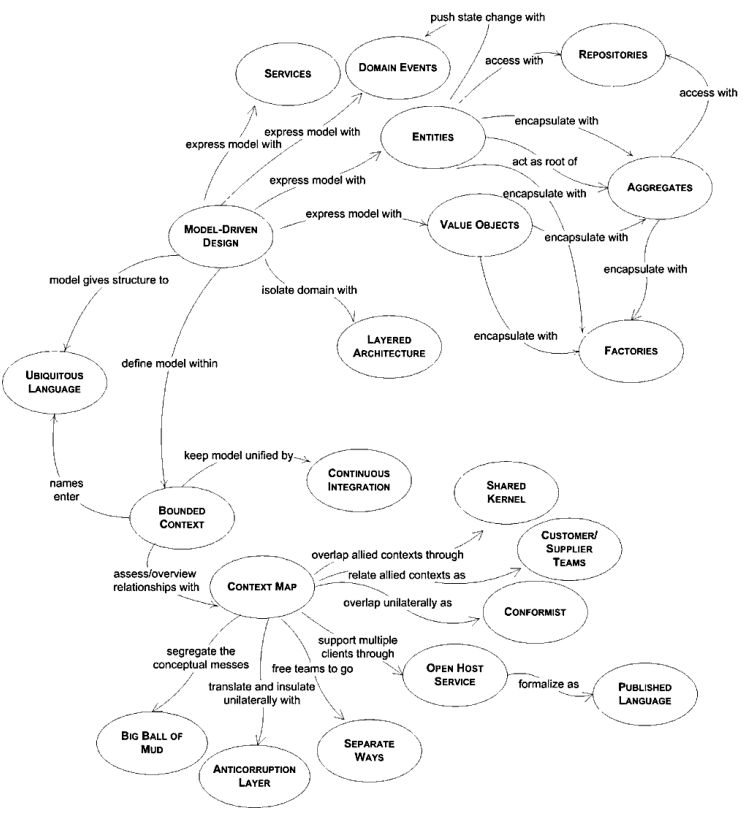

#### 领域驱动设计 DDD

- [领域驱动设计 参考手册](dddref.md)  [外文原文](DDD_Reference_2015-03.pdf)
  
  - **领域驱动设计的构建模块**
    
    - 实体、值对象、聚合
    
    - 工厂、仓库
    
    - 领域事件
    
    - 服务
    
    - 层次架构



- [视频 Developing microservices with aggregates]   
  - (https://www.bilibili.com/video/BV14V41127g6)
  - [slide](Developing microservices with aggregates.pdf)
- 阅读书籍  [微服务架构设计模式](https://bb.zucc.edu.cn/webapps/cmsmain/webui/users/j04014/softarch)
  - 第5章　微服务架构中的业务逻辑设计 / 141
    - 5.1　业务逻辑组织模式 / 142
    - 5.2　使用聚合模式设计领域模型 / 146
- [2021-04-20 DDD Overrated GOTOpia.pdf](2021-04-20 DDD Overrated GOTOpia.pdf)

#### 从壹开始 DDD  [源代码](https://gitee.com/laozhangIsPhi/ChristDDD)

- [一 ║ D3模式设计初探 与 我的计划书](https://www.cnblogs.com/laozhang-is-phi/p/9806335.html)

- [二 ║ DDD入门 & 项目结构粗搭建](https://www.cnblogs.com/laozhang-is-phi/p/9832684.html)

- [三 ║ 简单说说：领域、子域、限界上下文](https://www.cnblogs.com/laozhang-is-phi/p/9845573.html)

- [四 ║一个让你明白DDD的小故事 & EFCore初探](https://www.cnblogs.com/laozhang-is-phi/p/9872450.html)

- [五 ║聚合：实体与值对象 （上）](https://www.cnblogs.com/laozhang-is-phi/p/9888502.html)

- [六 ║聚合 与 聚合根 （下）](https://www.cnblogs.com/laozhang-is-phi/p/9916785.html)

- [七 ║项目第一次实现 & CQRS初探](https://www.cnblogs.com/laozhang-is-phi/p/9931304.html)

- [八 ║剪不断理还乱的 值对象和Dto](https://www.cnblogs.com/laozhang-is-phi/p/9962759.html)

- [九 ║从军事故事中，明白领域命令验证（上）](https://www.cnblogs.com/laozhang-is-phi/p/9984740.html)

- [十 ║领域驱动【实战篇·中】：命令总线Bus分发（一）](https://www.cnblogs.com/laozhang-is-phi/p/10000662.html)

- [十一 ║ 基于源码分析，命令分发的过程（二）](https://www.cnblogs.com/laozhang-is-phi/p/10025913.html)

- [十二 ║ 核心篇【下】：事件驱动EDA 详解](https://www.cnblogs.com/laozhang-is-phi/p/10059878.html)

### [事件建模，订单案例](https://github.com/fraktalio/order-demo)

### ~~ 函数式领域建模方法~~

- ~~函数响应式领域建模 - (美)德巴斯什·戈施(Debasish Ghosh)(2018).pdf （文档见 bb ）~~
  - ~~1.2 领域驱动设计介绍~~
- ~~translate 目录下面~~
  - ~~domain-modeling-made-functional.pdf 英文~~
  - ~~book.cn.html 中文 ~~
  - ~~欢迎参加中文翻译校对（参加者，期末附加分）~~

## 代码案例视频

### GOTO 2019 • Clean Architecture with ASP.NET Core 3.0 • Jason Taylor

https://www.bilibili.com/video/BV1NV411r7gJ?from=search&seid=15995676131754279486

https://github.com/jasontaylordev/CleanArchitecture Clean Architecture Solution Template

https://jasontaylor.dev/clean-architecture-getting-started/

#### Getting Started

6. https://github.com/jasontaylordev/CleanArchitecture  download zip file
7. Navigate to `src/WebUI/ClientApp` and run `npm start` to launch the front end (Angular)
8. Navigate to `src/WebUI` and run `dotnet run` to launch the back end (ASP.NET Core Web API)

#### 访问浏览器

```powershell
 Now listening on: https://localhost:port  # your port      
```

#### NorthwindTraders

```
cd NorthwindTraders\Src\WebUI
dotnet build
dotnet run

cd NorthwindTraders\Src\WebUI\clientApp
npm start
```

#### Sqlite

```sh
# Src\WebUI\appsettings.json
  "ConnectionStrings": {
    "NorthwindDatabase": "Data Source=./Data/Northwind.db"
  }
# \Src\Persistence\DesignTimeDbContextFactoryBase.cs
optionsBuilder.UseSqlite(connectionString);
dotnet ef database update
```

#### FAQ

```json
// global.json
{
 "sdk": {
  "version": "3.1.402"  //根据你的情况修改 sdk 版本
 }
}
```

#### SqlServer Docker

```sh
docker pull mcr.microsoft.com/mssql/server:2019-latest
docker run -e 'ACCEPT_EULA=Y' -e 'SA_PASSWORD=<YourStrong!Passw0rd>' -p 1433:1433 --name sql1 -d mcr.microsoft.com/mssql/server:2019-latest
```

#### Demo 程序

https://github.com/rafaelfgx/DotNetCoreArchitecture

https://github.com/kgrzybek/modular-monolith-with-ddd#5-how-to-run
