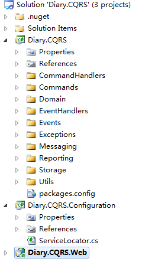

## 微服务架构设计模式 [下载](https://bb.zucc.edu.cn/webapps/cmsmain/webui/users/j04014/softarch)

- 第6章　使用事件溯源开发业务逻辑 / 176
  - 6.1　使用事件溯源开发业务逻辑概述 / 177
  - 6.2　实现事件存储库 / 194
  - 6.3　同时使用Saga和事件溯源 / 201
- 第7章　在微服务架构中实现查询 / 212
  - 7.2　使用CQRS模式 / 220
  - 7.3　设计CQRS视图 / 228

## 视频

- [Not Just Events - Developing Asynchronous Microservices](https://www.bilibili.com/video/BV1BJ411j7zD)
  - [code](https://github.com/eventuate-tram/eventuate-tram-examples-customers-and-orders/)
- [Building Microservices with Event Sourcing and CQRS](https://www.infoq.com/presentations/microservices-event-sourcing-cqrs/)

## [Event Modeling 事件建模方法](https://draft.io/wd2mpszbnr45p32bbvkhz2e7vgesdv56p7hz9t2hk292)

## [Demystifying "event” related software concepts and methodologies](https://developer.axoniq.io/w/devoxx-uk-demystifying-event-related-software-concepts-and-methodologies-by-milen-dyankov)

## CQRS架构介绍

CQRS是一种架构系统的思想，核心是让系统 读写流程分离，增加了系统的灵活性

- 隔离核心领域逻辑与应用实现机制

- 方便优化

- 提高可维护性

- 方便添加修改新特性

- https://www.cnblogs.com/yangecnu/p/Introduction-CQRS.html

- https://www.cnblogs.com/netfocus/p/4150084.html

- https://github.com/syxdevcode/Sample.Diary.CQRS

## [浅谈命令查询职责分离(CQRS)模式](https://www.cnblogs.com/youring2/p/10990984.html)

原文链接：https://www.cnblogs.com/yangecnu/p/Introduction-CQRS.html

在常用的**三层架构**中，通常都是通过数据访问层来修改或者查询数据，一般修改和查询使用的是相同的实体。在一些业务逻辑简单的系统中可能没有什么问题，但是随着系统逻辑变得复杂，用户增多，这种设计就会出现一些性能问题。虽然在DB上可以做一些读写分离的设计，但在业务上如果在读写方面混合在一起的话，仍然会出现一些问题。

本文介绍了命令查询职责分离模式(Command Query Responsibility Segregation，CQRS)，该模式从业务上分离修改 (Command，增，删，改，会对系统状态进行修改)和查询（Query，查，不会对系统状态进行修改)的行为。从而使得逻辑更加清晰，便于对不同部分进行针对性的优化。文章首先简要介绍了传统的CRUD方式存在的问题，接着介绍了CQRS模式，最后以一个简单的在线日记系统演示了如何实现CQRS模式。要谈到读写操作，首先我们来看传统的CRUD的问题。

# 一 CRUD方式的问题

在以前的管理系统中，命令(Command，通常用来更新数据，操作DB)和查询(Query)通常使用的是在数据访问层中Repository中的实体对象(这些对象是对DB中表的映射)，这些实体有可能是SQLServer中的一行数据或者多个表。

通常对DB执行的增，删，改，查（CRUD）都是针对的系统的实体对象。如通过数据访问层获取数据，然后通过数据传输对象DTO传给表现层。或者，用户需要更新数据，通过DTO对象将数据传给Model，然后通过数据访问层写回数据库，系统中的所有交互都是和数据查询和存储有关，可以认为是数据驱动（[Data-Driven](http://en.wikipedia.org/wiki/Data-driven_programming)）的，如下图：

 [

对于一些比较简单的系统，使用这种CRUD的设计方式能够满足要求。特别是通过一些代码生成工具及ORM等能够非常方便快速的实现功能。

但是传统的[CRUD方法有一些问题](http://msdn.microsoft.com/en-us/library/ms978509.aspx)：

- 使用同一个对象实体来进行数据库读写可能会太粗糙，大多数情况下，比如编辑的时候可能只需要更新个别字段，但是却需要将整个对象都穿进去，有些字段其实是不需要更新的。在查询的时候在表现层可能只需要个别字段，但是需要查询和返回整个实体对象。
- 使用同一实体对象对同一数据进行读写操作的时候，可能会遇到资源竞争的情况，经常要处理的锁的问题，在写入数据的时候，需要加锁。读取数据的时候需要判断是否允许脏读。这样使得系统的逻辑性和复杂性增加，并且会对系统吞吐量的增长会产生影响。
- 同步的，直接与数据库进行交互在大数据量同时访问的情况下可能会影响性能和响应性，并且可能会产生性能瓶颈。
- 由于同一实体对象都会在读写操作中用到，所以对于安全和权限的管理会变得比较复杂。

这里面很重要的一个问题是，**系统中的读写频率比**，是偏向读，还是偏向写，就如同一般的**数据结构在查找和修改上时间复杂度**不一样，在设计系统的结构时也需要考虑这样的问题。解决方法就是我们经常用到的对数据库进行读写分离。 让主数据库处理事务性的增，删，改操作(Insert,Update,Delete)操作，让从数据库处理查询操作(Select操作)，数据库复制被用来将事务性操作导致的变更同步到集群中的从数据库。这只是从DB角度处理了读写分离，但是从业务或者系统上面读和写仍然是存放在一起的。他们都是用的同一个实体对象。

要从业务上将读和写分离，就是接下来要介绍的命令查询职责分离模式。

# 二 什么是CQRS

CQRS最早来自于Betrand Meyer（Eiffel语言之父，[开-闭原则](http://msdn.microsoft.com/en-us/magazine/cc546578.aspx)OCP提出者）在 [Object-Oriented Software Construction](http://www.amazon.com/gp/product/0136291554) 这本书中提到的一种 [命令查询分离](http://martinfowler.com/bliki/CommandQuerySeparation.html)([Command Query Separation](http://en.wikipedia.org/wiki/Command-query_separation),CQS) 的概念。其基本思想在于，任何一个对象的方法可以分为两大类：

- 命令(Command):不返回任何结果(void)，但会改变对象的状态。
- 查询(Query):返回结果，但是不会改变对象的状态，对系统没有副作用。

根据CQS的思想，任何一个方法都可以拆分为命令和查询两部分，比如：

```
private int i = 0;
private int Increase(int value)
{
    i += value;
    return i;
}
```

这个方法，我们执行了一个命令即对变量i进行相加，同时又执行了一个Query，即查询返回了i的值，如果按照CQS的思想，该方法可以拆成Command和Query两个方法，如下：

```
private void IncreaseCommand(int value)
{
    i += value;
}
private int QueryValue()
{
    return i;
}
```

操作和查询分离使得我们能够更好的把握对象的细节，能够更好的理解哪些操作会改变系统的状态。当然[CQS](http://en.wikipedia.org/wiki/Command-query_separation)也有一些缺点，比如代码需要处理多线程的情况。

CQRS是对CQS模式的进一步改进成的一种简单模式。 它由Greg Young在[CQRS, Task Based UIs, Event Sourcing agh!](http://codebetter.com/gregyoung/2010/02/16/cqrs-task-based-uis-event-sourcing-agh/) 这篇文章中提出。“CQRS只是简单的将之前只需要创建一个对象拆分成了两个对象，这种分离是基于方法是执行命令还是执行查询这一原则来定的(这个和CQS的定义一致)”。

CQRS使用分离的接口将数据查询操作(Queries)和数据修改操作(Commands)分离开来，这也意味着在查询和更新过程中使用的数据模型也是不一样的。这样读和写逻辑就隔离开来了。

[

使用CQRS分离了读写职责之后，可以对数据进行读写分离操作来改进性能，可扩展性和安全。如下图：

[

主数据库处理CUD，从库处理R，从库的的结构可以和主库的结构完全一样，也可以不一样，从库主要用来进行只读的查询操作。在数量上从库的个数也可以根据查询的规模进行扩展，在业务逻辑上，也可以根据专题从主库中划分出不同的从库。从库也可以实现成[ReportingDatabase](http://martinfowler.com/bliki/ReportingDatabase.html)，根据查询的业务需求，从主库中抽取一些必要的数据生成一系列查询报表来存储。

[

使用ReportingDatabase的一些优点通常可以使得查询变得更加简单高效：

- ReportingDatabase的结构和数据表会针对常用的查询请求进行设计。
- ReportingDatabase数据库通常会去正规化，存储一些冗余而减少必要的Join等联合查询操作，使得查询简化和高效，一些在主数据库中用不到的数据信息，在ReportingDatabase可以不用存储。
- 可以对ReportingDatabase重构优化，而不用去改变操作数据库。
- 对ReportingDatabase数据库的查询不会给操作数据库带来任何压力。
- 可以针对不同的查询请求建立不同的ReportingDatabase库。

当然这也有一些缺点，比如从库数据的更新。如果使用SQLServer，本身也提供了一些如故障转移和复制机制来方便部署。

# 三 什么时候可以考虑CQRS

CQRS模式有一些优点：

1. 分工明确，可以负责不同的部分
2. 将业务上的命令和查询的职责分离能够提高系统的性能、可扩展性和安全性。并且在系统的演化中能够保持高度的灵活性，能够防止出现CRUD模式中，对查询或者修改中的某一方进行改动，导致另一方出现问题的情况。
3. 逻辑清晰，能够看到系统中的那些行为或者操作导致了系统的状态变化。
4. 可以从数据驱动(Data-Driven) 转到任务驱动(Task-Driven)以及事件驱动([Event-Driven](http://en.wikipedia.org/wiki/Event-driven_programming)).

在下场景中，可以考虑使用CQRS模式：

1. 当在业务逻辑层有很多操作需要相同的实体或者对象进行操作的时候。CQRS使得我们可以对读和写定义不同的实体和方法，从而可以减少或者避免对某一方面的更改造成冲突
2. 对于一些基于任务的用户交互系统，通常这类系统会引导用户通过一系列复杂的步骤和操作，通常会需要一些复杂的领域模型，并且整个团队已经熟悉领域驱动设计技术。写模型有很多和业务逻辑相关的命令操作的堆，输入验证，业务逻辑验证来保证数据的一致性。读模型没有业务逻辑以及验证堆，仅仅是返回DTO对象为视图模型提供数据。读模型最终和写模型相一致。
3. 适用于一些需要对查询性能和写入性能分开进行优化的系统，尤其是读/写比非常高的系统，横向扩展是必须的。比如，在很多系统中读操作的请求时远大于写操作。为适应这种场景，可以考虑将写模型抽离出来单独扩展，而将写模型运行在一个或者少数几个实例上。少量的写模型实例能够减少合并冲突发生的情况
4. 适用于一些团队中，一些有经验的开发者可以关注复杂的领域模型，这些用到写操作，而另一些经验较少的开发者可以关注用户界面上的读模型。
5. 对于系统在将来会随着时间不段演化，有可能会包含不同版本的模型，或者业务规则经常变化的系统
6. 需要和其他系统整合，特别是需要和事件溯源Event Sourcing进行整合的系统，这样子系统的临时异常不会影响整个系统的其他部分。

但是在以下场景中，可能**不适宜**使用CQRS：

1. 领域模型或者业务逻辑比较简单，这种情况下使用CQRS会把系统搞**复杂**。
2. 对于简单的，CRUD模式的用户界面以及与之相关的数据访问操作已经足够的话，没必要使用CQRS，这些都是一个简单的对数据进行增删改查。
3. 不适合在整个系统中到处使用该模式。在整个数据管理场景中的特定模块中CQRS可能比较有用。但是在有些地方使用CQRS会增加系统不必要的复杂性。

# 四 CQRS与Event Sourcing的关系

在CQRS中，查询方面，直接通过方法查询数据库，然后通过DTO将数据返回。在操作(Command)方面，是通过发送Command实现，由CommandBus处理特定的Command，然后由Command将特定的Event发布到EventBus上，然后EventBus使用特定的Handler来处理事件，执行一些诸如，修改，删除，更新等操作。这里，所有与Command相关的操作都通过Event实现。这样我们可以通过记录Event来记录系统的运行历史记录，并且能够方便的回滚到某一历史状态。[Event Sourcing](http://msdn.microsoft.com/en-us/library/dn589792.aspx)就是用来进行**存储和管理事件**的。这里不展开介绍。

# 五 CQRS的简单实现

CQRS模式在思想上比较简单，但是实现上还是有些复杂。它涉及到DDD，以及Event Sourcing，这里使用codeproject上的 [Introduction to CQRS](http://www.codeproject.com/Articles/555855/Introduction-to-CQRS) 这篇文章的例子来说明CQRS模式。这个例子是一个简单的在线记日志(Diary)系统，实现了日志的增删改查功能。整体结构如下：

[](https://images0.cnblogs.com/blog/94031/201408/261851443918700.jpg)

上图很清晰的说明了CQRS在读写方面的分离，在读方面，通过QueryFacade到数据库里去读取数据，这个库有可能是ReportingDB。在写方面，比较复杂，操作通过Command发送到CommandBus上，然后特定的CommandHandler处理请求，产生对应的Event，将Eevnt持久化后，通过EventBus特定的EevntHandler对数据库进行修改等操作。

例子代码可以到[codeproject](http://www.codeproject.com/Articles/555855/Introduction-to-CQRS)上下载，整体结构如下：

[

由三个项目构成，Diary.CQRS包含了所有的Domain和消息对象。Configuration通过使用一个名为StructMap的IOC来初始化一些变量方便Web调用，Web是一个简单的MVC3项目，在Controller中有与CQRS交互的代码。

下面分别看Query和Command方面的实现：

## Query方向的实现[#](https://www.cnblogs.com/youring2/p/10990984.html#312720677)

查询方面很简单，日志列表和明细获取就是简单的查询。下面先看列表查询部分的代码。

```
public ActionResult Index()
{
    ViewBag.Model = ServiceLocator.ReportDatabase.GetItems();
    return View();
}

public ActionResult Edit(Guid id)
{
    var item = ServiceLocator.ReportDatabase.GetById(id);
    var model = new DiaryItemDto()
    {
        Description = item.Description,
        From = item.From,
        Id = item.Id,
        Title = item.Title,
        To = item.To,
        Version = item.Version
    };
    return View(model);
}
```

ReportDatabase的GetItems和GetById(id)方法就是简单的查询，从命名可以看出他是ReportDatabase。

```
public class ReportDatabase : IReportDatabase
{
    static List<DiaryItemDto> items = new List<DiaryItemDto>();

    public DiaryItemDto GetById(Guid id)
    {
        return items.Where(a => a.Id == id).FirstOrDefault();
    }

    public void Add(DiaryItemDto item)
    {
        items.Add(item);
    }

    public void Delete(Guid id)
    {
        items.RemoveAll(i => i.Id == id);
    }

    public List<DiaryItemDto> GetItems()
    {
        return items;
    } 
}
```

ReportDataBase只是在内部维护了一个List的DiaryItemDto列表。在使用的时候，是通过IRepositoryDatabase对其进行操作的，这样便于mock代码。

Query方面的代码很简单。在实际的应用中，这一块就是直接对DB进行查询，然后通过DTO对象返回，这个DB可能是应对特定场景的报表数据库，这样可以提升查询性能。

下面来看Command方向的实现：

## Command方向的实现[#](https://www.cnblogs.com/youring2/p/10990984.html#139917754)

Command的实现比较复杂，下面以简单的创建一个新的日志来说明。

在MVC的Control中，可以看到Add的Controller中只调用了一句话:

```
[HttpPost]
public ActionResult Add(DiaryItemDto item)
{
    ServiceLocator.CommandBus.Send(new CreateItemCommand(Guid.NewGuid(), item.Title, item.Description, -1, item.From, item.To));

    return RedirectToAction("Index");
}
```

首先声明了一个CreateItemCommand，这个Command只是保存了一些必要的信息。

```
public class CreateItemCommand:Command
{
    public string Title { get; internal set; }
    public string Description { get;internal set; }
    public DateTime From { get; internal set; }
    public DateTime To { get; internal set; }

    public CreateItemCommand(Guid aggregateId, string title, 
        string description,int version,DateTime from, DateTime to)
        : base(aggregateId,version)
    {
        Title = title;
        Description = description;
        From = from;
        To = to;
    }
}
```

然后将Command发送到了CommandBus上，其实就是让CommandBus来选择合适的CommandHandler来处理。

```
public class CommandBus:ICommandBus
{
    private readonly ICommandHandlerFactory _commandHandlerFactory;

    public CommandBus(ICommandHandlerFactory commandHandlerFactory)
    {
        _commandHandlerFactory = commandHandlerFactory;
    }

    public void Send<T>(T command) where T : Command
    {
        var handler = _commandHandlerFactory.GetHandler<T>();
        if (handler != null)
        {
            handler.Execute(command);
        }
        else
        {
            throw new UnregisteredDomainCommandException("no handler registered");
        }
    }        
}
```

这个里面需要值得注意的是CommandHandlerFactory这个类型的GetHandler方法，他接受一个类型为T的泛型，这里就是我们之前传入的CreateItemCommand。来看他的GetHandler方法。

```
public class StructureMapCommandHandlerFactory : ICommandHandlerFactory
{
    public ICommandHandler<T> GetHandler<T>() where T : Command
    {
        var handlers = GetHandlerTypes<T>().ToList();

        var cmdHandler = handlers.Select(handler => 
            (ICommandHandler<T>)ObjectFactory.GetInstance(handler)).FirstOrDefault();

        return cmdHandler;
    }

    private IEnumerable<Type> GetHandlerTypes<T>() where T : Command
    {
        var handlers = typeof(ICommandHandler<>).Assembly.GetExportedTypes()
            .Where(x => x.GetInterfaces()
                .Any(a => a.IsGenericType && a.GetGenericTypeDefinition() == typeof(ICommandHandler<>) ))
                .Where(h=>h.GetInterfaces()
                    .Any(ii=>ii.GetGenericArguments()
                        .Any(aa=>aa==typeof(T)))).ToList();


        return handlers;
    }

}
```

这里可以看到，他首先查找当前的程序集中(ICommandHandler)所在的程序集中的所有的实现了ICommandHandler的接口的类型，然后在所有的类型找查找实现了该泛型接口并且泛型的类型参数类型为T类型的所有类型。以上面的代码为例，就是要找出实现了ICommandHandler<CreateItemCommand>接口的类型。可以看到就是CreateItemCommandHandler类型。

```
public class CreateItemCommandHandler : ICommandHandler<CreateItemCommand>
{
    private IRepository<DiaryItem> _repository;

    public CreateItemCommandHandler(IRepository<DiaryItem> repository)
    {
        _repository = repository;
    }

    public void Execute(CreateItemCommand command)
    {
        if (command == null)
        {
            throw new ArgumentNullException("command");
        }
        if (_repository == null)
        {
            throw new InvalidOperationException("Repository is not initialized.");
        }
        var aggregate = new DiaryItem(command.Id, command.Title, command.Description, command.From, command.To);
        aggregate.Version = -1;
        _repository.Save(aggregate, aggregate.Version);
    }
}
```

找到之后然后使用IOC实例化了该对象返回。

现在CommandBus中，找到了处理特定Command的Handler。然后执行该类型的Execute方法。

可以看到在该类型中实例化了一个名为aggregate的DiaryItem对象。这个和我们之前查询所用到的DiaryItemDto有所不同，这个一个领域对象，里面包含了一系列事件。

```
public class DiaryItem : AggregateRoot, 
    IHandle<ItemCreatedEvent>,
    IHandle<ItemRenamedEvent>,
    IHandle<ItemFromChangedEvent>, 
    IHandle<ItemToChangedEvent>,
    IHandle<ItemDescriptionChangedEvent>,
    IOriginator
{
    public string Title { get; set; }

    public DateTime From { get; set; }
    public DateTime To { get; set; }
    public string Description { get; set; }

    public DiaryItem()
    {

    }

    public DiaryItem(Guid id,string title, string description,  DateTime from, DateTime to)
    {
        ApplyChange(new ItemCreatedEvent(id, title,description, from, to));
    }

    public void ChangeTitle(string title)
    {
        ApplyChange(new ItemRenamedEvent(Id, title));
    }

    public void Handle(ItemCreatedEvent e)
    {
        Title = e.Title;
        From = e.From;
        To = e.To;
        Id = e.AggregateId;
        Description = e.Description;
        Version = e.Version;
    }

    public void Handle(ItemRenamedEvent e)
    {
        Title = e.Title;
    }
    ...
}
```

ItemCreatedEvent 事件的定义如下，其实就是用来存储传输过程中需要用到的数据。

```
public class ItemCreatedEvent:Event
{
    public string Title { get; internal set; }
    public DateTime From { get; internal set; }
    public DateTime To { get; internal set; }
    public string Description { get;internal set; }

    public ItemCreatedEvent(Guid aggregateId, string title ,
        string description, DateTime from, DateTime to)
    {
        AggregateId = aggregateId;
        Title = title;
        From = from;
        To = to;
        Description = description;
    }
}
```

可以看到在Domain对象中，除了定义基本的字段外，还定义了一些相应的事件，比如在构造函数中，实际上是发起了一个名为ItemCreateEvent的事件，同时还定义了处理时间的逻辑，这些逻辑都放在名为Handle的接口方法发，例如ItemCerateEvent的处理方法为Handle(ItemCreateEvent)方法。

ApplyChange方法在AggregateRoot对象中，他是聚集根，这是DDD中的概念。通过这个根可以串起所有对象。 该类实现了IEventProvider接口，他保存了所有在_changes中的所有没有提交的变更，其中的ApplyChange的用来为特定的Event查找Eventhandler的方法：

```
public abstract class AggregateRoot : IEventProvider
{
    private readonly List<Event> _changes;

    public Guid Id { get; internal set; }
    public int Version { get; internal set; }
    public int EventVersion { get; protected set; }

    protected AggregateRoot()
    {
        _changes = new List<Event>();
    }

    public IEnumerable<Event> GetUncommittedChanges()
    {
        return _changes;
    }

    public void MarkChangesAsCommitted()
    {
        _changes.Clear();
    }

    public void LoadsFromHistory(IEnumerable<Event> history)
    {
        foreach (var e in history) ApplyChange(e, false);
        Version = history.Last().Version;
        EventVersion = Version;
    }

    protected void ApplyChange(Event @event)
    {
        ApplyChange(@event, true);
    }

    private void ApplyChange(Event @event, bool isNew)
    {
        dynamic d = this;

        d.Handle(Converter.ChangeTo(@event, @event.GetType()));
        if (isNew)
        {
            _changes.Add(@event);
        }
    }
}
```

在ApplyChange的实现中，this其实就是对应的实现了AggregateRoot的DiaryItem的Domain对象，调用的Handle方法就是我们之前在DiaryItem中定义的行为。然后将该event保存在内部的未提交的事件列表中。相关的信息及事件都保存在了定义的aggregate对象中并返回。

然后Command继续执行，然后调用了_repository.Save(aggregate, aggregate.Version);这个方法。先看这个Repository对象。

```
public class Repository<T> : IRepository<T> where T : AggregateRoot, new()
{
    private readonly IEventStorage _storage;
    private static object _lockStorage = new object();

    public Repository(IEventStorage storage)
    {
        _storage = storage;
    } 

    public void Save(AggregateRoot aggregate, int expectedVersion)
    {
        if (aggregate.GetUncommittedChanges().Any())
        {
            lock (_lockStorage)
            {
                var item = new T();

                if (expectedVersion != -1)
                {
                    item = GetById(aggregate.Id);
                    if (item.Version != expectedVersion)
                    {
                        throw new ConcurrencyException(string.Format("Aggregate {0} has been previously modified",
                                                                        item.Id));
                    }
                }

                _storage.Save(aggregate);
            }
        }
    }

    public T GetById(Guid id)
    {
        IEnumerable<Event> events;
        var memento = _storage.GetMemento<BaseMemento>(id);
        if (memento != null)
        {
            events = _storage.GetEvents(id).Where(e=>e.Version>=memento.Version);
        }
        else
        {
            events = _storage.GetEvents(id);
        }
        var obj = new T();
        if(memento!=null)
            ((IOriginator)obj).SetMemento(memento);

        obj.LoadsFromHistory(events);
        return obj;
    }
}
```

这个方法主要是用来对事件进行持久化的。 所有的聚合的变动都会存在该Repository中，首先，检查当前的聚合是否和之前存储在storage中的聚合一致，如果不一致，则表示对象在其他地方被更改过，抛出ConcurrencyException，否则将该变动保存在Event Storage中。

IEventStorage用来存储所有的事件，其实现类型为InMemoryEventStorage。

```
public class InMemoryEventStorage:IEventStorage
{
    private List<Event> _events;
    private List<BaseMemento> _mementos;

    private readonly IEventBus _eventBus;

    public InMemoryEventStorage(IEventBus eventBus)
    {
        _events = new List<Event>();
        _mementos = new List<BaseMemento>();
        _eventBus = eventBus;
    }

    public IEnumerable<Event> GetEvents(Guid aggregateId)
    {
        var events = _events.Where(p => p.AggregateId == aggregateId).Select(p => p);
        if (events.Count() == 0)
        {
            throw new AggregateNotFoundException(string.Format("Aggregate with Id: {0} was not found", aggregateId));
        }
        return events;
    }

    public void Save(AggregateRoot aggregate)
    {
        var uncommittedChanges = aggregate.GetUncommittedChanges();
        var version = aggregate.Version;

        foreach (var @event in uncommittedChanges)
        {
            version++;
            if (version > 2)
            {
                if (version % 3 == 0)
                {
                    var originator = (IOriginator)aggregate;
                    var memento = originator.GetMemento();
                    memento.Version = version;
                    SaveMemento(memento);
                }
            }
            @event.Version=version;
            _events.Add(@event);
        }
        foreach (var @event in uncommittedChanges)
        {
            var desEvent = Converter.ChangeTo(@event, @event.GetType());
            _eventBus.Publish(desEvent);
        }
    }

    public T GetMemento<T>(Guid aggregateId) where T : BaseMemento
    {
        var memento = _mementos.Where(m => m.Id == aggregateId).Select(m=>m).LastOrDefault();
        if (memento != null)
            return (T) memento;
        return null;
    }

    public void SaveMemento(BaseMemento memento)
    {
        _mementos.Add(memento);
    }
}
```

在GetEvent方法中，会找到所有的聚合根Id相关的事件。在Save方法中，将所有的事件保存在内存中，然后每隔三个事件建立一个快照。可以看到这里面使用了备忘录模式。

然后在foreach循环中，对于所有的没有提交的变更，EventBus将该事件发布出去。

现在，所有的发生变更的事件已经记录下来了。事件已经被发布到EventBus上，然后对应的EventHandler再处理对应的事件，然后与DB交互。现在来看EventBus的Publish方法。

```
public class EventBus:IEventBus
{
    private IEventHandlerFactory _eventHandlerFactory;

    public EventBus(IEventHandlerFactory eventHandlerFactory)
    {
        _eventHandlerFactory = eventHandlerFactory;
    }

    public void Publish<T>(T @event) where T : Event
    {
        var handlers = _eventHandlerFactory.GetHandlers<T>();
        foreach (var eventHandler in handlers)
        {
            eventHandler.Handle(@event);
        }
    }
}
```

可以看到EventBus的Publish和CommandBus中的Send方法很相似，都是首先通过EventHandlerFactory查找对应Event的Handler，然后调用其Handler方法。比如

```
public class StructureMapEventHandlerFactory : IEventHandlerFactory
{
    public IEnumerable<IEventHandler<T>> GetHandlers<T>() where T : Event
    {
        var handlers = GetHandlerType<T>();

        var lstHandlers = handlers.Select(handler => (IEventHandler<T>) ObjectFactory.GetInstance(handler)).ToList();
        return lstHandlers;
    }

    private static IEnumerable<Type> GetHandlerType<T>() where T : Event
    {

        var handlers = typeof(IEventHandler<>).Assembly.GetExportedTypes()
            .Where(x => x.GetInterfaces()
                .Any(a => a.IsGenericType && a.GetGenericTypeDefinition() == typeof(IEventHandler<>)))
                .Where(h => h.GetInterfaces()
                    .Any(ii => ii.GetGenericArguments()
                        .Any(aa => aa == typeof(T))))
                 .ToList();
        return handlers;
    }
}
```

然后返回并实例化了ItemCreatedEventHandler 对象，该对象的实现如下：

```
public class ItemCreatedEventHandler : IEventHandler<ItemCreatedEvent>
{
    private readonly IReportDatabase _reportDatabase;
    public ItemCreatedEventHandler(IReportDatabase reportDatabase)
    {
        _reportDatabase = reportDatabase;
    }
    public void Handle(ItemCreatedEvent handle)
    {
        DiaryItemDto item = new DiaryItemDto()
            {
                Id = handle.AggregateId,
                Description =  handle.Description,
                From = handle.From,
                Title = handle.Title,
                To=handle.To,
                Version =  handle.Version
            };

        _reportDatabase.Add(item);
    }
}
```

可以看到在Handler方法中，从事件中获取参数，然后新建DTO对象，然后将该对象更新到DB中。

到此，整个Command执行完成。

# 六 结语

CQRS是一种思想很简单清晰的设计模式，他通过在业务上分离操作和查询来使得系统具有更好的可扩展性及性能，使得能够对系统的不同部分进行扩展和优化。在CQRS中，所有的涉及到对DB的操作都是通过发送Command，然后特定的Command触发对应事件来完成操作，这个过程是异步的，并且所有涉及到对系统的变更行为都包含在具体的事件中，结合Eventing Source模式，可以记录下所有的事件，而不是以往的某一点的数据信息，这些信息可以作为系统的操作日志，可以来对系统进行回退或者重放。

CQRS 模式在实现上有些复杂，很多地方比如AggregationRoot、Domain Object都涉及到DDD中的相关概念，本人对DDD不太懂。这里仅为了演示CQRS模式，所以使用的例子是codeproject上的，末尾列出了一些参考文章，如果您想了解更多，可以有针对性的阅读。

最后，希望CQRS模式能让您在设计高性能，可扩展性的程序时能够多一种选择和考虑。

# 七 参考文献

1. Introduction to CQRS http://www.codeproject.com/Articles/555855/Introduction-to-CQRS
2. CQRS http://martinfowler.com/bliki/CQRS.html
3. CQRS Journey http://msdn.microsoft.com/en-us/library/jj554200.aspx
4. Command and Query Responsibility Segregation (CQRS) Pattern http://msdn.microsoft.com/en-us/library/dn568103.aspx
5. EntityFramework之领域驱动设计实践：CQRS体系结构模式 http://www.cnblogs.com/daxnet/archive/2010/08/02/1790299.html
6. Event Sourcing Pattern http://msdn.microsoft.com/en-us/library/dn589792.aspx
