## [CQRS\ES架构介绍](https://www.cnblogs.com/netfocus/p/4150084.html)

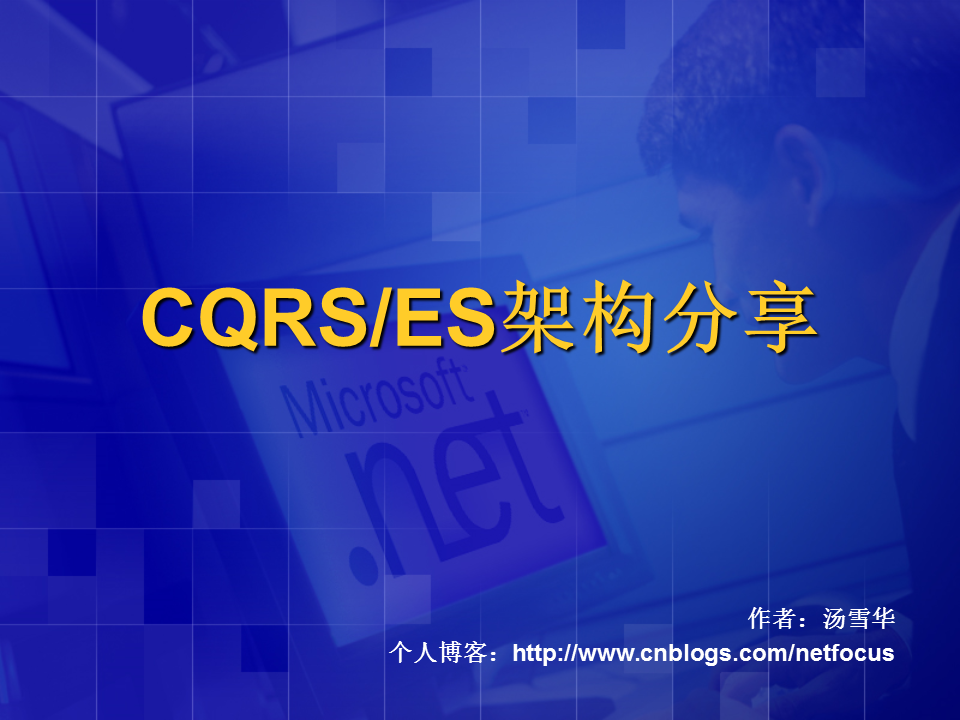

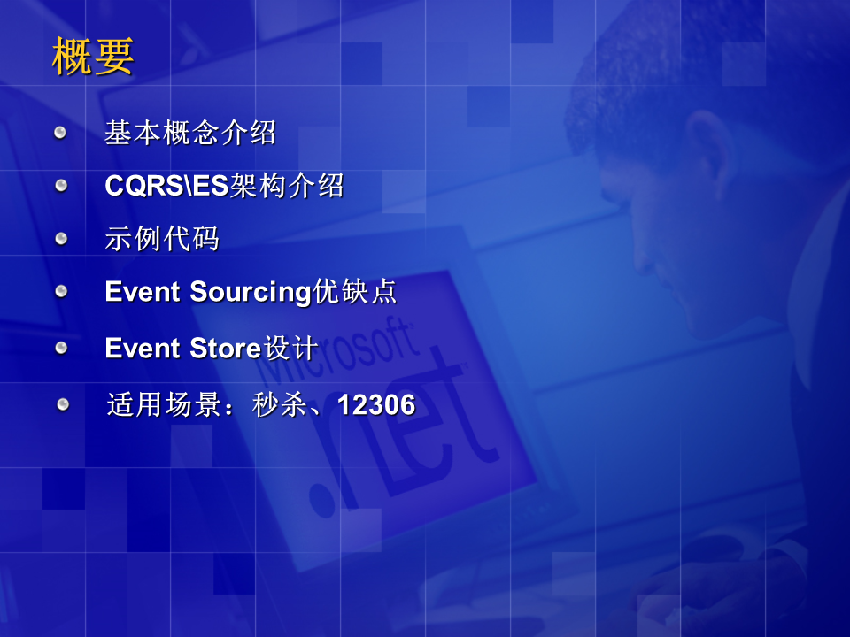

上面的提纲是今天主要分享的内容概要。开始之前想先说一下微服务架构和CQRS架构的区别和联系。

微服务架构现在很热，到处可以看到各大互联网公司的微服务道路的分享总结。但是，我今天的分享和微服务没有关系，希望可以带给大家一些新的东西。如果一定要说微服务和CQRS架构的关系，那我觉得微服务是一种边界思维，微服务的目的是为了从业务角度拆分（职责分离）当前业务领域的不同业务模块到不同的服务，每个微服务之间的数据完全独立，它们之间的交互可以通过SOA RPC调用（耦合比较高），也可以通过EDA 消息驱动（耦合比较低）；

微服务架构和CQRS架构的关系：每个微服务内部，我们可以用CQRS/ES架构来实现，也可以用传统三层架构来实现；

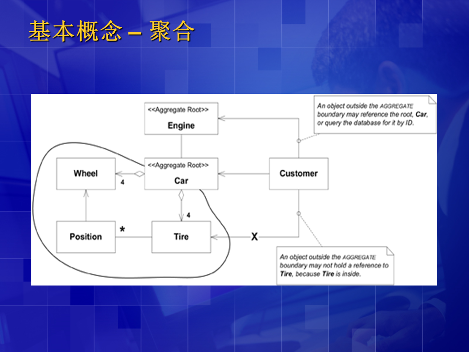

首先，我们需要先理解DDD中的聚合、聚合根这两个概念。

**聚合**，它通过定义对象之间清晰的所属关系和边界来实现**领域模型**的内聚，并避免了错综复杂的难以维护的对象关系网的形成。聚合定义了一组具有内聚关系的相关对象的集合，我们把聚合看作是一个修改数据的最小原子单元。聚合根，每个聚合都有一个**根对象**，根对象管理聚合内的其他**子对象（实体、值对象）**；**聚合之间的交互都是通过聚合根来交互**，不能绕过聚合根去直接和聚合下的子实体进行交互。上面的例子中，Car、Wheel、Position、Tire四个对象构成一个聚合，其中Car是聚合根；Customer也是聚合根，Customer不能直接访问Car下的Tire（子实体），而是只能通过聚合根Car来访问。

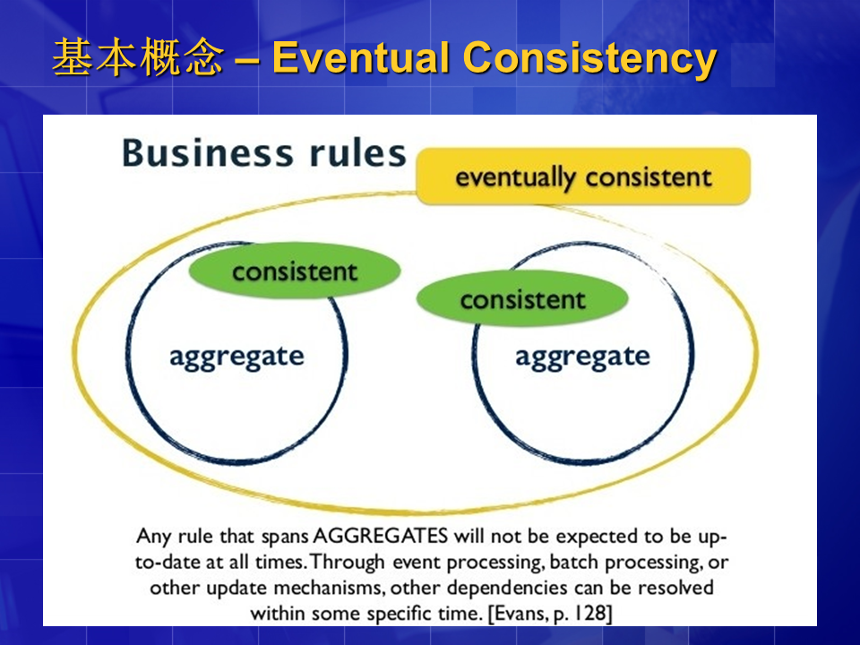

上面表达了一个关于聚合的一致性设计原则：**聚合内的数据修改，是ACID强一致性的**；跨聚合的数据修改，是**最终一致性**的。遵守这个原则，可以让我们最大化的降低并发冲突，从而最大化的提高整个系统的吞吐。

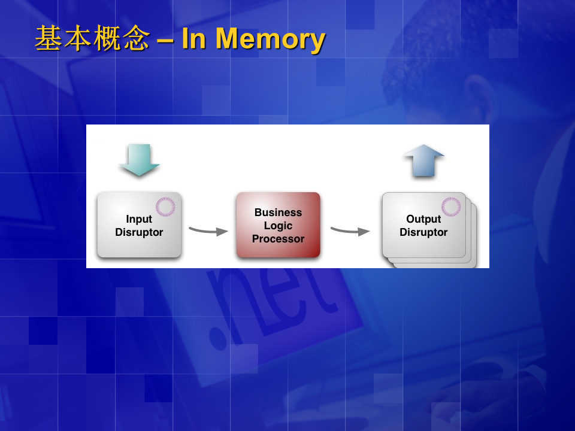

**In-Memory**的意思是指整个系统中的所有的聚合根对象都活在内存。而不是像我们平时那样，用到的时候才从DB获取对象，然后再做修改，再保存回去。

在In-Memory的架构下，当要修改某个聚合根的状态时，它已经在内存，我们可以直接拿到该对象的引用，且框架会尽量保证聚合根对象的状态就是最新的。聚合根是在内存中的最小计算单元，每个聚合内部都封装了业务规则，并保证数据的强一致性。

上图我是挪用了之前比较或的LMAX架构中的一个图，表达的思想就是in-memory架构。其中Business Logic Processor就是中央业务逻辑处理器，内部承载了大量在机器内存中活着的聚合根对象。

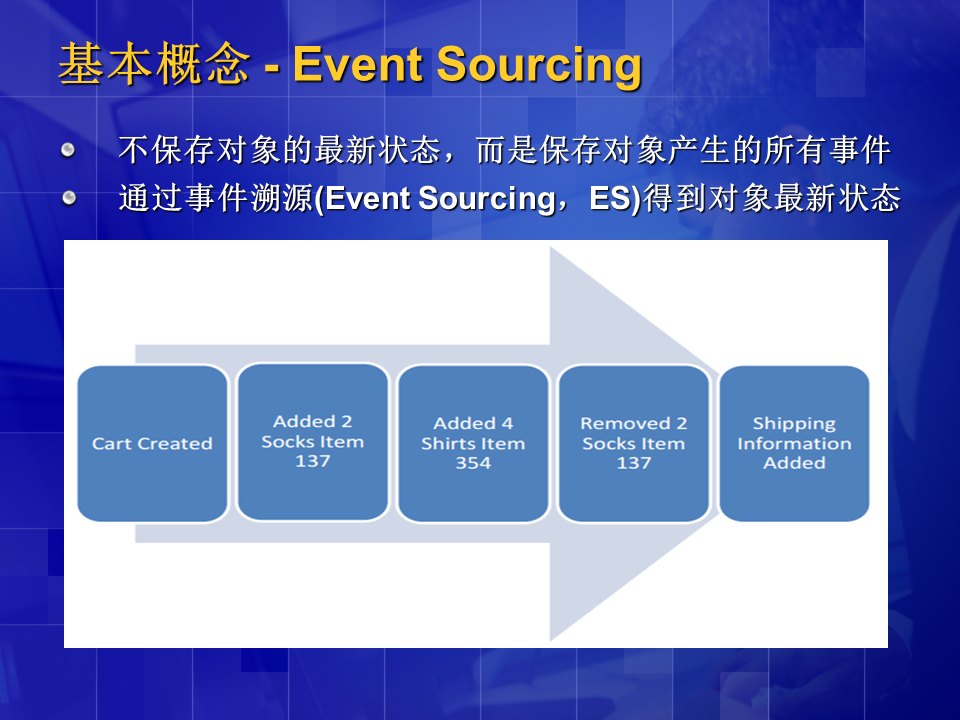

接下来，我们再来看一下什么是事件溯源。

一个对象从创建开始到消亡会经历很多事件，以前我们是在每次对象参与完一个业务动作后把对象的最新状态持久化保存到数据库中，也就是说我们的数据库中的数据是反映了对象的当前最新的状态。而事件溯源则相反，**不是保存对象的最新状态，而是保存这个对象所经历的每个事件**，所有的由对象产生的事件会按照时间先后顺序有序的存放在数据库中。可以看出，事件溯源的这种做法是更符合事实观的，因为它完整的描述了对象的整个生命周期过程中所经历的所有事件。

那么，事件到底如何影响一个领域对象的状态的呢？很简单，当我们在**触发某个领域对象的某个行为**时，该领域对象会**先产生一个事件**，然后该对象自己响应该事件并更新其自己的状态，同时我们还会持久化在该对象上所发生的每一个事件；这样当我们要重新得到该对象的最新状态时，只要先创建一个空的对象，然后将和该对象相关的**所有事件按照事件发生先后顺序从先到后再全部应用一遍**即可还原得到该对象的最新状态，这个过程就是所谓的**事件溯源**。

另一方面，因为是用事件来表示对象的状态，而**事件是只会增加不会修改**。这就能让数据库里的表示对象的数据非常稳定，不可能存在DELETE或UPDATE等操作。因为一个事件就是表示一个事实，事实是不能被磨灭或修改的。这种特性可以让领域模型非常稳定，在数据库级别不会产生并发更新同一条数据的问题。

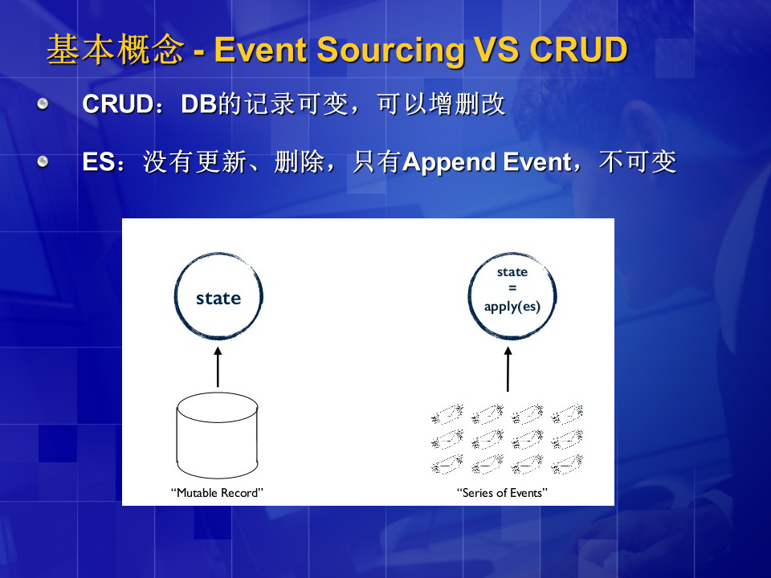

通过上面这个图，大家应该可以更直观的理解事件溯源和传统CRUD思想的区别。

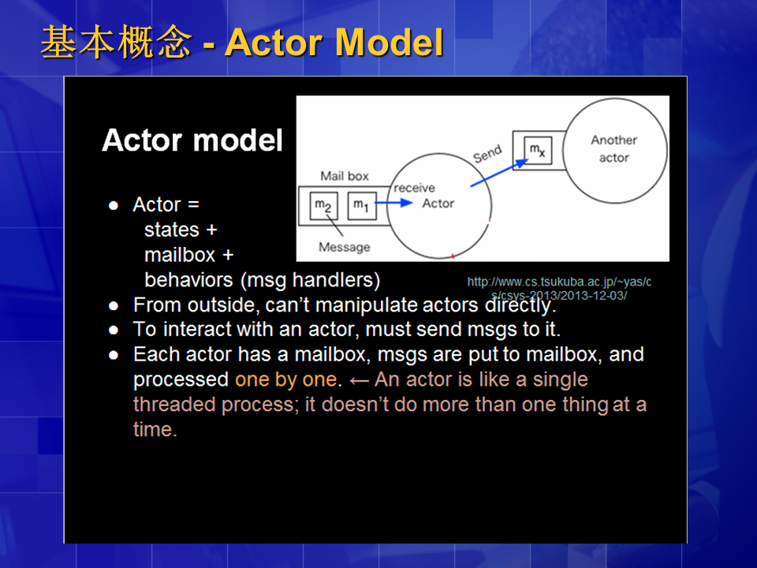

Actor模型，这个概念大家应该都了解。Actor模型的核心思想是，**对象直接不会直接调用来通信，而是通过发消息来通信**。每个Actor都有一个Mailbox，它收到的所有的消息都会先放入Mailbox中，然后**Actor内部单线程处理Mailbox中的消息**。从而保证对同一个Actor的任何消息的处理，都是线性的，**无并发冲突**。从全局上来看，就是整个系统中，有很多的Actor，每个Actor都在处理自己Mailbox中的消息，Actor之间通过发消息来通信。

Akka框架就是实现Actor模型的并行开发框架，并且Akka框架融入了聚合、In-Memory、Event Sourcing这些概念。Actor非常适合作为DDD聚合根。**Actor的状态修改是由事件驱动的**，事件被持久化起来，然后通过Event Sourcing的技术，还原特定Actor的最新状态到内存。

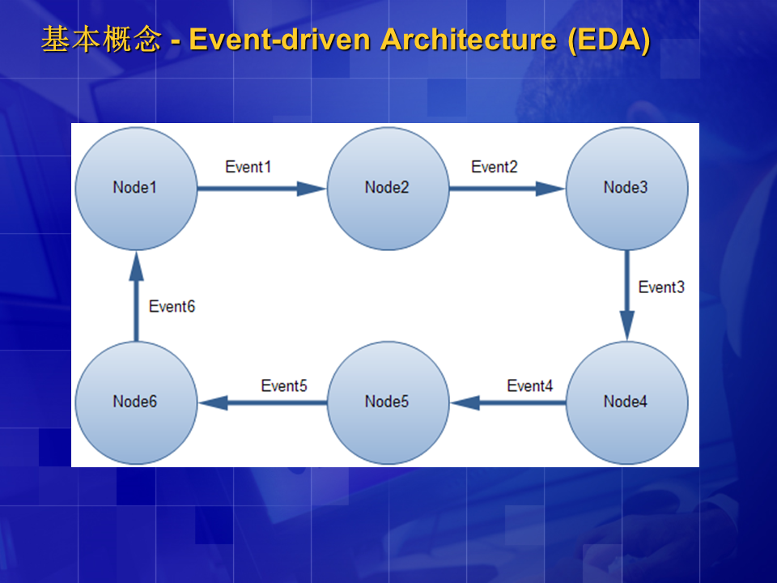

上图表达的是事件驱动的架构的思想。**Node表示节点，每个节点负责处理逻辑**；Event表示消息，节点之间通过消息进行通信。消息通过**分布式消息队列如RocketMQ，Equeue**进行通信。

## 事件驱动架构的**核心思想**是：

1. 不同于SOA架构，EDA架构是**pub-sub模式**；Node1处理完逻辑后产生消息，Node2订阅消息并进行处理，Node1**不知道**Node2的存在；
2. **最终一致性**原则，Node1，Node2之间的**数据一致性通过MQ最终保证**一致；
3. 如何保证最终一致性（消息链不会断开）：
   - 1）MQ保证消息不丢；
   - 2）任何一个Node要保证自己完全处理完后才发送ACK给MQ；
   - 3）每个Node做到对任何消息处理的**幂等性**；
5. 整个架构具有所有分布式MQ所带来的优点：如异步解耦、削峰、降低整个系统的整体部署成本；

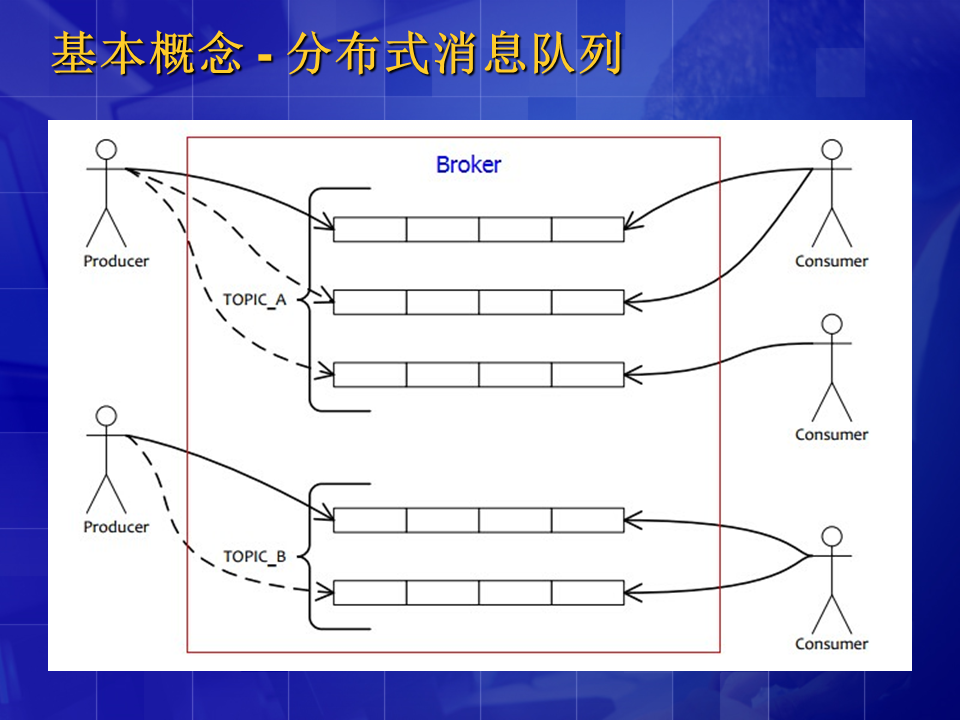

上图是一个面向Topic的分布式MQ的逻辑架构图，采用这种架构的MQ有：**Kafka，RocketMQ，EQueue**

1. Producer发送消息到某个Topic的某个Queue；
2. 消息都存储在Broker上；
3. Consumer从Broker拉取消息进行消费，并支持消费者负载均衡；

好了，上面是基本概念的介绍。接下来我们来看一下CQRS/ES架构。

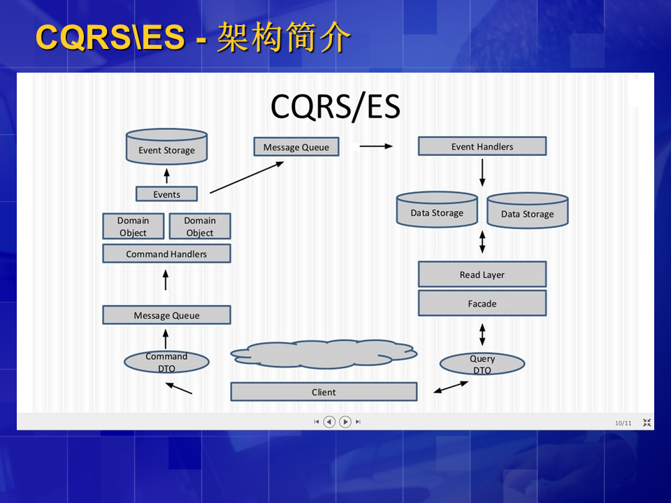

上图是CQRS架构的典型架构图。

### 什么是CQRS架构？

CQRS本身只是一个读写分离的架构思想，全称是：**Command Query Responsibility Segregation，即命令查询职责分离**，表示在架构层面，将一个系统分为**写入（命令）和查询**两部分。一个命令表示一种意图，表示命令系统做什么修改，命令的执行结果通常**不需要返回**；一个查询表示向系统查询数据并返回。

CQRS架构中，另外一个重要的概念就是事件，事件表示**命令操作领域中的聚合根，然后聚合根的状态发生变化后产生的事件**。

### 采用CQRS架构的一个前提

由于**CQRS架构**的一致性模型为**最终一致性**，所以，你的系统要接受查询到的数据**可能不是最新的**，而是有几个毫秒的延迟。之所以会有这个前提，是因为CQRS架构考虑到，作为一个多用户同时访问的互联网应用，当在**高并发**修改数据的情况下，比如**秒杀、12306购票**等场景，用户UI上看到的数据总是旧的。比如你秒杀时提交订单前看到库存还大于0，但是当你提交订单时，系统提示你宝贝卖完了。这个就说明，在这种高并发修改同一资源的情况下，**任何人看到的数据总是Stale的，即旧的**。

### CQRS作为一种架构思想，可以有多种实现方式

- 最常见的CQRS架构是数据库的读写分离；
- 系统底层存储不分离，但是上层逻辑代码分离；
- 系统**底层存储分离**，C端采用Event Sourcing的技术，在EventStore中存储事件；Q端存储对象的最新状态，用于提供查询支持；

### CQRS架构的适用场景

- 当我们的应用的写模型和读模型差别比较大时；
- 当我们希望实践DDD时；因为CQRS架构可以让我们实现领域模型不受任何ORM框架带来的对象和数据库的阻抗失衡的影响；
- 当我们希望对系统的查询性能和写入性能分开进行优化时，尤其是**读/写比非常高的系统**，CQ分离是必须的；
- 当我们希望我们的系统同时满足高并发的写、高并发的读的时候；因为CQRS架构可以做到C端最大化的写，Q端非常方便的提供可扩展的读模型；

这里我主要分享的CQRS架构是上面第3种实现方式，也就是上图所画的架构。在我心目中，只有第三种才是真正意义上的CQRS架构。

### 下面简单描述一下上面的CQRS架构的数据流

**C端的命令的执行流程**

客户端如（MVC Controller）发送命令通知系统做修改：

1. 发送命令到**分布式MQ**；
2. 然后命令的订阅者处理命令；
3. 订阅者内部根据不同的命令调用不同的Command Handler进行处理；
4. Command Handler内部根据命令所指定的聚合根ID从**In-Memory内存**中直接获取聚合根对象的引用，然后操作聚合根对象；
5. 聚合根对象状态发生变化并**产生事件**；
6. 框架负责自动持久化事件到Event Storage（简称EventStore）；
7. 框架负责将事件发布到**Event MQ**；
8. Event订阅者订阅事件，然后调用对应的Event Handler进行处理，如更新**Data Storage**（保存了聚合根的最新状态，通常叫读库，ReadDB）；

**Q端的查询的执行流程**

客户端如（MVC Controller）发出查询请求系统返回数据：

1. 调用轻薄的Query Service，传如Query DTO；
2. Query Service从读库进行查询并返回结果；

读库可以有很多种，依据我们的业务场景来选择：比如**关系型DB、分布式缓存等NoSQL、搜索引擎**，etc.

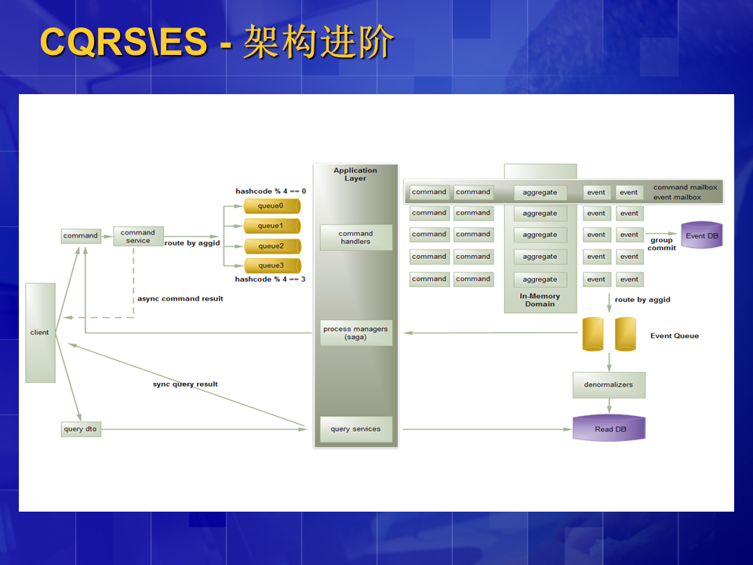

前面的CQRS架构图我介绍了CQRS架构的基本概念、设计初衷、一致性模型、实现方式、适用场景、架构的基本数据流这些方面。但这不是CQRS架构的全部，我们还可以挖掘出更多有用的特性出来。比如假设我们为这个架构引入以下一些特性，就可以达到更多意想不到的好处：

1. 遵守一个原则：一个命令只允许修改一个聚合根；
2. 命令或事件在分布式MQ的路由根据聚合根ID来路由，也就是同一个聚合根的命令和事件都在一个队列里；
3. 引入Command Mailbox，Event Mailbox这两个概念，将聚合根需要处理的命令和产生的事件都队列化，去并发；做到架构上最大的并行，将并发降低到最低；
4. 引入Group Commit技术，做到整个C端的架构层面支持批量提交聚合根产生的事件，从而极大的提高C端的整体吞吐量；比如可以实现对**同一个聚合根**的每秒修改TPS达到5W？这个在传统的架构下是很难做到的。而在这个架构下，框架就可以提供支持。
5. 通过引入Saga（不了解的同学可以网上搜一下什么是CQRS Saga）的概念，做到基于事件驱动的最终一致性，大家可以回想一下前面介绍的Node通过Event连接的架构；整个系统的所有节点的交互通过消息来驱动；

通过引入上面这些架构设计原则，我们可以让CQRS架构的C端更强大，性能更高；当然，复杂性也大大增加。所以，要完成这样一套架构，没有成熟框架的支撑，是几乎不可能的，**ENode框架**就是在为做这样的一个框架而努力。

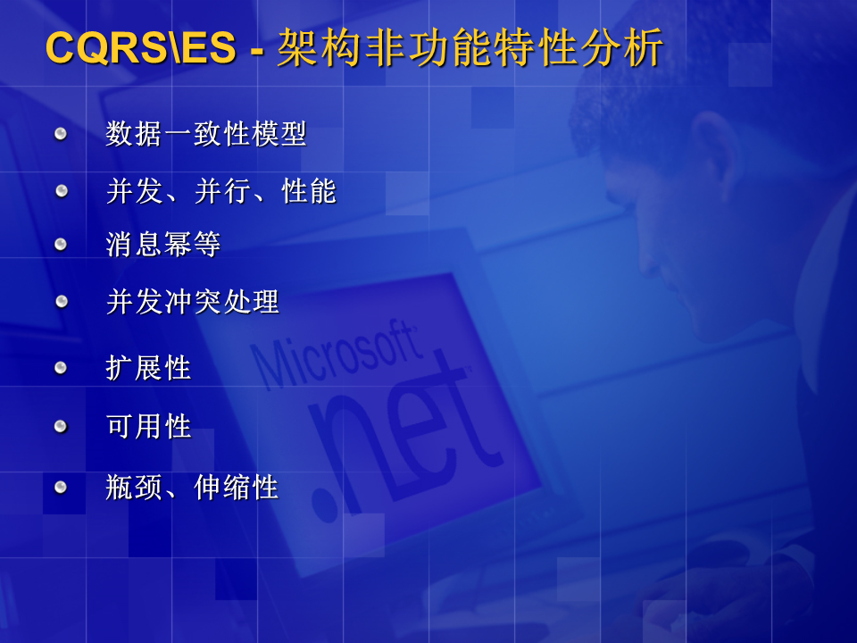

我们可以从上面几个非功能性特性去考察这个架构。大部分大家应该都可以体会到，关于消息的幂等处理这块，CQRS\ES这个架构可以做的非常彻底。

平时传统我们的消息驱动的架构，或者是RPC调用的SOA风格的应用，消息处理者或者服务被调用方，必须自己做到**数据修改的幂等性**。而幂等性的实现思路也很多，比如用kv来判重，用DB的唯一索引，等等。

而CQRS\ES架构，由于使用了Event Sourcing的技术，所以可以直接在EventStore中自动做到聚合根并发修改的冲突的检测、以及同一个命令的重复处理的检测。并能通知框架自动做并发处理或做重新发布该命令所产生的事件；

大家可能会疑问，为何已经将命令通过聚合根ID进行路由了，且同一台机器内页已经通过Actor Mailbox技术解决并发问题了，还是有并发冲突的可能呢？原因是当我们的服务器在出现扩容或缩容时，会出现由于集群中服务器变动导致的同一个聚合根的不同命令可能会在不同的机器上同时被处理，从而导致并发冲突。

最后，关于这个架构的瓶颈，相信大家已经可以发现，是在EventStore。所以，这就要求我们设计一个超高性能的EventStore数据库。具体见后面的介绍吧。

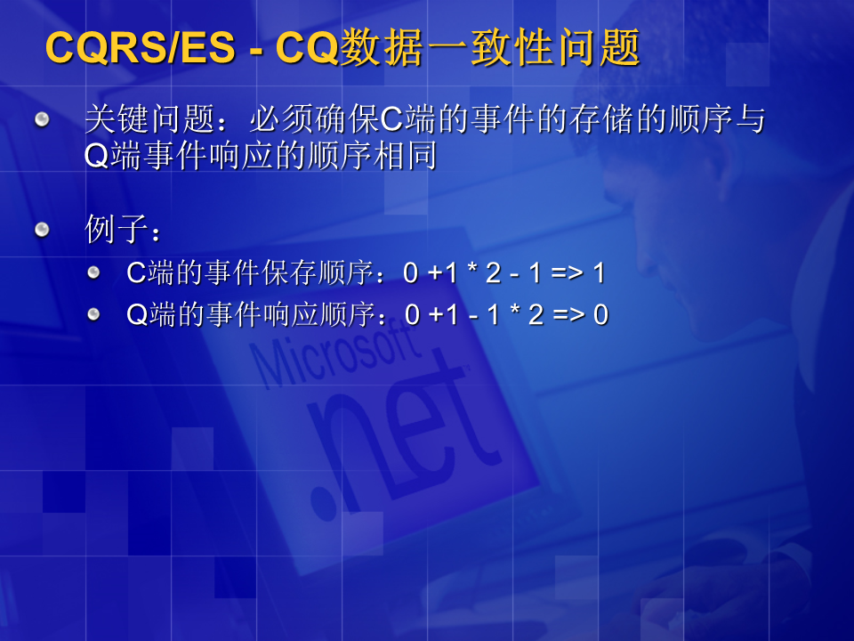

上面这个图演示了，当C端产生的事件，在Q端的处理顺序如果不一致时，导致Q端的结果和C端不一致了。所以，事件的处理顺序必须和产生的顺序一致，这点必须保证，但可以由框架来保证，开发者无需关注。需要强调的是，这个顺序处理事件不需要交给分布式消息中间件来保证，而是应该交给Consumer来自己保重。当Consumer收到一个版本为N+2的时间，而当前Q端的版本为N，则N+2的消息需要先hold一下，不要立即处理。然后等待N+1的事件过来，N+1的事件过来并处理后，再处理N+2的事件。如果N+1的事件一直不过来，则需要永远等待。总之，这里的顺序必须保证。如果这个顺序交给分布式消息中间件去保证，那性能上会非常差，而要让分布式消息中间件实现绝对意义上的顺序消费，又要实现高可用，高性能，难度很大。我个人不太赞成，除非是Consumer自己无法处理消息顺序的场景才迫不得已让分布式消息中间件来保证，比如mysql binlog的同步。

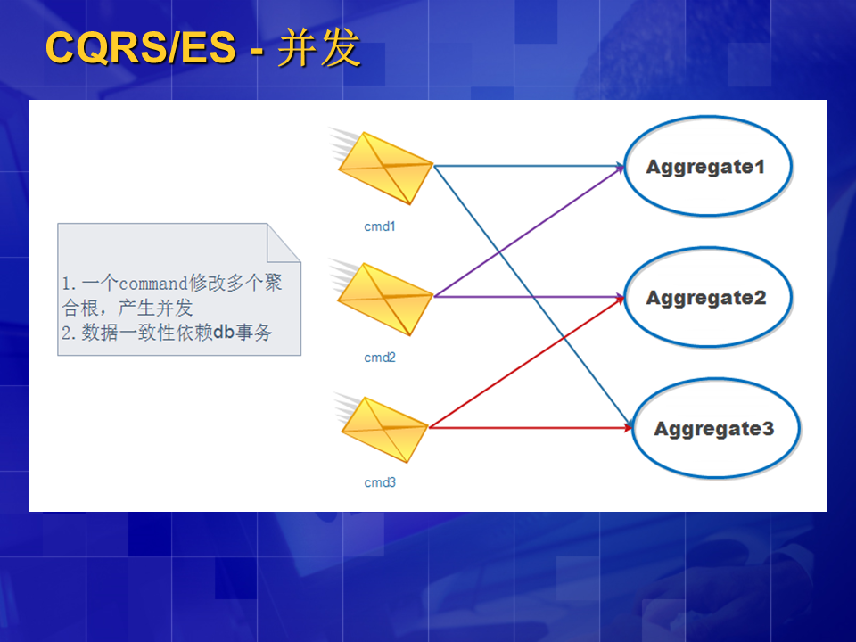

上图演示了假设一个命令修改两个或多个聚合根时，会导致阻塞大大增加，从而整个系统的吞吐会降低。而好处是，我们可以得到聚合根之间的数据的强一致性。

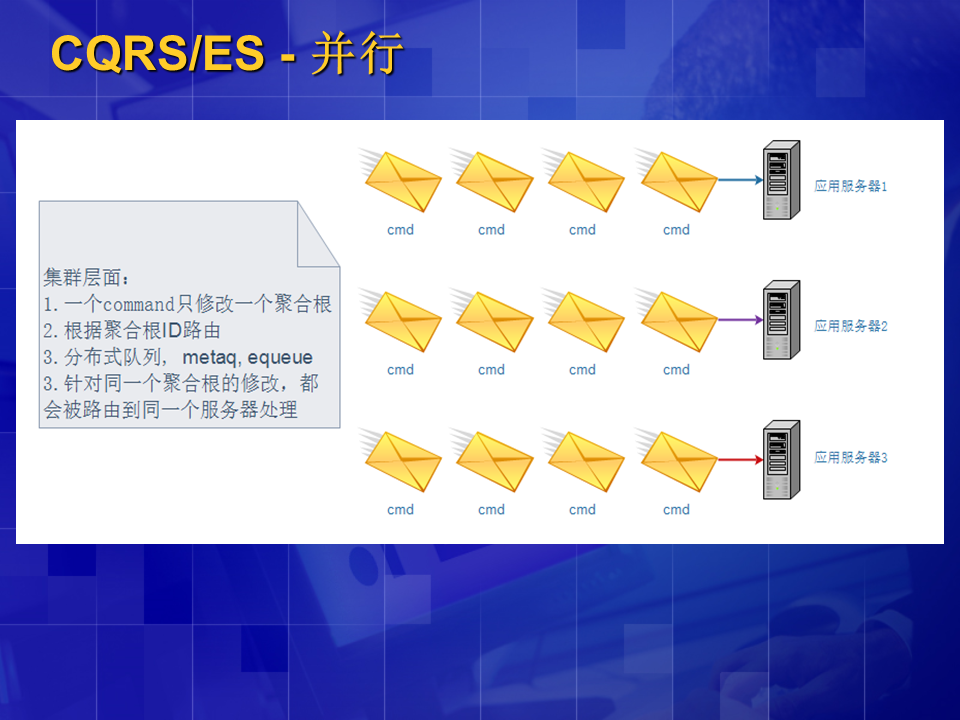

上图演示了，当一个命令只修改一个聚合根时，先通过一级路由，将聚合根路由到分布式MQ的同一个队列里，然后同一个队列总是被一台固定的机器消费，从而保证同一个聚合根的命令总是在一台机器上处理。

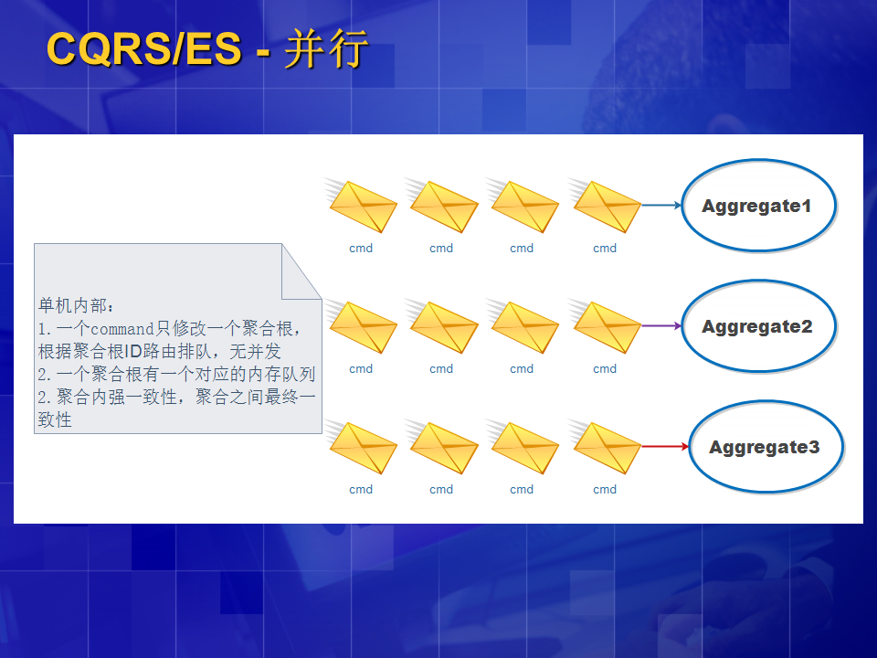

上图掩演示了，当命令进入一台机器后，再通过Command Mailbox的二次路由，同样是根据聚合根ID，从而保证单个机器内，同一个聚合根的命令的处理是顺序线性的，从而避免了并发冲突。

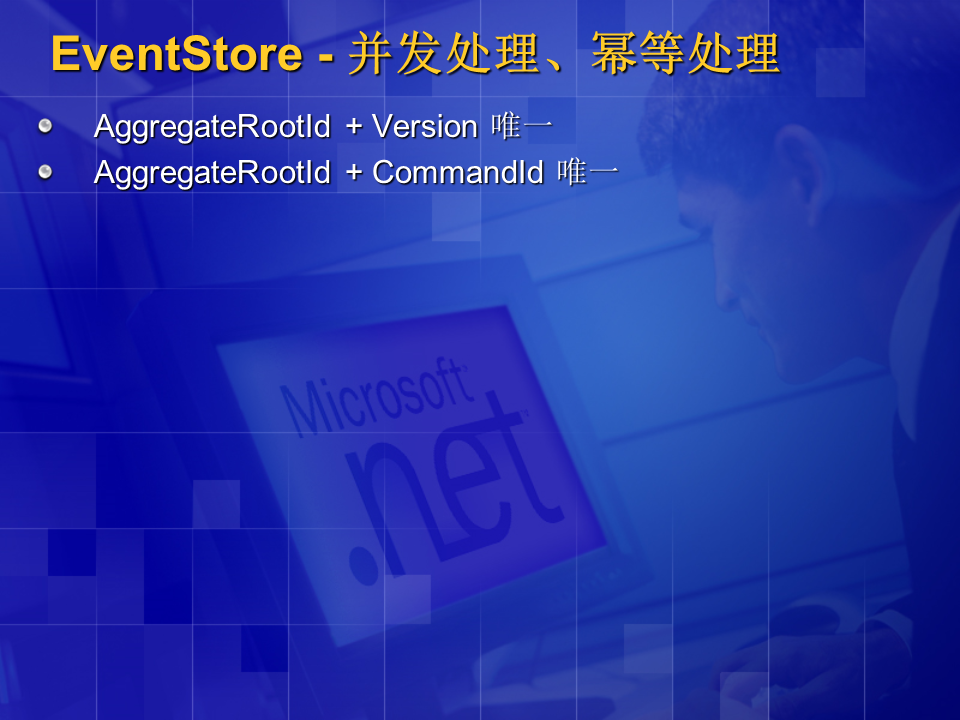

EventStore处理并发和命令幂等的根本设计就是上图的两个唯一索引。
\1. 聚合根ID + 事件版本号唯一；
\2. 聚合根ID + 命令ID唯一；

当万一出现了并发冲突，则框架需要取出重新加载该聚合根的最新状态，然后重试当前命令；当出现了命令的重复处理，则框架需要把该命令之前产生的事件再重新取出来，发布到分布式消息中间件。因为有可能之前虽然这个事件被持久化了，但理论山有可能这个事件没有成功发布到分布式消息中间件（因为那个时候断电了，够倒霉的，呵呵）。所以，事件的消费者可能会再次收到这个事件，并处理。但这么做都是为了保证整个业务流的最终一致性。想想之前的EDA的架构图的说明吧。

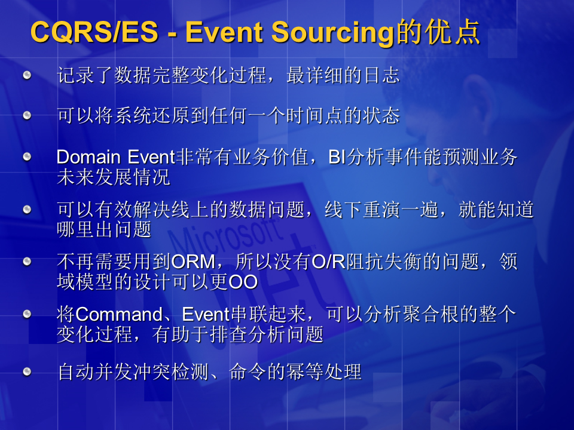

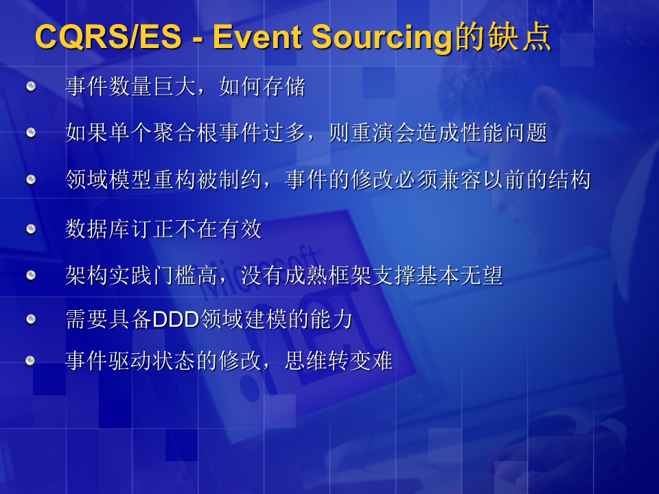

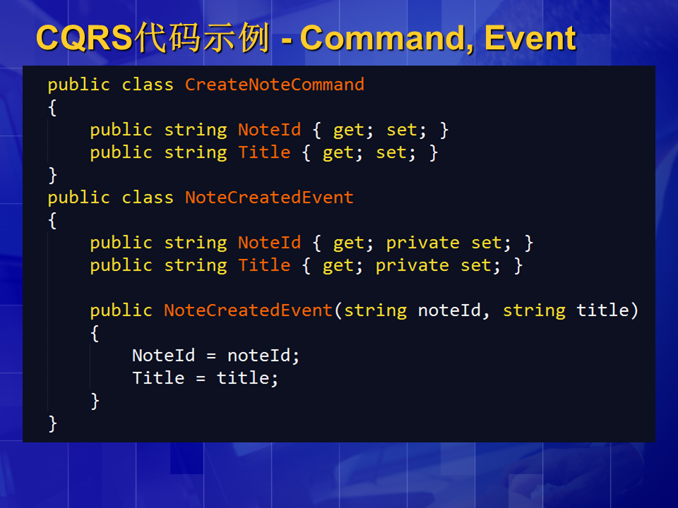

下面我们来看看CQRS架构下，开发者需要写的代码有哪些？

首先是需要**定义Command和Event**。其中Command相当于DDD经典四层架构中的应用层的一个方法的参数。

Command表示命令系统做什么，表达一种意图，在架构上设计为一个DTO即可。Event表示一个事件，表示领域内发生了什么状态变化，用过去式命名事件。**事件是只读的**。

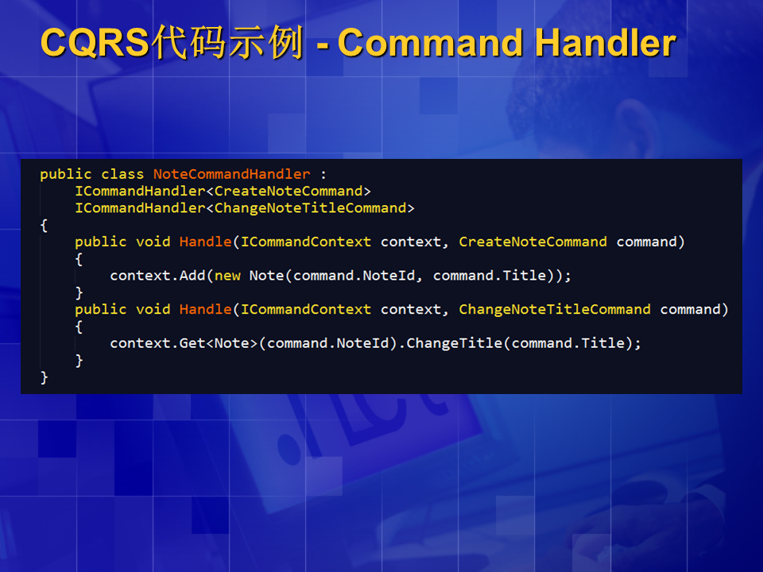

**Command Handler是无状态的**，用于处理一个或多个命令，不同的命令有不同的Handle方法。一个Command Handler做的典型的事情就两个：

1. 根据命令的信息**创建一个聚合根**；
2. 根据命令的信息**修改一个聚合根**；

框架可以做到开发人员无需关注底层的技术问题，比如如何存储**聚合根**产生的**事件**，如何发布事件到MQ；彻底做到技术架构和业务逻辑分离。这点在传统架构下是很难做到的。

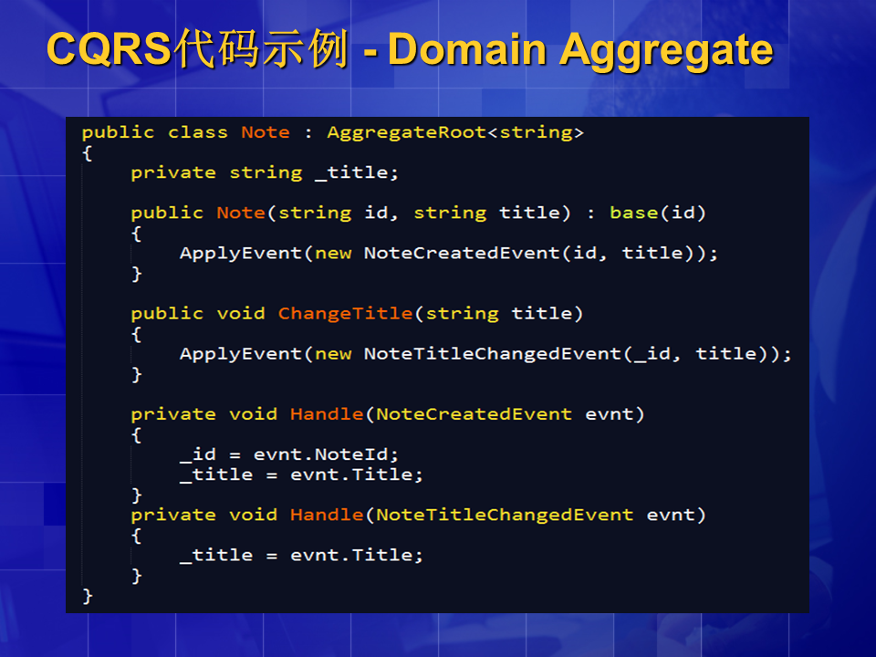

Note表示一个**DDD聚合根**

> 这里**最核心的概念**是：Note内部的**状态的修改都是通过事件来驱动的，也就是Note要做任何修改前，总是应该先产生`事件`，然后框架根据事件调用到对应的Handle方法，然后我们在Handle方法中修改Note的内部状态。**

为何要独立拆分出Handle方法呢？因为是在Event Souring事件溯源还原聚合根状态时，框架需要调用这些Handle方法。根据Event Sourcing的思想，会根据Note聚合根的ID获取该聚合根的所有的事件，然后按照事件发生的顺序，分别调用每个事件的Handle方法，就可以还原出聚合根的最新状态了。

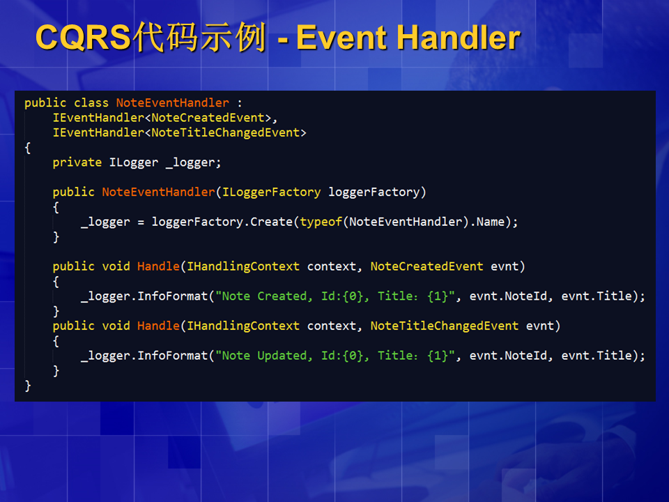

最后一个需要开发者写的代码就是Event Handler，根据CQRS架构的定义，Event Handler负责根据C端产生的事件来更新读库。上面的例子只是记录日志，实际我们需要在Handle方法中更新读库，如数据库，分布式缓存等。

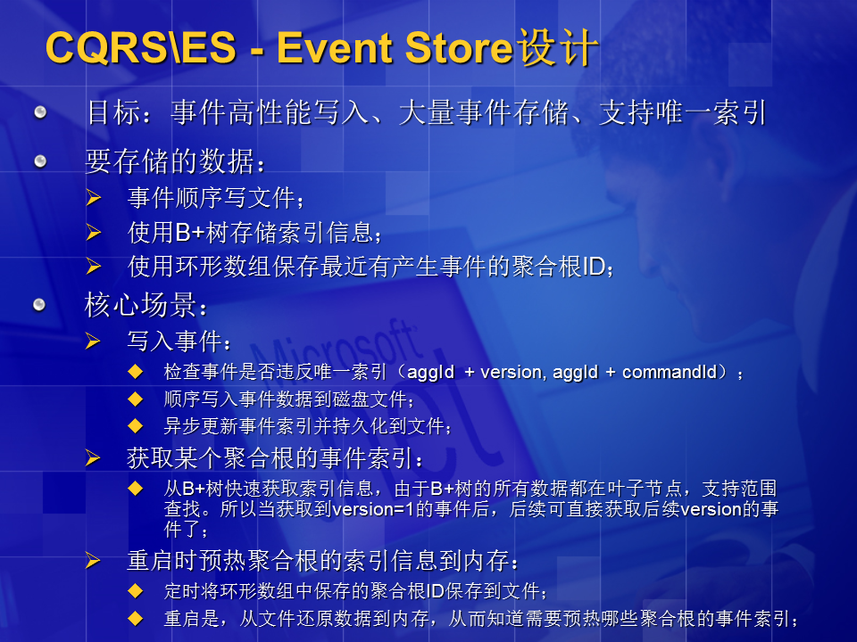

这是**ENode**中今年打算实现的文件版本的EventStore的设计思路，目前是使用的DB来实现的。我现在在做**EQueue**的高可用，等这个做完，就开始做EventStore的文件版本。上面PPT中的设计思路，还希望能和大家多多交流，一起完善它。因为它是整个CQRS/ES架构的核心所在。

前面介绍了很多CQRS\ES架构方面的东西，最后我们再看两个实际应用的场景：秒杀、12036购票。

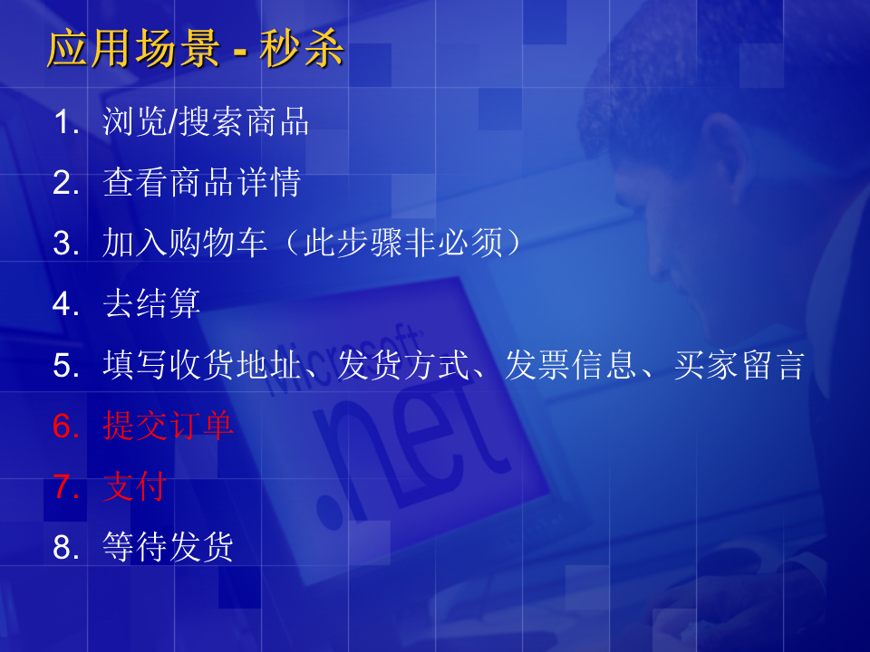

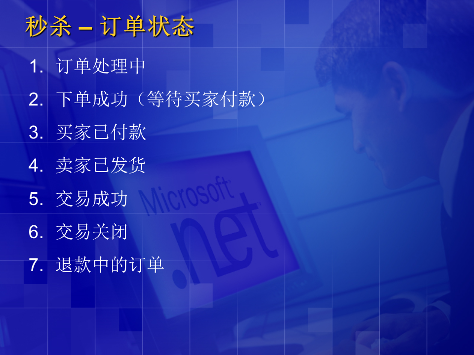

要实现高并发的订单处理（生成订单、预扣库存两个核心步骤）。淘宝做的很牛逼，可以在这两个步骤都完成后直接告诉用户下单结果，当然，我认为CQRS架构也完全可以在保证这两点处理后再返回买家的前提下，实现淘宝一样的吞吐。

这里我列举这些订单状态的目的，主要是想表达第一个状态用意：订单处理中。通过引入这个状态，我们处理订单的的代价就轻很多了，不需要在完成生成订单、预扣库存这两个核心步骤就可以返回客户端浏览器了。买家订单提交成功后，服务端首先在分布式缓存中检查商品的库存是否足够，如果不够，则立即返回并通知买家宝贝卖完了；如果足够，则发送下单的命令到MQ（异步处理订单）。然后通知买家“您好，您的订单已收到，正在处理中。请稍后到我的订单中心查看订单处理结果。祝您购物愉快！”之类的提示。

然后当买家进入“我的订单中心”查看订单时，可能的情况有：

1. 订单未生成，则买家看不到订单，没关系，TA过一会儿刷新页面继续查看；
2. 订单已生成，但是预扣库存还未有结果，则提示订单处理中，用户同样会等待；
3. 订单已生成，预扣库存也已经有结果，不管库存是否足够，都显示相应状态给用户；

通过这样的订单状态的设计和交互体验，相当于把轮训查看订单处理结果的职责交给了买家。而这个小小的设计，带来的好处是极大的方便我们实现非常高的订单处理吞吐了。当然，如果我们能做到像淘宝这样的体验，就是下单时直接告诉结果，那自然最好了。只是这样代价更大而已。我提出这个例子的原因是CQRS架构是一种C端异步处理命令的架构，所以在这种架构上，我们需要一切尽量以**异步**为出发点去思考和设计业务流程，设计用户交互体验。实际上这个体验在亚马逊上买东西，你可能会遇到，甚至亚马逊直接让你去你的邮箱看订单处理结果。所以，我觉得这里只是一个购物习惯的差别，但对技术的要求却差别很大。

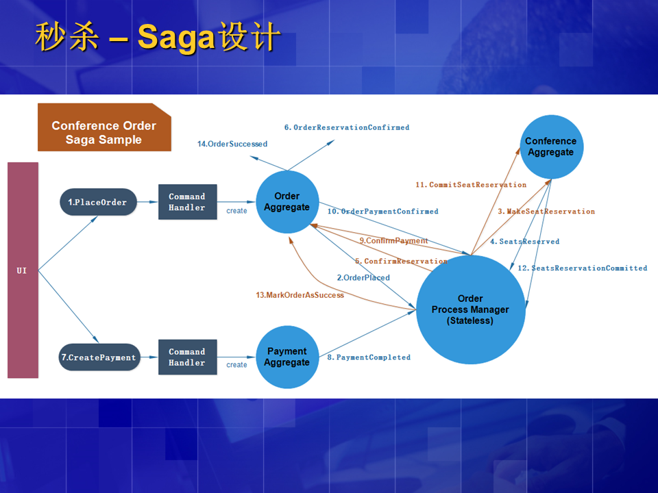

上图描述了一个DDD CQRS架构的典型的Saga的设计，对应前面的秒杀场景的订单处理流程。

上图中，Order、Conference、Payment为三个聚合根，分别表示订单、库存、支付；Order Process Manager是无状态的，表示一个流程管理器，CQRS架构中一般叫Saga。流程管理器的设计理念是：订阅事件，根据不同的事件，发送不同的命令。也就是说，流程管理器的职责是对流程进行建模，负责封装流程控制逻辑，而聚合根负责业务逻辑。整个订单处理的流程大概为业务层面的2PC。即下单时，要先预扣库存；然后，买家付款后要真正扣库存。

上图中，棕色的线条表示命令，蓝色的线条表示事件。

Saga是CQRS架构中处理复杂业务流程的典型做法，通过事件驱动的方式去替代传统的分布式事务。牺牲强一致性的方式来提高系统的吞吐。实际上，在**高并发**的情况下，有时我们不得不选择最终一致性，因为**分布式事务**的成本太高。

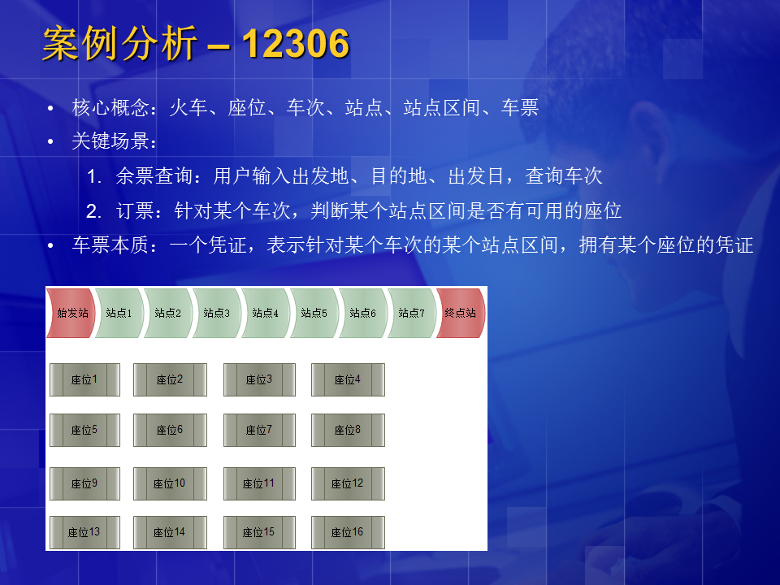

这个案例是关于12306购票的例子，上面说了核心的业务场景和领域概念。我举这个例子的用意是为了说明，12306购票的场景，C端的领域模型是比传统的电商网站要复杂很多的，因为库存是一个动态的概念。不像普通电商，一个库存跟着SKU，很简单。12306你买了一个车子的某个区间的票之后，这个区间内的其他的票的库存数都会发生变化，而且这个库存数还要考虑座位的分配，非常复杂。

这个场景，就是我上面说的CQRS的应用场景中的：

- 要满足高并发的写

- 高并发的查询，

- 同时C端的业务模型非常复杂。

  要同时面对这3点，实现这个系统是很难的。

我认为，这个场景的难点不在于技术层面，而是在于**DDD领域建模**层面。大家如果对这个场景的领域模型，架构实现，以及示例代码感兴趣，可以看我下面的两个地址：
浅谈12306核心模型设计思路和架构设计
http://www.cnblogs.com/netfocus/p/5187241.html

12306购票领域建模示例代码：
https://github.com/tangxuehua/enode，具体看ENode开源项目中的E12306案例代码。

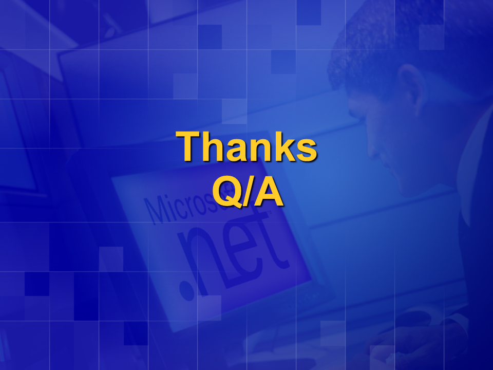

如果大家对这个领域感兴趣，可以访问我的博客。我博客中录制了大量的视频介绍，视频介绍汇总地址：
http://www.cnblogs.com/netfocus/p/4707789.html