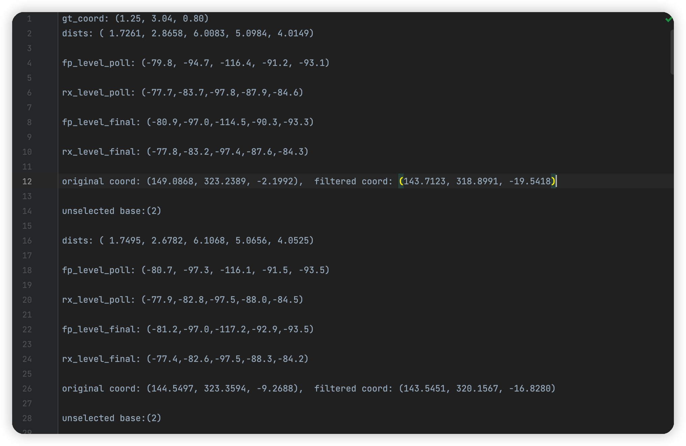
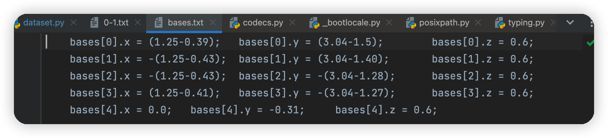

# 人工智能导论实验3

> - 课程名称：人工智能导论实验     
> - 实验项目名称：人工智能导论实验作业3-基于神经网络的分类实验 
> - 学生姓名：徐彬涵
> - 专业班级：软件工程2003
> - 学号：32001272 
> - 实验成绩：
> - 指导老师：李卓蓉
> - 日期：2022/05/25

## 数据准备（使用CIFAR10）



该类型文件共16个，每组包含50个以上的数据，每条数据包含dists、fp_level_poll……等数据



标准参数，用于计算标准距离

```python
class Measure:
    def __init__(self, gt_dist, mea_dist, fp_level_poll, rx_level_poll, fp_level_final, rx_level_final, base_id, in_out):
        self.gt_dist = gt_dist
        self.mea_dist = mea_dist
        self.fp_level_poll = fp_level_poll
        self.rx_level_poll = rx_level_poll
        self.fp_level_final = fp_level_final
        self.rx_level_final = rx_level_final
        self.base_id = base_id
        self.in_out = in_out

```

用于存储数据的类

```python
import torch

import os
import numpy as np
from measure import Measure


def calc_dist(a, b):
    return np.linalg.norm(a - b)


def calc_dists2bases(a, bases):
    dists = []
    for b in bases:
        dists.append(calc_dist(a, b))
    dists = np.asfarray(dists)
    return dists


class UWBDataSet(torch.utils.data.Dataset):
    def __init__(self, file_path):
        self.base_num = 5
        base_coords = np.zeros((self.base_num, 3))
        with open(os.path.join(file_path, 'bases.txt'), 'r') as f:
            lines = f.readlines()
            for line in lines:
                lhs = line.split(';')[0].split('=')[0]
                base_i = int(lhs.split('[')[1].split(']')[0])
                # print(base_num)
                sub_strs = line.split(';')
                val = np.asfarray([eval(sub_str.split('=')[1]) for sub_str in sub_strs if "=" in sub_str])
                base_coords[base_i] = val
        file_list = os.listdir(os.path.join(file_path, 'measures'))
        self.measures = []
        self.len = 0

        for file_name in file_list:
            with open(os.path.join(file_path, 'measures', file_name), 'r') as f:
                lines = f.readlines()
                started = False
                cnt = 0
                if file_name[0:2] == 'in':
                    in_out = 'in'
                else:
                    in_out = 'out'
                    # continue
                # print(in_out)
                for line in lines:
                    try:
                        first_word = line.split(':')[0]
                        first_val_strs = line.split('(')[1].split(')')[0].split(',')
                        first_val_np = np.asfarray([float(str_i) for str_i in first_val_strs])
                        if first_word == 'gt_coord':
                            gt_coord = first_val_np
                            gt_dists = calc_dists2bases(gt_coord, base_coords)
                        elif first_word == 'dists':
                            if not started:
                                started = True
                            mea_dists = first_val_np
                        elif first_word == 'rx_level_poll':
                            # print(first_word)
                            rx_level_polls = first_val_np
                        elif first_word == 'fp_level_poll':
                            fp_level_polls = first_val_np
                        elif first_word == 'fp_level_final':
                            fp_level_finals = first_val_np
                        elif first_word == 'rx_level_final':
                            rx_level_finals = first_val_np
                            if started:
                                tmp_measure = []
                                for i in range(self.base_num):
                                    tmp_measure.append(
                                        Measure(gt_dists[i], mea_dists[i], fp_level_polls[i], rx_level_polls[i],
                                                fp_level_finals[i], rx_level_finals[i], i, in_out))
                                self.measures.append(tmp_measure)
                                cnt += 1
                                if cnt >= 50:
                                    break
                    except Exception as e:
                        pass

    def __len__(self):
        return len(self.measures)

    def __getitem__(self, idx):
        x_list = []
        y_list = []
        for i in range(self.base_num):
            x_list.append(self.measures[idx][i].mea_dist)
            x_list.append(self.measures[idx][i].fp_level_poll)
            y_list.append(self.measures[idx][i].gt_dist)

        x_array = np.asfarray(x_list, dtype=float)
        y_array = np.asfarray(y_list, dtype=float)
        x_tensor = torch.from_numpy(np.float32(x_array))
        y_tensor = torch.from_numpy(np.float32(y_array))

        return x_tensor, y_tensor
```

## 模型

```python
from torch import nn
from torch.nn import Sequential, Linear, ReLU, Dropout


class DisFit(nn.Module):
    def __init__(self):
        super(DisFit, self).__init__()
        self.model = Sequential(
            Linear(10, 24),
            ReLU(True),
            Dropout(),
            Linear(24, 24),
            ReLU(True),
            Dropout(),
            Linear(24, 5)
        )

    def forward(self, x):
        x = self.model(x)
        return x
```

使用了3层网络：

- 线性层 10 -> 24 + ReLU 激活函数 + 正则化层
- 线性层 24 -> 24 + ReLU 激活函数 + 正则化层
- 线性层 24 -> 5

## 训练

```python
from shutil import copyfile
from dataset import UWBDataSet
from measure import Measure
from model import DisFit
import torch
import argparse
from torch.utils.data import DataLoader
import os
import numpy as np
from timeit import default_timer as timer
from evaluator import get_accuracy
import math

parser = argparse.ArgumentParser(description='UWB')

parser.add_argument('--cuda',        type=int,   default=0,    help='cuda number (default: 1)')
parser.add_argument('--output_dir',   type=str,   default='./results/model_weights/main/', help='output_dir')

parser.add_argument('--data_dir',   type=str,   default='./data/2022年4月20日静态数据', help='output_dir')
parser.add_argument('--epochs',      type=int,   default=200,  help='number of epochs (default: 5)')
parser.add_argument('--batch_size',  type=int,   default=5,   help='batch size for training (default: 32)')
parser.add_argument('--lr',          type=float, default=0.0001, help='learning rate (default: 5e-3)')


params = parser.parse_args()
print(params)

torch.cuda.set_device(params.cuda)

dataset = UWBDataSet(params.data_dir)
length = len(dataset)
train_size, validate_size = int(0.8*length), int(0.2*length)
train_dataset, test_dataset = torch.utils.data.random_split(dataset, [train_size, validate_size])
train_data_loader = DataLoader(train_dataset, batch_size=params.batch_size, shuffle=True,)
test_data_loader = DataLoader(test_dataset, batch_size=1)

model = DisFit()
model = model.cuda()

loss_fn = torch.nn.MSELoss()
loss_fn = loss_fn.cuda()
optimizer = torch.optim.Adam(model.parameters(), lr=params.lr)
loss_best = math.inf

for epoch in range(params.epochs):
    start_time = timer()

    losses = []
    model.train()
    for x, y in train_data_loader:
        x = x.cuda()
        y = y.cuda()
        predict = model(x)
        
        loss_val = loss_fn(predict, y)
        loss_val.backward()
        losses.append(loss_val.data.cpu().numpy())
        optimizer.step()
    
    with torch.no_grad():
        loss = get_accuracy(model, test_data_loader)
        print(
            "Epoch {} : 平均训练集Loss: {:.5f}, 验证集Loss: {:.5f}, Time elapsed {:.2f} s".format(
                epoch + 1,
                np.mean(losses),
                loss,
                timer() - start_time
            )
        )
        if loss < loss_best:
            stopping_step = 0
            print("loss reduced....saving weights !!")
            best_loss_epoch = epoch + 1
            loss_best = loss
            output_dir = params.output_dir
            os.makedirs(output_dir, exist_ok=True)
            model_path = output_dir + "epoch{}_loss_{:.5f}.pth".format(epoch + 1, loss)
            torch.save(model.state_dict(), model_path)
            print("model saved in " + model_path)

    if epoch + 1 == params.epochs:
        best_model_path = output_dir + "epoch{}_loss_{:.5f}.pth".format(best_loss_epoch, loss_best)
        copyfile(best_model_path, output_dir + "final.pth")
        print("the model " + model_path + " is saved in " + model_path)
```

- 使用 CUDA 训练
- 训练 epochs = 200
- 训练 batch size = 5
- 训练学习率 = 0.0001
- 训练损失函数：MSELoss
- 训练优化器：Adam

### 训练集、测试集划分

```python
dataset = UWBDataSet(params.data_dir)
length = len(dataset)
train_size, validate_size = int(0.8*length), int(0.2*length)
train_dataset, test_dataset = torch.utils.data.random_split(dataset, [train_size, validate_size])
train_data_loader = DataLoader(train_dataset, batch_size=params.batch_size, shuffle=True,)
test_data_loader = DataLoader(test_dataset, batch_size=1)
```

获取16个文件前50条数据，并随机将80%作为训练集，20%作为测试集

### 结果输出

以测试集的loss为批评标准，找到最小的loss，将局部最优解保存，并在最后保存已找到的最优解
