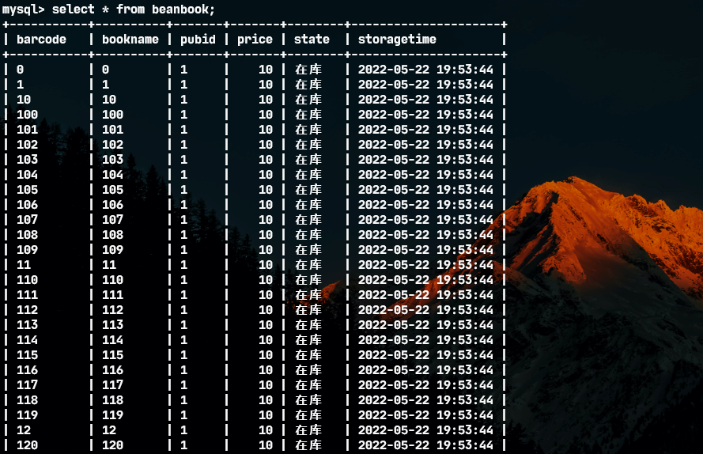
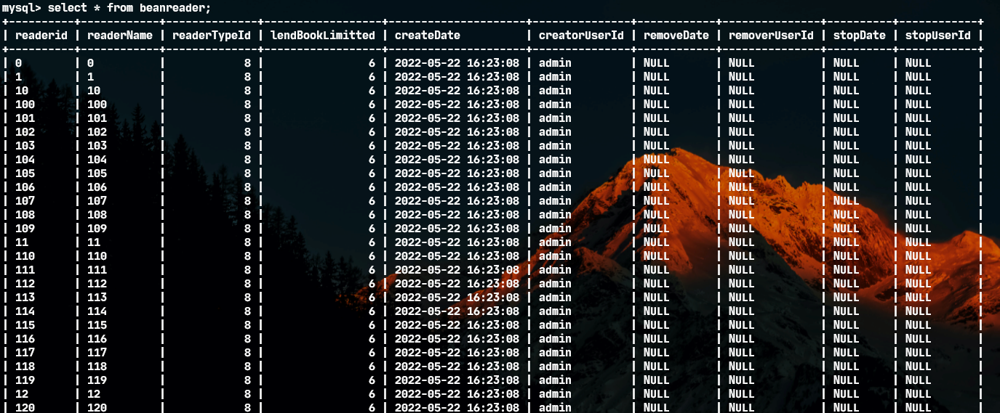
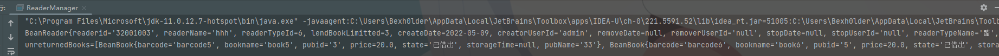
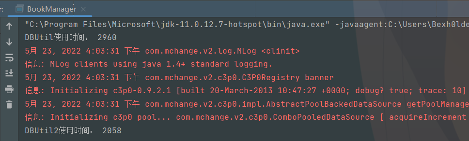

# 实验七 JDBC进阶

## 一、相关知识点

1. JDBC基本概念
2. 主从关系，分页查询，连接池

 

## 二、实验目的

理解分页查询的概念和处理方法

## 三、实验内容

### 1、 数据准备：编写程序，自动生成1000个读者和图书；

```java
//num为需要创建读者的数量，PreReaderTypeId为读者类型ID
public void AutogenerationReaders(int num, int PreReaderTypeId) throws BaseException{
		Connection conn = null;
		java.sql.PreparedStatement pst = null;
		try {
		    conn = DBUtil.getConnection();
		    String sql = "select lendBookLimitted from BeanReaderType where readerTypeId=" + PreReaderTypeId;
            java.sql.Statement st = conn.createStatement();
            java.sql.ResultSet rs = st.executeQuery(sql);
            if (!rs.next()) throw new BusinessException("读者类别不存在");
            int lendBookLimitted = rs.getInt(1);
            rs.close();
            st.close();
		    sql = "insert into BeanReader(readerid,readerName,readerTypeId,lendBookLimitted,createDate,creatorUserId) values(?,?,?,?,?,?)";
		    pst = conn.prepareStatement(sql);
		    //手动事务
		    conn.setAutoCommit(false);
		    Long startTime = System.currentTimeMillis();
		    int count =0;
		    System.out.println("开始插入...");
		    for(int i = 0; i < num; i++){
		    	pst.setString(1, String.valueOf(i));
	            pst.setString(2, String.valueOf(i));
	            pst.setInt(3, PreReaderTypeId);//将所有创建的读者类型设为
	            pst.setInt(4, lendBookLimitted);
	            pst.setTimestamp(5, new java.sql.Timestamp(System.currentTimeMillis()));
	            pst.setString(6, "admin"); //默认为admin创建
	            pst.addBatch();
	            count++;
	            if(count>=25000) {
	                //每25000条数据进行一次批量插入操作
	                pst.executeBatch();
	                pst.clearBatch();
	                conn.commit();
	                count = 0;
	            }
		    }
		    if(count != 0)
		    {
		    	pst.executeBatch();
                pst.clearBatch();
                conn.commit();
                count = 0;
		    }
		    Long endTime = System.currentTimeMillis();
		    System.out.println(num + "条数据插入完成,总用时：" + (endTime - startTime)+"ms");
		} catch (Exception e) {
		    e.printStackTrace();
		    throw new RuntimeException(e);
		}finally{
		    if(pst !=null){
		        try {
		            pst.close();
		        } catch (SQLException e) {
		            e.printStackTrace();
		            throw new RuntimeException(e);
		        }
		    }
		    if(conn!=null){
		        try {
		            conn.close();
		        } catch (SQLException e) {
		            e.printStackTrace();
		            throw new RuntimeException(e);
		        }
		    }
		}
	}
```

```java
//num为需要创建书本的数量，Prepubid为出版社ID
public void AutogenerationBooks(int num, String Prepubid) throws BaseException{
		Connection conn = null;
		java.sql.PreparedStatement pst = null;
		try {
		    conn = DBUtil.getConnection();
		    String sql = "select * from beanpublisher where pubid=" + Prepubid;
            java.sql.Statement st = conn.createStatement();
            java.sql.ResultSet rs = st.executeQuery(sql);
            if (!rs.next()) throw new BusinessException("出版社类别不存在");
            rs.close();
            st.close();
		    sql = "insert into BeanBook(barcode,bookname,pubid,price,state,storagetime) values(?,?,?,?,'在库',?)";
		    pst = conn.prepareStatement(sql);
		    //手动事务
		    conn.setAutoCommit(false);
		    Long startTime = System.currentTimeMillis();
		    int count =0;
		    System.out.println("开始插入...");
		    for(int i = 0; i < num; i++){
		    	pst = conn.prepareStatement(sql);
	            pst.setString(1, String.valueOf(i));
	            pst.setString(2, String.valueOf(i));
	            pst.setString(3, Prepubid);
	            pst.setDouble(4, 10);
	            pst.setTimestamp(5, new java.sql.Timestamp(System.currentTimeMillis()));
	            pst.addBatch();
	            count++;
	            if(count>=25000) {
	                //每25000条数据进行一次批量插入操作
	                pst.executeBatch();
	                pst.clearBatch();
	                conn.commit();
	                count = 0;
	            }
		    }
		    if(count != 0)
		    {
		    	pst.executeBatch();
                pst.clearBatch();
                conn.commit();
                count = 0;
		    }
		    Long endTime = System.currentTimeMillis();
		    System.out.println(num + "条数据插入完成,总用时：" + (endTime - startTime)+"ms");
		} catch (Exception e) {
		    e.printStackTrace();
		    throw new RuntimeException(e);
		}finally{
		    if(pst !=null){
		        try {
		            pst.close();
		        } catch (SQLException e) {
		            e.printStackTrace();
		            throw new RuntimeException(e);
		        }
		    }
		    if(conn!=null){
		        try {
		            conn.close();
		        } catch (SQLException e) {
		            e.printStackTrace();
		            throw new RuntimeException(e);
		        }
		    }
		}
	}
```





### 2、 改造读者模块，在提取读者的同时，提取其未归还的图书信息

第一步：通过程序增加一些借阅纪录

第二步：改造读者javabean，使之包括借阅的图书信息

第三步：改造ReaderManager中的读者提取方法（public BeanReader loadReader(String readerid) throws DbException ），同时提取未归还图书；

第四步：ReaderManager的main函数中调用该方法进行测试，要求输出指定读者的基本信息及其未归还的图书名称。

【实验结果与分析】

A、 javabean类代码。

```java
private List<BeanBook> unreturnedBooks = new ArrayList<BeanBook>();

public List<BeanBook> getUnreturnedBooks() {
        return unreturnedBooks;
}

public void setUnreturnedBooks(List<BeanBook> unreturnedBooks) {
    this.unreturnedBooks = unreturnedBooks;
}
```

B、 给出改造后ReaderManager类的方法代码。

```java
public BeanReader loadReader(String readerid) throws DbException {
        Connection conn = null;
        try {
            conn = DBUtil.getConnection();
            String sql = "select readerid,readerName,r.readerTypeId,r.lendBookLimitted,createDate,creatorUserId,stopDate,stopUserId,rt.readerTypeName,r.removeDate" +
                    "  from BeanReader r,BeanReaderType rt where r.readerTypeId=rt.readerTypeId" +
                    " and  r.readerid=?";
            sql += " order by readerid";
            java.sql.PreparedStatement pst = conn.prepareStatement(sql);
            pst.setString(1, readerid);
            java.sql.ResultSet rs = pst.executeQuery();
            if (rs.next()) {
                BeanReader r = new BeanReader();
                r.setReaderid(rs.getString(1));
                r.setReaderName(rs.getString(2));
                r.setReaderTypeId(rs.getInt(3));
                r.setLendBookLimitted(rs.getInt(4));
                r.setCreateDate(rs.getDate(5));
                r.setCreatorUserId(rs.getString(6));
                r.setStopDate(rs.getDate(7));
                r.setStopUserId(rs.getString(8));
                r.setReaderTypeName(rs.getString(9));
                r.setRemoveDate(rs.getDate(10));
                r.setUnreturnedBooks((new BookLendManager()).loadReaderLentBooks(r.getReaderid()));//修改处
                return r;
            }
        } catch (SQLException e) {
            e.printStackTrace();
            throw new DbException(e);
        } finally {
            if (conn != null)
                try {
                    conn.close();
                } catch (SQLException e) {
                    // TODO Auto-generated catch block
                    e.printStackTrace();
                }
        }
        return null;
    }
```

```java
public static void main(String[] args) {
        try {
        	    BeanReader test = (new ReaderManager()).loadReader("32001003");
                System.out.println(test);
        } catch (BaseException e) {
            // TODO Auto-generated catch block
            e.printStackTrace();
        }
//       try {
//           pm.deletePublisher("testpubid");
//       } catch (BaseException e) {
//           // TODO Auto-generated catch block
//           e.printStackTrace();
//       }
   }
```



### 3、 改造读者管理模块，将读者列表页面改造成分页查询方式。

第一步：自行设计PageData类，用于存放分页数据

第二步：改造ReaderManager类，将其中的查询读者方法改造成分页查询。

第三步（选做）：修改ui类，增加上一页、下一页按钮，实现读者的分页查询，要求每页20人

【实验结果与分析】

A、  PageData类代码。

```java
package cn.edu.zucc.booklib.model;

import java.util.ArrayList;

public class PageData {
    private int totalRecordCount;
    private static int pageSize = 10;
    private static int pageIndex = 1;
    private ArrayList<BeanReader> beanReaders = new ArrayList<>(pageSize);

    public PageData(int pageSize) {
        this.pageSize = pageSize;
    }

    public int getTotalRecordCount() {
        return totalRecordCount;
    }

    public void setTotalRecordCount(int totalRecordCount) {
        this.totalRecordCount = totalRecordCount;
    }

    public static int getPageSize() {
        return pageSize;
    }

    public static void setPageSize(int pageSize) {
        PageData.pageSize = pageSize;
    }

    public static int getPageIndex() {
        return pageIndex;
    }

    public static void setPageIndex(int pageIndex) {
        PageData.pageIndex = pageIndex;
    }

    public PageData() {
    }

    public ArrayList<BeanReader> getBeanReaders() {
        return beanReaders;
    }

    public void setBeanReaders(ArrayList<BeanReader> beanReaders) {
        this.beanReaders = beanReaders;
    }
}
```

 

B、 给出改造后ReaderManager类的方法代码。

```java
public List<BeanReader> searchReader(String keyword, int readerTypeId) throws BaseException {
        List<BeanReader> result = new ArrayList<BeanReader>();
        Connection conn = null;
        try {
            conn = DBUtil.getConnection();
            String sql = "select readerid,readerName,r.readerTypeId,r.lendBookLimitted,createDate,creatorUserId,stopDate,stopUserId,rt.readerTypeName" +
                    "  from BeanReader r,BeanReaderType rt where r.readerTypeId=rt.readerTypeId" +
                    " and removeDate is null ";
            if (readerTypeId > 0) sql += " and r.readerTypeId=" + readerTypeId;
            if (keyword != null && !"".equals(keyword))
                sql += " and (readerid like ? or readerName like ?)";
            sql += " order by readerid";
            //--------------------------------------------------------------------------
            sql += "limit ?,?";
            java.sql.PreparedStatement pst = conn.prepareStatement(sql);
            if (keyword != null && !"".equals(keyword)) {
                pst.setString(1, "%" + keyword + "%");
                pst.setString(2, "%" + keyword + "%");
                pst.setObject(3, (PageData.getPageIndex()-1)*PageData.getPageSize());
                pst.setObject(4,PageData.getPageSize());
            }else {
                pst.setObject(1, (PageData.getPageIndex()-1)*PageData.getPageSize());
                pst.setObject(2,PageData.getPageSize());
            }
	   //--------------------------------------------------------------------------
            java.sql.ResultSet rs = pst.executeQuery();
            while (rs.next()) {
                BeanReader r = new BeanReader();
                r.setReaderid(rs.getString(1));
                r.setReaderName(rs.getString(2));
                r.setReaderTypeId(rs.getInt(3));
                r.setLendBookLimitted(rs.getInt(4));
                r.setCreateDate(rs.getDate(5));
                r.setCreatorUserId(rs.getString(6));
                r.setStopDate(rs.getDate(7));
                r.setStopUserId(rs.getString(8));
                r.setReaderTypeName(rs.getString(9));
                result.add(r);
            }
        } catch (SQLException e) {
            e.printStackTrace();
            throw new DbException(e);
        } finally {
            if (conn != null)
                try {
                    conn.close();
                } catch (SQLException e) {
                    // TODO Auto-generated catch block
                    e.printStackTrace();
                }
        }
        return result;

    }
```

C、 给出ui类中的修改部分（注：生成表格的方法需做微调）

 

 

### 4、 用C3P0连接池改造booklib应用

第一步：将mchange-commons-java-0.2.3.4、c3p0-0.9.2.1.jar引入工程

第二步：在cn.edu.zucc.booklib.util包下增加类DBUtil2，并模仿DBPool类实现DBUtil类中定义的功能

第三步：改造BookManager类，将其各方法中获取数据库的连接的方法改成用DBUtil2；

第四步：BookManager中编写main函数，利用循环待用添加图书方法的形式增加1000本图书，并记录整体运行时间；分别测试利用DBUtil和DBUtil2获取数据库连接的耗时。

【实验结果与分析】

A、 DBUtil2类代码。

```java
package cn.edu.zucc.booklib.util;

import com.mchange.v2.c3p0.ComboPooledDataSource;

import java.beans.PropertyVetoException;
import java.sql.*;

public class DBUtil2 {
    private static final String jdbcDriver = "com.mysql.jdbc.Driver";
    private static final String jdbcUrl = "jdbc:mysql://localhost:3306/booklib?useUnicode=true&characterEncoding=UTF-8";
    private static final String dbUser = "root";
    private static final String dbPwd = "xxbbhh";


    public static Connection getConnection() throws java.sql.SQLException {
        ComboPooledDataSource cpds = new ComboPooledDataSource();
        try {
            cpds.setDriverClass(jdbcDriver);
            cpds.setJdbcUrl(jdbcUrl);
            cpds.setUser(dbUser);
            cpds.setPassword(dbPwd);
            return cpds.getConnection();
        } catch (Exception e) {
            throw new ExceptionInInitializerError(e);
        }

    }

    public static void closeResorce(Connection conn, Statement ps) {
        try {
            if (conn != null)
                conn.close();
        } catch (SQLException e) {
            e.printStackTrace();
        }
        try {
            if (ps != null)
                ps.close();
        } catch (SQLException e) {
            e.printStackTrace();
        }
    }

    public static void closeResorce(Connection conn, Statement ps, ResultSet rs) {
        try {
            if (conn != null)
                conn.close();
        } catch (SQLException e) {
            e.printStackTrace();
        }
        try {
            if (ps != null)
                ps.close();
        } catch (SQLException e) {
            e.printStackTrace();
        }

        try {
            if (rs != null)
                rs.close();
        } catch (SQLException e) {
            e.printStackTrace();
        }
    }
}
```

B、 给出改造后BookManager类的main函数代码。

```java
public void insertBooks_DBUtil() {
        Connection conn = null;
        java.sql.PreparedStatement ps = null;
        try {
            conn = DBUtil.getConnection();

            String sql = "insert into BeanBook(barcode,bookname,pubid,price,state) values(?,?,?,?,'在库')";
            ps = conn.prepareStatement(sql);

            for (int i = 2000; i < 3000; i++) {
                ps.setObject(1, i);
                ps.setObject(2, "book_" + i);
                ps.setObject(3, 5);
                ps.setObject(4, 10);
                ps.execute();
            }
        } catch (SQLException e) {
            e.printStackTrace();
        } finally {
            DBUtil.closeResorce(conn, ps);
        }

    }
    public void insertBooks_DBUtil2() {
        Connection conn = null;
        java.sql.PreparedStatement ps = null;
        try {
            conn = DBUtil2.getConnection();

            String sql = "insert into BeanBook(barcode,bookname,pubid,price,state) values(?,?,?,?,'在库')";
            ps = conn.prepareStatement(sql);

            for (int i = 1000; i < 2000; i++) {
                ps.setObject(1, i);
                ps.setObject(2, "book_" + i);
                ps.setObject(3, 5);
                ps.setObject(4, 10);
                ps.execute();
            }
        } catch (SQLException e) {
            e.printStackTrace();
        } finally {
            DBUtil.closeResorce(conn, ps);
        }

    }
    public static void main(String[] args) {
        try {
            long startTime = System.currentTimeMillis();
            (new BookManager()).insertBooks_DBUtil();
            long endTime = System.currentTimeMillis();
            System.out.println("DBUtil使用时间： " + (endTime - startTime));
            startTime = System.currentTimeMillis();
            (new BookManager()).insertBooks_DBUtil2();
            endTime = System.currentTimeMillis();
            System.out.println("DBUtil2使用时间： " + (endTime - startTime));
        } catch (Exception e) {
            // TODO Auto-generated catch block
            e.printStackTrace();
        }
   }
```

C、 给出用DBUtil和DBUtil2获取数据库连接时，main函数的执

 

 

 

 