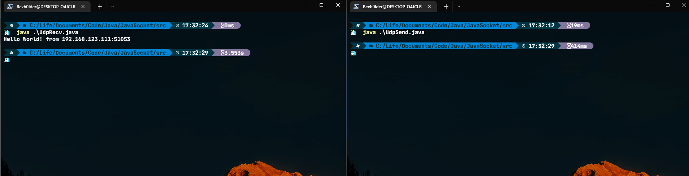
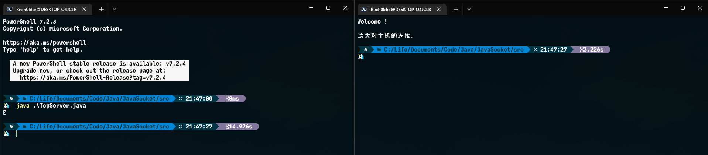
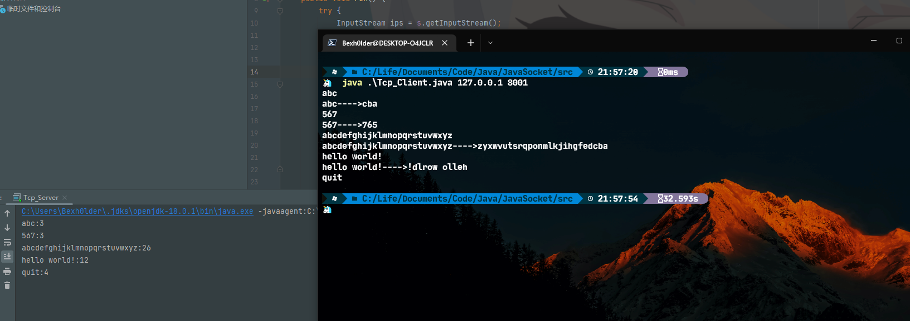
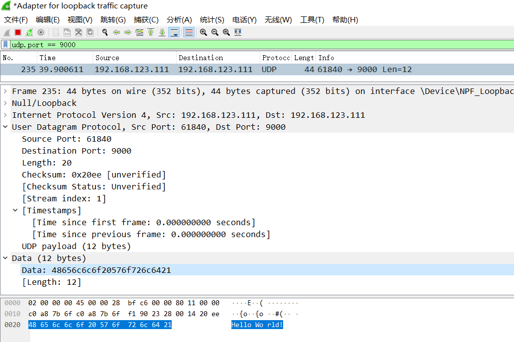
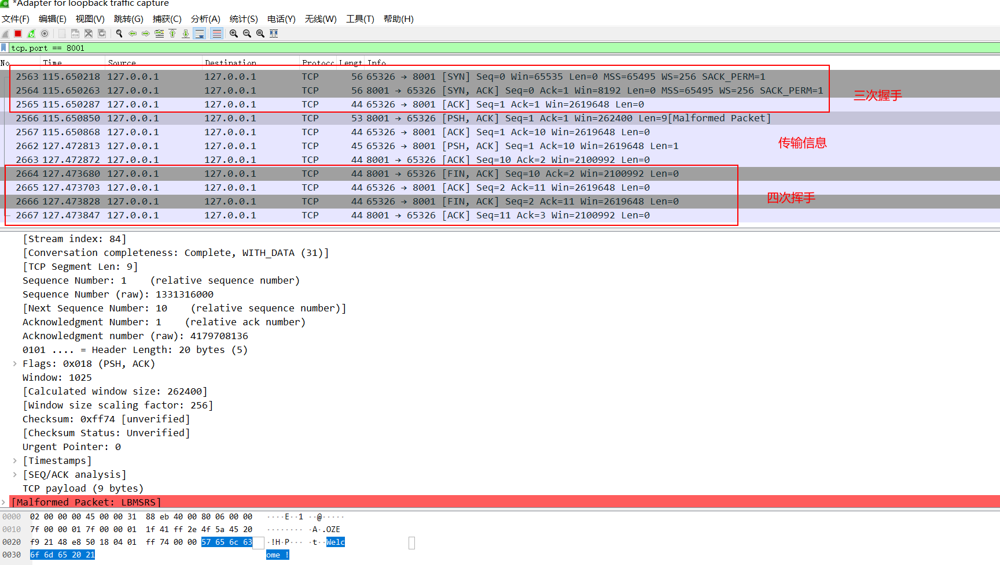
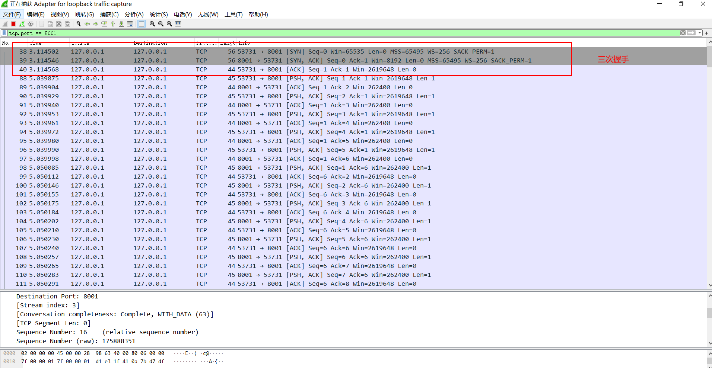

# 浙大城市学院实验报告

> - 课程名称：计算机网络实验       
> - 实验项目名称：实验十四 传输层网络编程
> - 学生姓名：徐彬涵
> - 专业班级：软件工程2003
> - 学号：32001272 
> - 实验成绩：
> - 指导老师：霍梅梅
> - 日期：2022/05/26  

 

 

## 一. 实验目的和要求

1. 通过实现使用Java Socket进行通信的UDP客户端和服务器来获得关于使用Java Socket网络编程的经验；
2. 通过实现使用Java Socket进行通信的TCP客户端和服务器来获得关于使用Java Socket网络编程的经验。

 

## 二. 实验内容、原理及实验结果与分析

1. **UDP编程**

阅读讲义，并将源代码（UdpSend.java和UdpRecv.java）在机器上编译运行通过(注意：要根据自己的机器IP地址修改源代码)。

【程序源代码】

-  UdpSend.java

  ```java
  import java.net.*;
  
  public class UdpSend
  {
      public static void main(String[] args) throws Exception
      {
          DatagramSocket ds = new DatagramSocket();
          String str = "Hello World!";
          DatagramPacket dp = new DatagramPacket(str.getBytes(), str.length(), InetAddress.getByName("192.168.123.111"), 9000);
          ds.send(dp);
          ds.close();
      }
  }
  ```

-  UdpRecv.java

  ```java
  import java.net.*;
  
  public class UdpRecv {
      public static void main(String[] args) throws Exception
      {
          DatagramSocket ds = new DatagramSocket(9000);
          byte[] buf = new byte[1024];
          DatagramPacket dp = new DatagramPacket(buf, 1024);
          ds.receive(dp);
          String strRecv = new String(dp.getData(), 0, dp.getLength()) + " from " + dp.getAddress().getHostAddress() + ":" + dp.getPort();
          System.out.println(strRecv);
          ds.close();
      }
  }
  
  ```


【实验结果与分析】

 

 

2. **TCP编程**

 阅读讲义，并将源代码（TcpServer.java）在机器上编译运行，然后通过在命令行中输入“telnet 自己的IP地址 8001”进行测试。

【程序源代码】

```java
import java.net.*;
import java.io.*;
public class TcpServer {
    public static void main(String [] args){
        try
        {
            ServerSocket ss=new ServerSocket(8001);
            Socket s=ss.accept();
            InputStream ips=s.getInputStream();
            OutputStream ops=s.getOutputStream();
            ops.write("Welcome !".getBytes());
            byte [] buf=new byte[1024];
            int len=ips.read(buf);
            System.out.println(new String(buf,0,len));
            ips.close();
            ops.close();
            s.close();
            ss.close();
        }catch(Exception e)
        {
            e.printStackTrace();
        }
    }
}

```

【实验结果与分析】

 


阅读讲义，并将服务器端（Tcp_Server.java）以及客户端程序的源代码（Tcp_Client.java）在机器上编译运行，客户端测试命令为“java Tcp_Client 自己的IP地址 8001”。

【程序源代码】

-  Tcp_Client.java

  ```java
  import java.net.*;
  import java.io.*;
  
  public class Tcp_Client {
      public static void main(String[] args) {
          try {
              if (args.length < 2) {
                  System.out.println("Usage:java TcpClient ServerIP ServerPort");
                  return;
              }
              Socket s = new Socket(InetAddress.getByName(args[0]), Integer.parseInt(args[1]));
              InputStream ips = s.getInputStream();
              OutputStream ops = s.getOutputStream();
              BufferedReader brKey = new BufferedReader(new InputStreamReader(System.in));
              DataOutputStream dos = new DataOutputStream(ops);
              BufferedReader brNet = new BufferedReader(new InputStreamReader(ips));
              while (true) {
                  String strWord = brKey.readLine();
                  dos.writeBytes(strWord + System.getProperty("line.separator"));
                  if (strWord.equalsIgnoreCase("quit"))
                      break;
                  else
                      System.out.println(brNet.readLine());
              }
              dos.close();
              brNet.close();
              brKey.close();
              s.close();
          } catch (Exception e) {
              e.printStackTrace();
          }
      }
  }
  ```

- Servicer.java

  ```java
  import java.net.*;
  import java.io.*;
  class Servicer implements Runnable {
      Socket s;
      public Servicer(Socket s) {
          this.s = s;
      }
      public void run() {
          try {
              InputStream ips = s.getInputStream();
              OutputStream ops = s.getOutputStream();
  
              BufferedReader br = new BufferedReader(new InputStreamReader(ips));
              DataOutputStream dos = new DataOutputStream(ops);
              while (true) {
                  String strWord = br.readLine();
                  System.out.println(strWord + ":" + strWord.length());
                  if (strWord.equalsIgnoreCase("quit"))
                      break;
                  String strEcho = (new StringBuffer(strWord).reverse()).toString();
                  dos.writeBytes(strWord + "---->" + strEcho + System.getProperty("line.separator"));
              }
              br.close();
              dos.close();
              s.close();
          } catch (Exception e) {
              e.printStackTrace();
          }
      }
  }
  ```

- Tcp_Server.java

  ```java
  import java.net.ServerSocket;
  import java.net.Socket;
  
  class Tcp_Server {
      public static void main(String[] args) {
          try {
              ServerSocket ss = new ServerSocket(8001);
              while (true) {
                  Socket s = ss.accept();
                  new Thread(new Servicer(s)).start();
              }
          } catch (Exception e) {
              e.printStackTrace();
          }
      }
  }
  
  ```

   

【实验结果与分析】

 

 

3. **Wireshark抓包分析**

用Wireshark软件截获上面三个程序运行时客户机和服务器之间发送的数据包，并且根据截获的数据包内容进行分析。

【实验结果与分析】

1.  **UDP编程**

   

   源IP地址和目的IP地址均相同，源端口为61840，目的端口为9000，传输数据为"Hello World!"

2. **TCP编程**

   

   

   中间传输数据时为一个字节一帧进行传输

 

 

 

三. 讨论、心得

记录实验感受、上机过程中遇到的困难及解决办法、遗留的问题、意见和建议等。