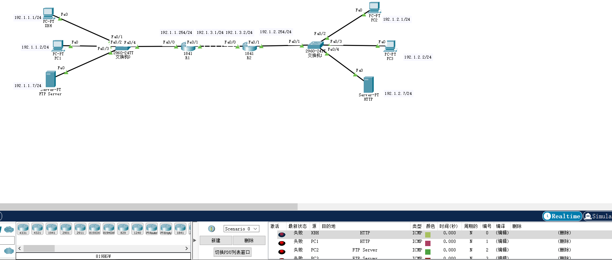

# 浙大城市学院实验报告

> - 课程名称：计算机网络实验       
> - 实验项目名称：实验十六 防火墙配置实验报告
> - 学生姓名：徐彬涵
> - 专业班级：软件工程2003
> - 学号：32001272 
> - 实验成绩：
> - 指导老师：霍梅梅
> - 日期：2022/06/02  

## 一、实验目的

1. 掌握防火墙工作原理；
2. 掌握无状态分组过滤、有状态分组过滤路由器配置;
3. 掌握终端上的防火墙配置

## 二、实验设备

1. Packet Tracer模拟器软件；
2. Cisco 2911路由器若干台，交换机若干台，PC机若干台，服务器若干台。

## 三、实验内容

### 1\. 无状态分组过滤器路由器防火墙配置

网络拓扑如下图所示：


1）配置路由器的各个接口的IP地址，子网掩码

2）配置路由器的路由协议（可以用RIP或者OSPF）

**R1**

```powershell
interface FastEthernet0/0 
ip address 192.1.1.254 255.255.255.0  
no shutdown
interface FastEthernet0/1  
ip address 192.1.3.1 255.255.255.0  
no shutdown
router rip  
network 192.1.1.0  
network 192.1.3.0
```

**R2**

```powershell
interface FastEthernet0/0 
ip address 192.1.3.2 255.255.255.0 
no shutdown
interface FastEthernet0/1 
ip address 192.1.2.254 255.255.255.0   
no shutdown
router rip  
network 192.1.2.0  
network 192.1.3.0
```

3）配置主机和服务器的IP地址、子网掩码、网关，配置服务器的HTTP、FTP服务;（在HTTP服务页面上显示自己的名字）


4）测试全网连通性


5）配置路由器R1和R2的**无状态分组过滤规则**

**R1**

```powershell
interface FastEthernet0/0 
ip access-group 101 in  
duplex auto   
speed auto 
interface FastEthernet0/1  
duplex auto   
speed auto 
access-list 101 permit tcp host 192.1.1.1 host 192.1.2.7 eq www
access-list 101 permit tcp host 192.1.1.7 eq ftp host 192.1.2.1
access-list 101 permit tcp host 192.1.1.7 gt 1024 host 192.1.2.1
access-list 101 deny ip any any

```

**R2**

```powershell
interface FastEthernet0/0 
duplex auto   
speed auto 
interface FastEthernet0/1 
ip access-group 101 in  
duplex auto   
speed auto 
access-list 101 permit tcp host 192.1.2.7 eq www host 192.1.1.1
access-list 101 permit tcp host 192.1.2.1 host 192.1.1.7 eq ftp
access-list 101 permit tcp host 192.1.2.1 host 192.1.1.7 gt 1024 
access-list 101 deny ip any any
```

6）测试过滤规则效果




### 2\. 有状态分组过滤器路由器防火墙配置

网络拓扑如下图所示：


1）配置路由器的各个接口的IP地址，子网掩码

2）配置路由器的路由协议（可以用RIP或者OSPF）

3）配置主机和服务器的IP地址、子网掩码、网关，配置服务器的HTTP、FTP服务;

（在HTTP服务页面上显示自己的名字）

4）测试全网连通性


5）配置路由器R1和R2的**有状态分组过滤规则**

**R1**

```powershell
ip inspect name a1 http timeout 3600
ip inspect name a1 tcp timeout 3600
ip inspect name a2 tcp timeout 36
spanning-tree mode pvst
interface FastEthernet0/0
ip access-group 101 in  
ip access-group 102 out  
ip inspect a1 in 
ip inspect a2 out  
duplex auto   
speed auto
interface FastEthernet0/1 
duplex auto   
speed auto 
access-list 101 permit tcp host 192.1.1.1 host 192.1.2.7 eq www
access-list 101 deny ip any any
access-list 102 permit tcp host 192.1.2.1 host 192.1.1.7 eq ftp
access-list 102 permit tcp host 192.1.2.1 host 192.1.1.7 gt 1024 
access-list 102 deny ip any any
```

R2

```powershell
ip inspect name a1 http timeout 3600
ip inspect name a1 tcp timeout 3600
ip inspect name a2 tcp timeout 3600
spanning-tree mode pvst 
interface FastEthernet0/0   
duplex auto   
speed auto
interface FastEthernet0/1  
ip access-group 102 in  
ip access-group 101 out  
ip inspect a2 in  
ip inspect a1 out  
duplex auto   
speed auto
access-list 101 permit tcp host 192.1.1.1 host 192.1.2.7 eq www
access-list 101 deny ip any any
access-list 102 permit tcp host 192.1.2.1 host 192.1.1.7 eq ftp
access-list 102 permit tcp host 192.1.2.1 host 192.1.1.7 gt 1024 
access-list 102 deny ip any any
```

6）测试过滤规则效果


### 3\. 终端和服务器防火墙配置

网络拓扑如下图所示：


1）配置路由器的各个接口的IP地址，子网掩码

2）配置主机和服务器的IP地址、子网掩码、网关，配置服务器的HTTP服务;

（在两个HTTP服务页面上分别显示自己的名字、自己的兴趣爱好）

**R0**

```powershell
interface FastEthernet0/0 
ip address 192.1.1.254 255.255.255.0  
no shutdown
interface FastEthernet0/1  
ip address 192.1.2.254 255.255.255.0  
no shutdown
router rip  
network 192.1.1.0  
network 192.1.2.0
```


3）测试全网连通性


4）配置每台终端的防火墙


5）测试防火墙过滤规则效果


## 四、收获感想：

记录实验感受、操作过程中遇到的困难及解决办法、遗留的问题、意见和建议等。

学习了防火墙的设置