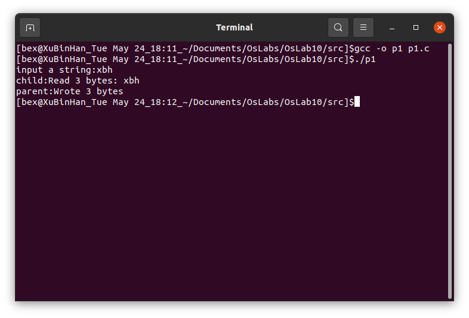
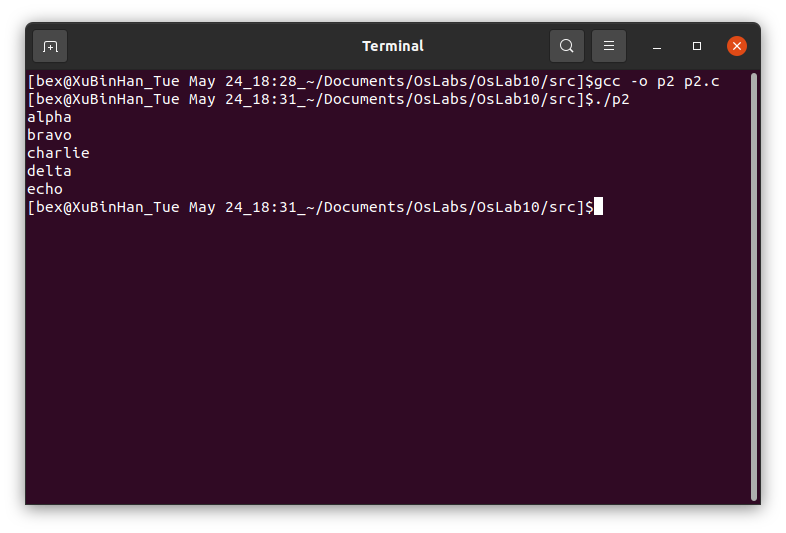
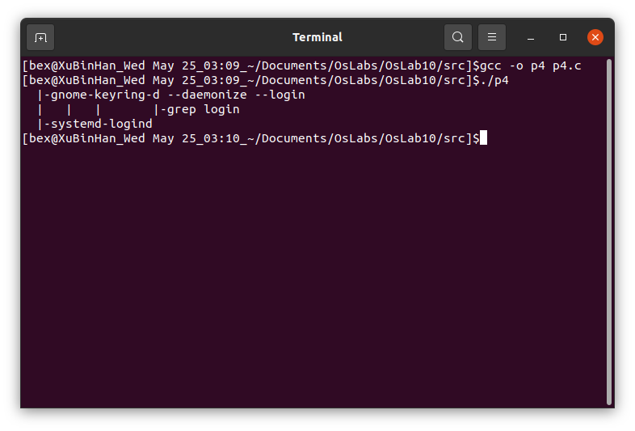
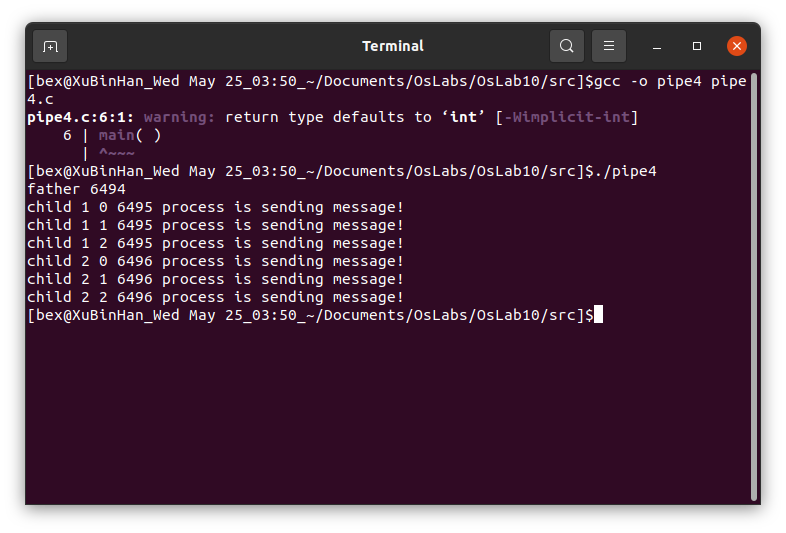
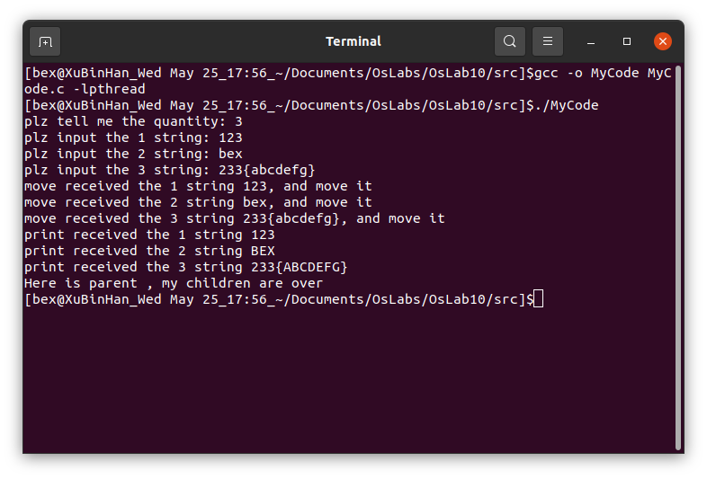

# 浙大城市学院实验报告

> - 课程名称：操作系统原理实验       
> - 实验项目名称：实验十 进程通信——管道    
> - 学生姓名：徐彬涵
> - 专业班级：软件工程2003
> - 学号：32001272 
> - 实验成绩：
> - 指导老师：胡隽
> - 日期：2022/05/25

## 实验目的

1. 了解Linux系统的进程间通信机构（IPC）；
2. 理解Linux关于管道的概念；
3. 掌握Linux支持管道的系统调用和管道的使用
4. 巩固进程同步概念

## 实验步骤

### p1.c

程序先用pipe创建了管道，接着用fork创建了新进程。如果fork操作成功，父进程用write函数把数据写到管道中，而子进程用read函数从管道中读出数据



### p2.c

程序先用`popen`创建了管道，并启动了`sort`进程。如果管道创建成功，将乱序数据写到管道中。`sort`进程将对输入的数据排序。
另一个创建管道的简单方法是使用库函数`FILE *popen(char *command, char *type)`。popen库函数允许一个程序把另一个程序当作一个新的进程来启动，并能对它发送数据或者
接受数据。popen库函数通过在系统内部调用`pipe()`来创建一个[半双工](https://baike.baidu.com/item/%E5%8D%8A%E5%8F%8C%E5%B7%A5/309852)的管道，然后它创建一个子进程，启动 `shell`，最后在`shell`上执行`command`参数中的命令。管道中数据流的方向
是由第二个参数`type`控制的。此参数可以是`r`或者`w`，分别代表读或写。但不能同时为读和写。如果成功，函数返回一个新的文件流。如果无法创建进程或者管道，返回 NULL。

使用`popen()`创建的管道必须使用`pclose()`关闭。`pclose`函数等待`popen`进程启动的进程运行结束才关闭文件流。




### p4.c

父进程关闭管道的两端，父进程不使用管道，并使用wait()等待两个子进程结束。



父进程创建的第一个子进程关闭了管道的fd1并关闭了默认的stdout输出口，然后调用dup将fd0设为输出口，最后再将与管道连接的fd0副本删除，只留下了一个fd0的输出口，父进程的第二个子进程关闭了管道的fd0并关闭了默认的stdin输入口，然后调用dup将fd1设为输入口，最后再将与管道连接的fd1副本删除，只留下了一个fd1的输入口，第一个子进程执行`pstree -a`后将输出通过管道传给第二个子进程当作输入，第二个子进程再对这个输入执行`grep login`操作,由于第二个进程本身的输出口没变，仍为stdout，从而将结果输出

整体运行结果相当于执行指令`pstree -a | grep login`

### pipe4.c



父进程创建了两个子进程，在第一个子进程被创建后，同时调用`lockf()`函数将管道设为互斥锁定区域，这时候另一个子进程由于也调用了`lockf()`就会先等待第一个进程将内容全部写入调用`lockf()`将管道解锁后才可以写入，从而实现了进程间对于写入管道的互斥，最后父进程在子进程结束后将管道内的内容全部输出

### 编程题

假定系统有三个并发进程read，move和print共享缓冲器B1和B2。进程read负责从输入设备上读信息，每读出一个记录后把它存放到缓冲器B1中。进程move从缓冲器B1中取出一个记录，加工后存入缓冲器B2。进程print将B2中的记录取出打印输出。缓冲器B1和B2每次只能存放一个记录。要求三个进程协调完成任务，使打印出来的与读入的记录的个数，次序完全一样。试创建三个进程，用`pipe()`打开两个管道，如下图所
示，实现三个进程之间的同步。

使用一个管道和信号量实现通信


```c
#include <errno.h>
#include <fcntl.h>
#include <semaphore.h>
#include <stdio.h>
#include <stdlib.h>
#include <string.h>
#include <sys/ipc.h>
#include <sys/sem.h>
#include <sys/types.h>
#include <sys/wait.h>
#include <unistd.h>
#include <string.h>

#define STR_MAX_SIZE 100
#define CHECK(x)                                            \
    do {                                                    \
        if (!(x)) {                                         \
            fprintf(stderr, "%s:%d: ", __func__, __LINE__); \
            perror(#x);                                     \
            exit(-1);                                       \
        }                                                   \
    } while (0)


int main() {
    int fd[2], pid, i = 0, j = 0;
    int len;
    int count;
    ssize_t n;
    char str[STR_MAX_SIZE];
	//sem_t *read_mutex;
    sem_t *move_mutex;
    sem_t *print_mutex;
    //read_mutex = sem_open("pipe_test_read", O_CREAT | O_RDWR, 0666, 1);
    move_mutex = sem_open("pipe_test_move", O_CREAT | O_RDWR, 0666, 0);
    print_mutex = sem_open("pipe_test_print", O_CREAT | O_RDWR, 0666, 0);

	printf("plz tell me the quantity: ");
	scanf("%d",&count);
	
    CHECK(pipe(fd) >= 0);
    CHECK((pid = fork()) >= 0);
    
    if (pid == 0) {// child1 read
        //sem_wait(read_mutex);
        
        for(i = 1; i <= count; ++i){
        	printf("plz input the %d string: ", i);
        	scanf("%s",str);
        	write(fd[1], str, STR_MAX_SIZE);
        }
        
        sem_post(move_mutex);
        exit(EXIT_SUCCESS);
    }

    CHECK((pid = fork()) >= 0);
    if (pid == 0) {//child2 move
        sem_wait(move_mutex);
        
        for(i = 1; i <= count; ++i){
        	read(fd[0], str, STR_MAX_SIZE);
        	printf("move received the %d string %s, and move it\n", i, str);
        	for(j = 0; j < strlen(str); ++j){
        		if(str[j] >= 97 && str[j] <= 122)
        			str[j] -= 32; 
        	}
        	write(fd[1], str, STR_MAX_SIZE);
        }
        
        sem_post(print_mutex);
        exit(EXIT_SUCCESS);
    }

    CHECK((pid = fork()) >= 0);
    if (pid == 0) {//child3 print
        sem_wait(print_mutex);
        
        for(i = 1; i <= count; ++i){
        	read(fd[0], str, STR_MAX_SIZE);
        	printf("print received the %d string %s\n", i, str);
        }
        
        exit(EXIT_SUCCESS);
    }
    
    wait(0);
    wait(0);
    wait(0);

    printf("Here is parent , my children are over\n");

    //sem_close(read_mutex);
    sem_close(move_mutex);
    sem_close(print_mutex);
    //sem_unlink("pipe_test_read");
    sem_unlink("pipe_test_move");
    sem_unlink("pipe_test_print");
    return 0;
}
```


