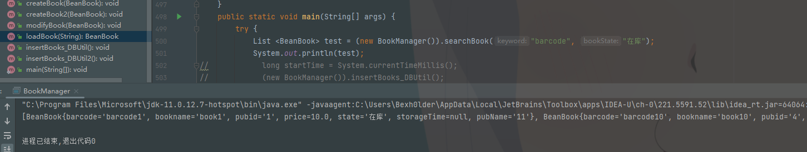
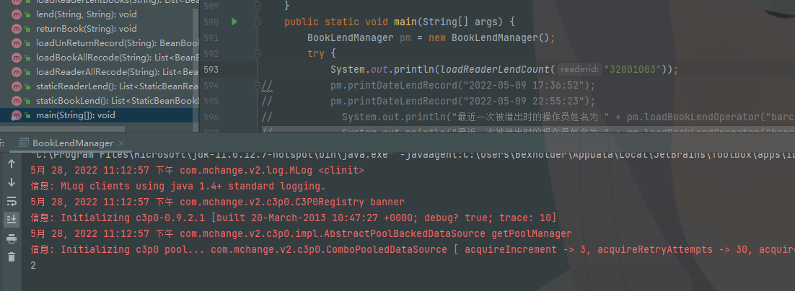
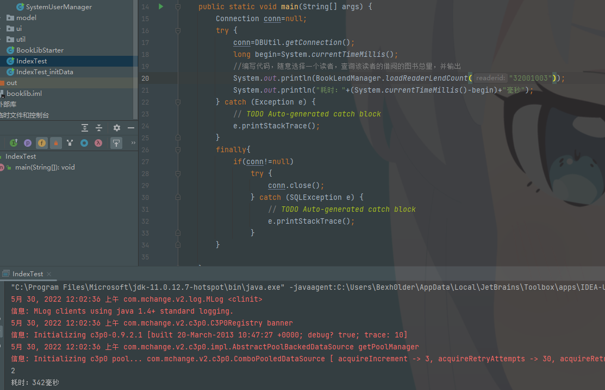

# 实验八 JDBC进阶（2）

## 一、相关知识点

1. JDBC基本概念
2. 视图、索引
3. java集合框架

## 二、实验目的：

1. 理解视图和索引的概念，并通过视图设计简化程序设计，通过索引设计优化查询性能；
2. 理解java集合框架

## 三、实验内容：

### 1、 设计读者视图view_reader，并修改readerManager类中相关代码。

第一步：建立读者视图，要求视图中包含读者类别名称；

第二步：改造ReaderManager类，将其中的连接查询用视图代替。

第三步：运行图书管理系统，进行各个功能的测试（读者类别管理、读者管理）

【实验结果与分析】

A、 写出视图创建代码。

```sql
create view view_reader as
select a.*, b.readertypename
from beanreader a, beanreadertype b
where a.readerTypeId = b.readerTypeId;
```


B、 给出改造后ReaderManager类的各个方法的代码。

- ReaderManager.searchReader

  ```java
  public List<BeanReader> searchReader(String keyword, int readerTypeId) throws BaseException {
          List<BeanReader> result = new ArrayList<BeanReader>();
          Connection conn = null;
          try {
              conn = DBUtil.getConnection();
              //连接查询
  //            String sql = "select readerid,readerName,r.readerTypeId,r.lendBookLimitted,createDate,creatorUserId,stopDate,stopUserId,rt.readerTypeName" +
  //                    "  from BeanReader r,BeanReaderType rt where r.readerTypeId=rt.readerTypeId" +
  //                    " and removeDate is null ";
              //创建试图查询
              String sql = "select readerid,readerName,readerTypeId,lendBookLimitted,createDate,creatorUserId,stopDate,stopUserId,readerTypeName" +
                      " from view_reader" +
                      " where removeDate is null ";
              if (readerTypeId > 0) sql += " and readerTypeId=" + readerTypeId;
              if (keyword != null && !"".equals(keyword))
                  sql += " and (readerid like ? or readerName like ?)";
              sql += " order by readerid";
              sql += "limit ?,?";
              java.sql.PreparedStatement pst = conn.prepareStatement(sql);
              if (keyword != null && !"".equals(keyword)) {
                  pst.setString(1, "%" + keyword + "%");
                  pst.setString(2, "%" + keyword + "%");
                  pst.setObject(3, (PageData.getPageIndex()-1)*PageData.getPageSize());
                  pst.setObject(4,PageData.getPageSize());
              }else {
                  pst.setObject(1, (PageData.getPageIndex()-1)*PageData.getPageSize());
                  pst.setObject(2,PageData.getPageSize());
              }
  
              java.sql.ResultSet rs = pst.executeQuery();
              while (rs.next()) {
                  BeanReader r = new BeanReader();
                  r.setReaderid(rs.getString(1));
                  r.setReaderName(rs.getString(2));
                  r.setReaderTypeId(rs.getInt(3));
                  r.setLendBookLimitted(rs.getInt(4));
                  r.setCreateDate(rs.getDate(5));
                  r.setCreatorUserId(rs.getString(6));
                  r.setStopDate(rs.getDate(7));
                  r.setStopUserId(rs.getString(8));
                  r.setReaderTypeName(rs.getString(9));
                  result.add(r);
              }
          } catch (SQLException e) {
              e.printStackTrace();
              throw new DbException(e);
          } finally {
              if (conn != null)
                  try {
                      conn.close();
                  } catch (SQLException e) {
                      // TODO Auto-generated catch block
                      e.printStackTrace();
                  }
          }
          return result;
  
      }
  ```

  

- ReaderManager.loadReader

  ```java
  public BeanReader loadReader(String readerid) throws DbException {
          Connection conn = null;
          try {
              conn = DBUtil.getConnection();
              //连接查询
  //            String sql = "select readerid,readerName,r.readerTypeId,r.lendBookLimitted,createDate,creatorUserId,stopDate,stopUserId,rt.readerTypeName,r.removeDate" +
  //                    "  from BeanReader r,BeanReaderType rt where r.readerTypeId=rt.readerTypeId" +
  //                    " and  r.readerid=?";
              //视图查询
              String sql = "select readerid,readerName,readerTypeId,lendBookLimitted,createDate,creatorUserId,stopDate,stopUserId,readerTypeName,removeDate" +
                      " from view_reader" +
                      " where readerid=?";
              sql += " order by readerid";
              java.sql.PreparedStatement pst = conn.prepareStatement(sql);
              pst.setString(1, readerid);
              java.sql.ResultSet rs = pst.executeQuery();
              if (rs.next()) {
                  BeanReader r = new BeanReader();
                  r.setReaderid(rs.getString(1));
                  r.setReaderName(rs.getString(2));
                  r.setReaderTypeId(rs.getInt(3));
                  r.setLendBookLimitted(rs.getInt(4));
                  r.setCreateDate(rs.getDate(5));
                  r.setCreatorUserId(rs.getString(6));
                  r.setStopDate(rs.getDate(7));
                  r.setStopUserId(rs.getString(8));
                  r.setReaderTypeName(rs.getString(9));
                  r.setRemoveDate(rs.getDate(10));
                  r.setUnreturnedBooks((new BookLendManager()).loadReaderLentBooks(r.getReaderid()));//修改处
                  return r;
              }
          } catch (SQLException e) {
              e.printStackTrace();
              throw new DbException(e);
          } finally {
              if (conn != null)
                  try {
                      conn.close();
                  } catch (SQLException e) {
                      // TODO Auto-generated catch block
                      e.printStackTrace();
                  }
          }
          return null;
      }
  ```

### 2、 设计图书视图view_book，并修改BookManager类中相关代码。

第一步：建立图书视图，要求视图中包含出版社名称；

第二步：改造BookManager类，将其中的连接查询用视图代替。

第三步：运行图书管理系统，进行各个功能的测试

【实验结果与分析】

A、 写出视图创建代码。

```sql
create view view_book as
select a.*, b.publishername
from beanbook a, beanpublisher b
where a.pubid = b.pubid;
```

B、 给出改造后BookManager类的各个方法的代码。

- BookManager.searchBook

  ```java
  public List<BeanBook> searchBook(String keyword, String bookState) throws BaseException {
          List<BeanBook> result = new ArrayList<BeanBook>();
          Connection conn = null;
          try {
              conn = DBUtil.getConnection();
              //连接查询
  //            String sql = "select b.barcode,b.bookname,b.pubid,b.price,b.state,p.publishername " +
  //                    " from beanbook b left outer join beanpublisher p on (b.pubid=p.pubid)" +
  //                    " where  b.state='" + bookState + "' ";
  //            if (keyword != null && !"".equals(keyword))
  //                sql += " and (b.bookname like ? or b.barcode like ?)";
  //            sql += " order by b.barcode";
              //视图查询
              String sql = "select barcode, bookname, pubid, price, state, publishername " +
                      " from view_book" +
                      " where  state='" + bookState + "' ";
  
              if (keyword != null && !"".equals(keyword))
                  sql += " and (bookname like ? or barcode like ?)";
              sql += " order by barcode";
              java.sql.PreparedStatement pst = conn.prepareStatement(sql);
              if (keyword != null && !"".equals(keyword)) {
                  pst.setString(1, "%" + keyword + "%");
                  pst.setString(2, "%" + keyword + "%");
              }
  
              java.sql.ResultSet rs = pst.executeQuery();
              while (rs.next()) {
                  BeanBook b = new BeanBook();
                  b.setBarcode(rs.getString(1));
                  b.setBookname(rs.getString(2));
                  b.setPubid(rs.getString(3));
                  b.setPrice(rs.getDouble(4));
                  b.setState(rs.getString(5));
                  b.setPubName(rs.getString(6));
                  result.add(b);
              }
          } catch (SQLException e) {
              e.printStackTrace();
              throw new DbException(e);
          } finally {
              if (conn != null)
                  try {
                      conn.close();
                  } catch (SQLException e) {
                      // TODO Auto-generated catch block
                      e.printStackTrace();
                  }
          }
          return result;
  
      }
  ```

  

- BookManager.searchBook

  ```java
  public BeanBook loadBook(String barcode) throws DbException {
          Connection conn = null;
          try {
              conn = DBUtil2.getConnection();
  //            String sql = "select b.barcode,b.bookname,b.pubid,b.price,b.state,b.storagetime,p.publishername " + //修改处
  //                    " from beanbook b left outer join beanpublisher p on (b.pubid=p.pubid)" +
  //                    " where  b.barcode=? ";
              String sql = "select barcode, bookname, pubid, price, state, storagetime, publishername " + //修改处
                      " from view_book " +
                      " where barcode=? ";
              java.sql.PreparedStatement pst = conn.prepareStatement(sql);
              pst.setString(1, barcode);
              java.sql.ResultSet rs = pst.executeQuery();
              if (rs.next()) {
                  BeanBook b = new BeanBook();
                  b.setBarcode(rs.getString(1));
                  b.setBookname(rs.getString(2));
                  b.setPubid(rs.getString(3));
                  b.setPrice(rs.getDouble(4));
                  b.setState(rs.getString(5));
                  b.setStorageTime(rs.getDate(6));//修改处
                  b.setPubName(rs.getString(7));
                  return b;
              }
          } catch (SQLException e) {
              e.printStackTrace();
              throw new DbException(e);
          } finally {
              if (conn != null)
                  try {
                      conn.close();
                  } catch (SQLException e) {
                      // TODO Auto-generated catch block
                      e.printStackTrace();
                  }
          }
          return null;
      }
  ```

  

 

 

 

### 3、 设计读者借阅情况统计视图view_reader_static，并在BookLendManager类中添加根据读者ID提取其借阅数量的代码。

第一步：建立读者统计视图，要求视图中包含读者ID、读者姓名、借阅数量；

第二步：在BookLendManager中添加方法 public int loadReaderLendCount(String readerid) throws DbException。并编写其代码

第三步：在BookLendManager类中添加main函数，并编写上述方法的测试代码。进行功能的测试

【实验结果与分析】

A、 写出视图创建代码。

```sql
create view view_reader_static as
select a.readerid, (count(*)-1) num
from (
	select readerid
	from beanreader
	union all
	select readerid
	from beanbooklendrecord
	where returnDate is null
) a
group by readerid;
```

B、 给出改造后BookLendManager类的各个方法的代码。

```java
public static int loadReaderLendCount(String readerid) throws Exception {
    Connection conn = null;
    PreparedStatement ps = null;
    ResultSet rs = null;
    try {
        conn = DBUtil2.getConnection();

        String sql = "select num from view_reader_static where readerid = ?";
        ps = conn.prepareStatement(sql);

        ps.setObject(1,readerid);

        rs = ps.executeQuery();

        if (rs.next()) {
            return rs.getInt(1);
        }
    } catch (Exception e) {
        e.printStackTrace();
    } finally {
        DBUtil2.closeResorce(conn,ps,rs);
    }

    return 0;
}
```



 

### 4、 索引实验：

第一步：完成IndexTest_initData类中的代码，并测试。

第二步：完成IndexTest类中的代码，并测试，记录执行结果

第三步：通过查询分析器，在BeanBookLendRecord表的readerid上建立索引

第四步：再次执行IndexTest类，记录执行结果

A、 给出两个类的代码和索引建立的代码

- IndexTest_initData

  ```java
  public void AutogenerationReaders(String readeridKeyword, String nameKeyword, int num, int PreReaderTypeId) throws BaseException{
  		Connection conn = null;
  		java.sql.PreparedStatement pst = null;
  		try {
  		    conn = DBUtil.getConnection();
  		    String sql = "select lendBookLimitted from BeanReaderType where readerTypeId=" + PreReaderTypeId;
              java.sql.Statement st = conn.createStatement();
              java.sql.ResultSet rs = st.executeQuery(sql);
              if (!rs.next()) throw new BusinessException("读者类别不存在");
              int lendBookLimitted = rs.getInt(1);
              rs.close();
              st.close();
  		    sql = "insert into BeanReader(readerid,readerName,readerTypeId,lendBookLimitted,createDate,creatorUserId) values(?,?,?,?,?,?)";
  		    pst = conn.prepareStatement(sql);
  		    //手动事务
  		    conn.setAutoCommit(false);
  		    Long startTime = System.currentTimeMillis();
  		    int count =0;
  		    System.out.println("开始插入...");
  		    for(int i = 0; i < num; i++){
  		    	pst.setString(1, readeridKeyword + String.valueOf(i));
  	            pst.setString(2, nameKeyword + String.valueOf(i));
  	            pst.setInt(3, PreReaderTypeId);//将所有创建的读者类型设为
  	            pst.setInt(4, lendBookLimitted);
  	            pst.setTimestamp(5, new java.sql.Timestamp(System.currentTimeMillis()));
  	            pst.setString(6, "admin"); //默认为admin创建
  	            pst.addBatch();
  	            count++;
  	            if(count>=25000) {
  	                //每25000条数据进行一次批量插入操作
  	                pst.executeBatch();
  	                pst.clearBatch();
  	                conn.commit();
  	                count = 0;
  	            }
  		    }
  		    if(count != 0)
  		    {
  		    	pst.executeBatch();
                  pst.clearBatch();
                  conn.commit();
                  count = 0;
  		    }
  		    Long endTime = System.currentTimeMillis();
  		    System.out.println(num + "条数据插入完成,总用时：" + (endTime - startTime)+"ms");
  		} catch (Exception e) {
  		    e.printStackTrace();
  		    throw new RuntimeException(e);
  		}finally{
  		    if(pst !=null){
  		        try {
  		            pst.close();
  		        } catch (SQLException e) {
  		            e.printStackTrace();
  		            throw new RuntimeException(e);
  		        }
  		    }
  		    if(conn!=null){
  		        try {
  		            conn.close();
  		        } catch (SQLException e) {
  		            e.printStackTrace();
  		            throw new RuntimeException(e);
  		        }
  		    }
  		}
  	}
  ```

  ```java
  public void AutogenerationBooks(String barcodeKeyword, String bookNameKeyword,int num, String Prepubid) throws BaseException{
  		Connection conn = null;
  		java.sql.PreparedStatement pst = null;
  		try {
  		    conn = DBUtil.getConnection();
  		    String sql = "select * from beanpublisher where pubid=" + Prepubid;
              java.sql.Statement st = conn.createStatement();
              java.sql.ResultSet rs = st.executeQuery(sql);
              if (!rs.next()) throw new BusinessException("出版社类别不存在");
              rs.close();
              st.close();
  		    sql = "insert into BeanBook(barcode,bookname,pubid,price,state,storagetime) values(?,?,?,?,'在库',?)";
  		    pst = conn.prepareStatement(sql);
  		    //手动事务
  		    conn.setAutoCommit(false);
  		    Long startTime = System.currentTimeMillis();
  		    int count =0;
  		    System.out.println("开始插入...");
  		    for(int i = 0; i < num; i++){
  	            pst.setString(1, barcodeKeyword + String.valueOf(i));
  	            pst.setString(2, bookNameKeyword + String.valueOf(i));
  	            pst.setString(3, Prepubid);
  	            pst.setDouble(4, 10);
  	            pst.setTimestamp(5, new java.sql.Timestamp(System.currentTimeMillis()));
  	            pst.addBatch();
  	            count++;
  	            if(count>=25000) {
  	                //每25000条数据进行一次批量插入操作
  	                pst.executeBatch();
  	                pst.clearBatch();
  	                conn.commit();
  	                count = 0;
  	            }
  		    }
  		    if(count != 0)
  		    {
  		    	pst.executeBatch();
                  pst.clearBatch();
                  conn.commit();
                  count = 0;
  		    }
  		    Long endTime = System.currentTimeMillis();
  		    System.out.println(num + "条数据插入完成,总用时：" + (endTime - startTime)+"ms");
  		} catch (Exception e) {
  		    e.printStackTrace();
  		    throw new RuntimeException(e);
  		}finally{
  		    if(pst !=null){
  		        try {
  		            pst.close();
  		        } catch (SQLException e) {
  		            e.printStackTrace();
  		            throw new RuntimeException(e);
  		        }
  		    }
  		    if(conn!=null){
  		        try {
  		            conn.close();
  		        } catch (SQLException e) {
  		            e.printStackTrace();
  		            throw new RuntimeException(e);
  		        }
  		    }
  		}
  	}
  ```

  

- IndexTest

  

B、 比较IndexTest类两次执行的结果，并说明索引的作用。并思考：如果我们需要经常查询某用户近期借阅的n本图书，请问，应该如何建立索引？【提示：多列索引】

```sql
ALTER TABLE `beanbooklendrecord` ADD INDEX books_recently_borrowed_bytheuser(`readerid`, `lendDate`);
```

 

### 5、 数据统计实验：

A、在ReaderManager中，添加函数Map<String,Integer> staticTypeReaderCount()...

要求通过读者类别名称及其读者数量，请给出代码：

```java
public Map<String,Integer> staticTypeReaderCount() throws Exception {
        Map<String, Integer> re = new HashMap<>();

        Connection conn = DBUtil.getConnection();

        String sql = "select readerTypeId, count(*) num from beanreader " + "group by readerTypeId";
        java.sql.PreparedStatement ps = conn.prepareStatement(sql);

        java.sql.ResultSet rs = ps.executeQuery();

        while(rs.next()) {
            String typeid = rs.getString(1);
            int num = rs.getInt(2);
            re.put(typeid,num);
        }
        System.out.println(re.size());
        return re;
    }
```

 

B、在BookManager中，添加函数Map<String,Double> staticPublisherBookAvgPrice()...  。要求统计各出版社名称及其图书的平均价格，请给出代码：

```java
public Map<String,Double> staticPublisherBookAvgPrice() throws SQLException {
        Map<String, Double> re = new HashMap<>();

        Connection conn = DBUtil.getConnection();

        String sql = "select pubid, avg(price) avg_price from beanbook " + "group by pubid";
        java.sql.PreparedStatement ps = conn.prepareStatement(sql);

        java.sql.ResultSet rs = ps.executeQuery();

        while(rs.next()) {
            String typeid = rs.getString(1);
            double price = rs.getInt(2);
            re.put(typeid,price);
        }
        System.out.println(re.size());
        return re;
    }
```


C、在BookLendManager中，添加函数Map<String,Integer> staticReaderBookCount()... 。要求统计读者为归还的图书数量，返回结果的key为读者ID。请给出代码：

```java
 public Map<String,Integer> staticReaderBookCount() throws SQLException {
        Map<String, Integer> re = new HashMap<>();

        Connection conn = DBUtil.getConnection();

        String sql = "select readerid ,count(1) num" + " from beanbooklendrecord" + " where returnDate is not null" + " group by readerid";

        java.sql.PreparedStatement ps = conn.prepareStatement(sql);

        java.sql.ResultSet rs = ps.executeQuery();

        while(rs.next()) {
            String typeid = rs.getString(1);
            int num = rs.getInt(2);
            re.put(typeid,num);
        }
        System.out.println(re.size());
        return re;
    }
```

6、 集合对象的遍历实验：

A、编写批量借阅读书函数： public void lendbooks(String readerId,Collection<String> barcodes) .... 。其中第二个参数为图书条码集合。

```java
public void lendbooks(String readerId,Collection<String> barcodes) throws BaseException {
        Object[] objects = barcodes.toArray();
        for (int i = 0; i < objects.length; i++) {
            lend((String) objects[i],readerId);
        }
    }
```

B、编写批量设置罚金函数：public void setPenalSum(String readerId,Map<String,Double> penalSums) .... 。其中第二个参数的key为barcode，value为改读者尚未归还图书的罚金（注意，不要设置已经归还图书的罚金）。

```java
public void setPenalSum(String readerId,Map<String,Double> penalSums) throws Exception {
    Connection conn = null;
    PreparedStatement ps = null;
    try {
        conn = DBUtil.getConnection();
        String sql = "update beanbooklendrecord set penalSum = ? where readerid = ? and bookBarcode = ? and returnDate is null";
        ps = conn.prepareStatement(sql);
        ps.setObject(2,readerId);
        for (Map.Entry<String,Double> x : penalSums.entrySet()) {
            String barcode = x.getKey();
            double penal = x.getValue();
            ps.setObject(1,penal);
            ps.setObject(3,barcode);
            ps.execute();
        }
    } catch (SQLException e) {
        e.printStackTrace();
    } finally {
        DBUtil.closeResorce(conn,ps);
    }

}
```

 

 

 

 

 

 

 

 

 

 