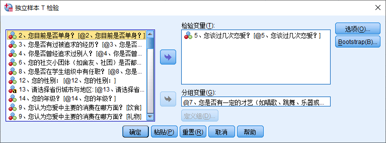
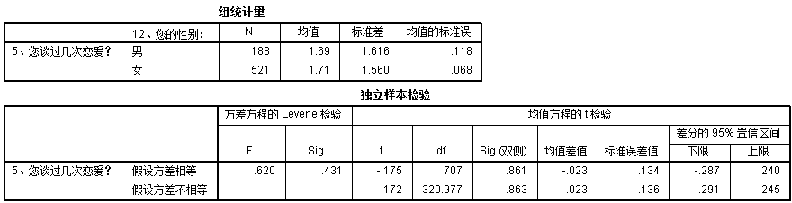

# 大学生恋爱数据分析

## 研究背景

*看好数据主要是大学生和研究生*

## 数据资料

## 对于数据的初步解读(图有问题，再加个扇形图)

## 研究目标

## 数据分析

### 假设性检验

#### 对平均恋爱次数的假设

> p122
>
> u为平均恋爱次数
>
> 原假设H0：u=2
>
> H1：u！=2
>
> 1. 由上图表一可以看出，大学生谈过恋爱次数的平均值为1.71，标准差为1.574，均值的标准误为0.059
> 2. 由上图表二可以看出，检验值为2，样本均值与检验值的差为0.29，检验统计量的观察值为-4.927，输出结果中的“Sig.(双侧)”即为检验的p值，由于p值 = 0.000 < 0.01，表面我们有充分的理由拒绝原假设，即有充分的理由认为学生的平均恋爱次数为2与实际平均恋爱次数有显著差异

#### 分析性别对恋爱次数的影响

p130

> u1为男同学的恋爱次数，u2为女同学的恋爱次数
>
> 原假设为H0：u1=u2
>
> H1：u1！=u2
>
> 1. 上图表一为两组样本的基本统计量，由此可以看出，男同学组和女同学组的均值和标准差有一定差距，但差别不大
> 2. 在表二中，我们先看方差是否相等的检验，采用的使Levene F检验，检验的显著性水平“Sig.”(即p值)等于0.431，如果采用的显著性水平为0.1，意味着我们没有充分的理由拒绝原假设，即认为两总体的标准差相等，因此采用加权两样本t检验(情形Ⅱ)，即第一行的“假设方差相等情形”的结果
> 3. 检验统计量的值为-0.175，自由度df为707，双侧检验的p值为0.861 > 0.1，因此我们没有充分的理由拒绝男女恋爱次数相等的原假设，即男女的恋爱次数并无显著差异

### 方差分析

#### 不同年级对恋爱次数是否有显著差异

> p152-154 单因素方差分析
>
> 原假设H0：u1=u2=u3=u4=u5 
>
> H1:u1 u2 u3 u4 u5 全不相等
>
> 1. 描述表给出了不同年级的谈过恋爱次数的样本量、样本均值、标准差、标准误以及各个总体均值的置信水平为95%的置信区间等描述性信息
> 2. 方差齐性检验表给出了方差齐次性检验的结果，表中最后一列即为检验的p值，等于0.142，因此在显著性水平0.05下，可以认为模型中的各个总体方差是齐次的
> 3. ANOVA表为方差分析表，最后一列即为检验的p值，等于0.034，在显著性水平0.05下，应拒绝原假设，认为5个年级的恋爱次数存在显著差异，即考察因素是显著的，但是无法判断那几个总体的均值是不同的，因此采用多重比较进一步讨论
> 4. 由折线图可以直观地反映均值的变化情况
> 5. 多重比较采用LSD法，从中可见，大三和硕士及以上的p值很小，也就说明这两者均值差异较大，大一和大四、大一和硕士及以上、大三和大四的p值也相对较小
> 6. 由方差分析表得出在显著性水平0.05下，应拒绝原假设，认为5个年级的恋爱次数存在显著差异，但从折线图和多重比较表都可以得出大四和硕士及以上学历的恋爱次数无显著差异，而大三和硕士及以上的恋爱次数存在显著不同，大三恋爱次数均值比硕士及以上要低，由此可以对照恋爱次数在一定程度上判断年级

#### 是否有才艺与是否参加学生会对恋爱次数的影响

> *才艺影响显著*
>
> 双因素的方差分析p164
>
> 1. 从主体间因子表可见出题中两个元素是否有才艺和是否在学生会任职均为两个水平
> 2. 在主体间效应检验分析列表中，可以看到是否具有才艺、是否学生会任职、是否具有才艺*是否学生会任职的显著性数值，根据国际衡量值0.05可知，其中只有是否具有才艺具有明显的显著性，具有可继续研究的价值，其余不具有明显显著性，没有继续研究价值

### 线性分析

#### 变量与处理

由于我们的初始数据都是分类数据，每个因素的值不是1就是0，所以很难进行线性分析，于是我们想到建立数学模型，对已有变量进行建模，生成新的变量，以便进行线性分析

首先我们可以将“恋爱中主要消费”的多选列进行分析，分析每个选项的权重情况

频率表如下：

可以发现选择饮食占据了大多数，其次是礼物，旅游，交通通讯其他在多选中占比较少

所以可以进行数学公式模拟，设置变量，恋爱中花费系数 = 因素x频率

可得恋爱中花费系数  = 饮食x94.1+礼物x82.1+旅游x56.3+交通x47.5+通讯x9.9+其他x6.5

同理，构建变量注重恋人系数（男生对女生）

构建恋人注重系数（女生对男生）：

我们得到如下三列数据：

#### 进行一元线性分析——注重恋人系数与恋人注重系数的一元线性关系

> p194
>
> 1. 表一为回归分析的一般说明，指出了自变量是恋人注重系数，因变量是注重恋人系数，回归选择的方法是所有变量直接进入模型
>
> 2. 表二给出了模型的指标，回归方程的相关系数为0.566，判定系数为0.320，与1相差较远，说明因变量的变异有56.6%是自变量引起的，给出的估计值为47.56140
>
> 3. 表三为模型线性关系检验的结果，其中检验统计量的值F = 333.131，最后一列计算了检验的p值为0.000，这表明线性回归方程是显著的，即注重恋人系数对恋人注重系数在统计意义下具有显著的线性关系
>
> 4. 表四是回归系数表，由此可以得到线性回归方程为(x：恋人注重系数，y：注重恋人系数)
>    $$
>    y = 115.827 + 0.532 * x
>    $$
>    

#### 进行多元线性分析——注重恋人指数与恋人注重指数对恋爱花费系数的多元线性分析

> 1. 表一为回归分析的一般说明，指出了自变量是恋人注重系数和注重恋人系数，因变量是恋爱花费系数，回归选择的方法是所有变量直接进入模型，回归的选择方法为向前
> 2. 表二给出了模型整体拟合效果，其多元决定系数为0.55，修正的多元决定系数为0.54，说明恋人注重系数对于因变量的解释度一般，再加上注重恋人系数后多元决定系数的变化不大，说明注重变量系数对因变量的影响很小
> 3. 表四的最后两列的两个自变量恋人注重系数和注重恋人系数的容差均为0.680 > 0.1，VIF = 1.471 < 10，说明恋人注重系数和注重恋人系数不存在多重共线性

## 对大学生恋爱数据的总结