# 回归分析

## 银行贷款样例

> 一家大型商业银行为了弄清不良贷款形成的原因，以便找出控制不良贷款的办法，现利用相关业务数据进行分析。

1. 利用SPSS分别作出分行不良贷款与其他四个变量(依此记为x1,x2,x3,x4)的散点图

   - 不良贷款和各项贷款总额近似于线性关系

   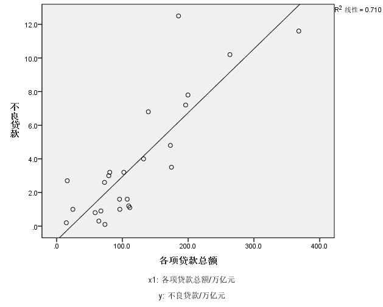

   - 本年度累计营收贷款和不良贷款近似于线性关系

   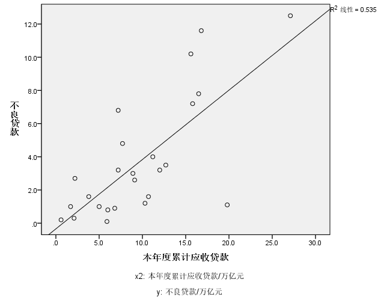

   - 贷款项目个数和不良贷款近似于线性关系

   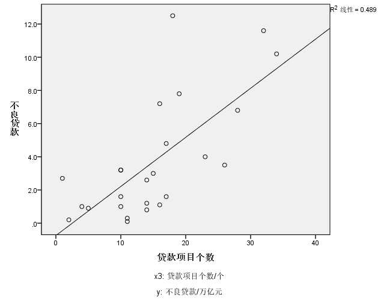

   - 固定资产投资额和不良贷款率不近似线性关系

   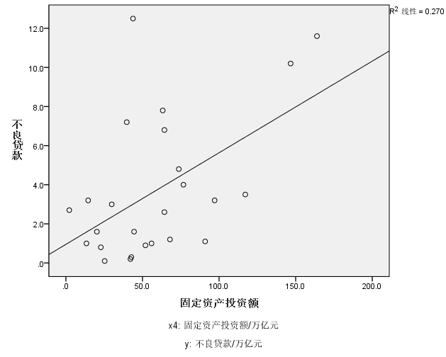

2. 利用SPSS计算分行不良贷款与其他四个变量的皮尔逊相关系数;

   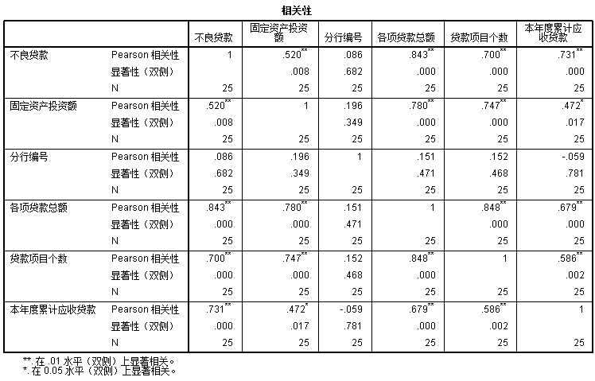

   通过观察表格，我们可以得知各变量与不良贷款的皮尔逊相关系数，各项贷款总额和不良贷款的皮尔逊系数为0.843，在四个变量中和不良贷款的皮尔逊系数最高，线性关系最强，再看本年度累计应收贷款和不良贷款的皮尔森相关系数为0.731，贷款项目个数和不良贷款的皮尔森相关系数为0.7，可以得出这两个变量和不良贷款的线性关系也较强，最后看固定资产投资额的皮尔森相关系数只有0.52，所以线性关系相对较弱

3. 分析不良资产的形成与哪些变量有关，并建立回归方程。

   #### 进入选择法

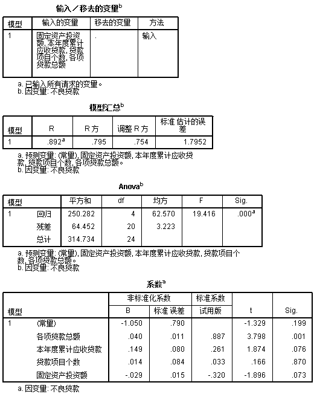

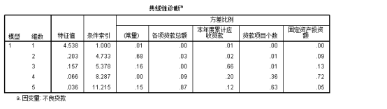

由上列表可得

- 模型汇总表中，多元决定系数为0.795，修正的多元决定系数为0.754，说明选择的变量对于因变量的解释度还算较高
- Anova表给出了方程检验的方差分析，从中可见F检验的P值近似为0，故可以判断模型十分显著
- 系数表中，变量各项贷款总额和固定资产投资额通过了检验，贷款项目个数的p值为0.870，对因变量而言不够显著 ，可以考虑剔除

#### 逐步选择法

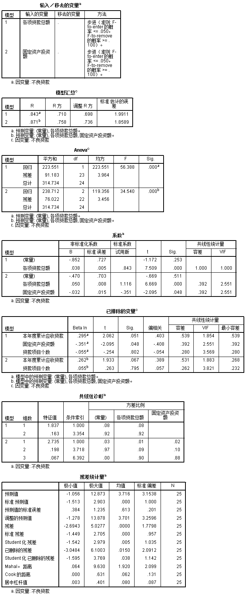

- 剔除本年度累计应收贷款和贷款项目个数后，R² = 0.758，调整后的R² = 0.736，相对原理变化较小，说明本年度累计应收贷款和贷款项目个数对因变量的变化小

- 系数表中最后两列入选变量各项贷款总额和固定资产投资的容差均为0.392 > 0.1，VIF = 2.551 < 10，说明各项贷款总额和固定资产投资不存在多重共线性

- 已排除的变量表中最后两列本年度累计应收贷款和贷款项目个数的容差为，0.531和0.262，VIF为1.883和3.821，虽然没有达到多重共线的标准，但剔除这两个变量后多元决定系数变化很小，所以剔除这两个变量是合理的

- 利用系数表格得到回归方程：
  $$
  y = -0.47 +0.05*各项贷款总额-0.032*固定资产投资额
  $$
  

## 粮食产量样例

> 根据理论和经验分析，影响粮食生产(y)的主要因素大致有：化肥施用量(x1)、播种面积(x2)、成灾面积(x3)、农业机械总动力(x4)、劳动力(x5)

1. 将所有变量选入线性回归模型，得到参数估计并完成参数的显著性检验;

   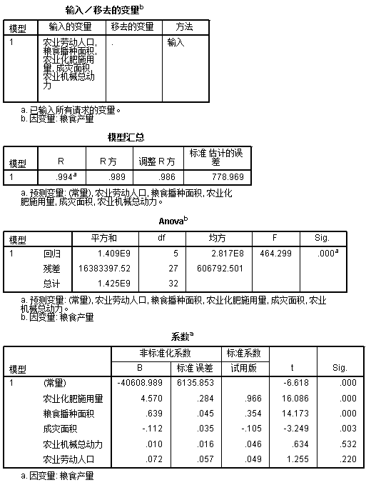

   - 模型汇总表中，多元决定系数为0.989，修正的多元决定系数为0.986，说明选择的变量对于因变量的解释度极高
   - Anova表给出了方程检验的方差分析，从中可见F检验的P值近似为0，故可以判断模型十分显著

2. 利用向前选择法，逐步增加变量找到最优的线性模型。

   设显著性水平a为0.05

   引入变量化肥施用量(x1)

   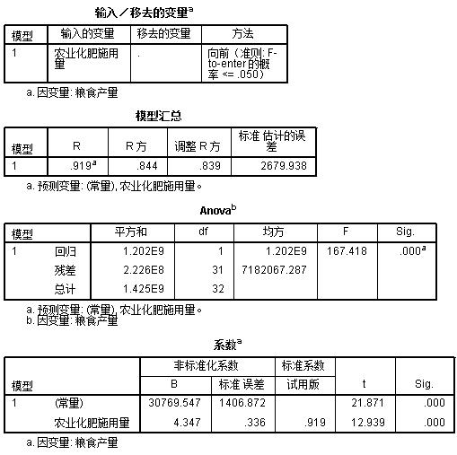

   多元决定系数R²为0.844，变化较小，判断x1是显著型变量，所以保留

   引入变量播种面积(x2)

   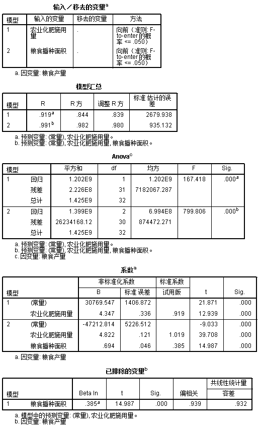

   引入x2后，多元决定系数R²增长为0.982，所以x2也是一个显著性变量，所以保留

   引入变量成灾面积(x3)

   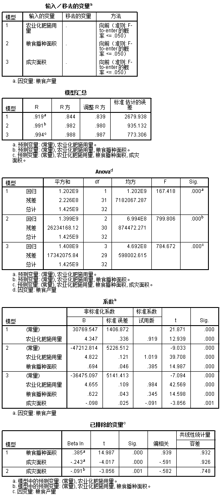

   引入x3后，多元决定系数R²增长为0.988，所以x3也是一个显著性变量，所以保留

   引入变量劳动力(x5)

   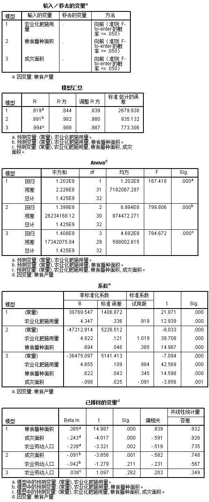

   引入x5后，p值大于0.1，不显著，所以排除

   引入变量农业机械总动力(x4)

   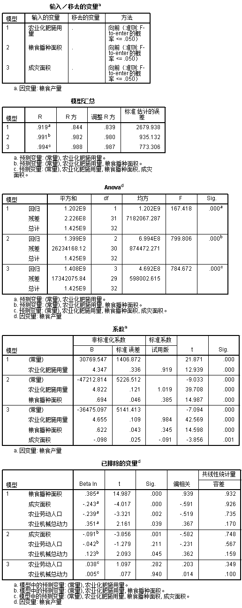

   引入x4后，p值仍大于0.1，不显著，所以x4和x5均排除

   回归方程

$$
y = -36475.097+4.655*X1+0.622*X2-0.098*X3
$$

