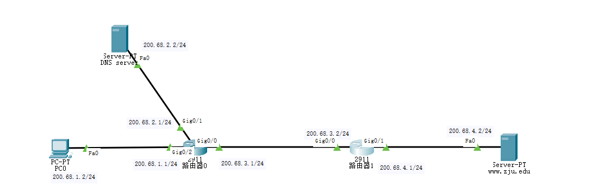

# 浙大城市学院实验报告

> - 课程名称：计算机网络实验       
> - 实验项目名称：实验十五 DNS工作原理实验报告
> - 学生姓名：徐彬涵
> - 专业班级：软件工程2003
> - 学号：32001272 
> - 实验成绩：
> - 指导老师：霍梅梅
> - 日期：2022/05/19  

## 一. 实验目的和要求

1. 掌握DNS的工作原理

2. 掌握DNS的两种解析方法

3. 掌握DNS服务器的配置

## 二、实验设备

1. Packet Tracer模拟器软件；
2. Cisco 2911路由器若干台，交换机若干台，PC机若干台，服务器若干台。 

## 三. 实验内容、原理及实验结果与分析

### DNS基本配置实验

|                                                              |
| ------------------------------------------------------------ |
|  |

1. 配置路由器的各个接口的IP地址，子网掩码

   

   

2. 配置路由器的路由协议（可以用RIP或者OSPF）

   

   

3. 配置主机和服务器的IP地址、子网掩码、网关，配置[www.zju.edu](http://www.zju.edu)服务器的HTTP服务;（在[www.zju.edu](http://www.zju.edu)服务页面上显示自己的名字）

   

4. 测试全网连通性

   

5. 配置DNS服务器的DNS 服务器，添加资源记录表

   

6. 配置主机的DNS server

   

7. 测试域名解析效果以及查看DNS请求和响应过程。

   

### DNS原理实验

 

步骤：

1. 配置终端甲、终端乙的IP地址、子网掩码、网关;（请将终端甲的显示名字改为自己的学号）

   

   

   

2. 配置路由器各个接口的IP地址和子网掩码;

   

   

   

   

3. 配置root域服务器、cn域服务器、net域服务器、zj.cn域服务器、sh.cn域服务器、zucc.net域服务器、zju.net域务器的IP地址、子网掩码、网关;（请将root域服务器显示名字改为自己的姓名）

   

   

   

   

   

   

   

4. 配置www.sh.cn, www.zj.cn, www.zucc.net, www.zju.net四个服务器的的IP地址、子网掩码、网关， 并配置它们的HTTP服务;（请在每个HTTP服务页面放置一幅自己喜欢的图片，四个HTTP页面不重复）

   

   

   

   

   

5. 配置路由器的路由协议，可以采用RIP或者OSPF;

   

   

   

   

6. 测试网络连通性，在各个节点尝试ping命令测试全网可达性

   

   

   

7. 设计配置root域服务器、cn域服务器、net域服务器、zj.cn域服务器、sh.cn域服务器、zucc.net域服务器、zju.net域务器的DNS资源记录表，并配置DNS服务。

   ```
   www.sh.cn
   220.88.2.2
   www.zj.cn
   220.88.2.3
   www.zucc.net
   220.88.8.2
   www.zju.net
   220.88.1.2
   ```

   

   

   

   

   

   

   

8. 测试域名解析效果。

   


## 四、收获感想：

记录实验感受、操作过程中遇到的困难及解决办法、遗留的问题、意见和建议等。

 
